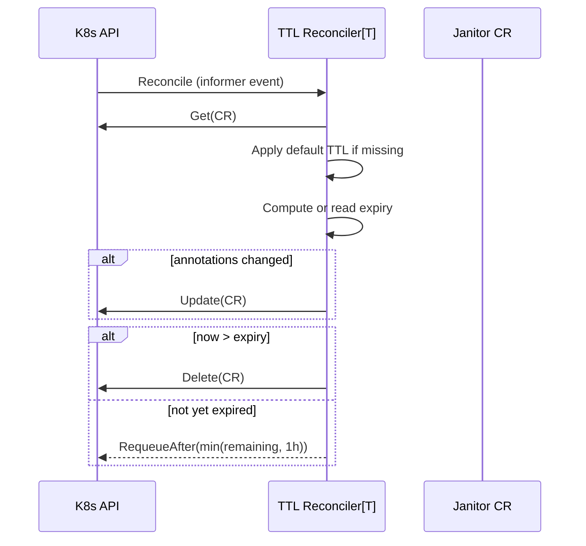

# ADR-037: Janitor — TTL-Based Cleanup of Maintenance CRs

## Context

The janitor controllers own three cluster-scoped CRs — `RebootNode`, `GPUReset`, `TerminateNode` (`janitor.dgxc.nvidia.com/v1alpha1`) — that drive maintenance workflows. They are created per-event (typically by `fault-remediation`) and reach a terminal state signaled by `status.completionTime`.

There is no cleanup after completion. The reconcilers return `ctrl.Result{}` on terminal state and never revisit the CR. Existing mechanisms also don't GC:

- OwnerReference cascade is ineffective: `fault-remediation` sets the owner to the `Node` with `BlockOwnerDeletion: false`, so cascade fires only when the Node is deleted, which is rare for long-lived clusters.
- No TTL field exists on any of the three CRD schemas.

Observed in production: across multiple long-running clusters, 93–99% of `RebootNode` CRs are older than 14 days.

### Impact

- etcd growth scales linearly with cluster age.
- Informer cache and LIST latency degrade in proportion — notably in `fault-remediation.checkExistingCRStatus`, which LISTs on every reconcile.
- `kubectl get rebootnode` is dominated by stale items.

## Decision

Add a generic, annotation-driven TTL reconciler as a new controller inside the existing janitor binary, wired at compile time to the three janitor CRDs.

- Each CR carries `nvsentinel.nvidia.com/ttl` (e.g. `"336h"`). The reconciler computes `nvsentinel.nvidia.com/expiry` on first reconcile and deletes the CR when `now > expiry`.
- Default TTL: `336h` (14 days), configurable via `--default-ttl`. `0` disables the default (per-CR annotations still take effect).
- Fully disabled via `--enable-ttl=false`: the TTL reconcilers are not registered at all, annotations are ignored, and CRs persist indefinitely. Intended for dev/test environments.
- Per-CR opt-out: `nvsentinel.nvidia.com/preserve: "true"`.
- The three existing janitor reconcilers are unchanged. No CRD schema changes.

## Implementation

### Layout

```
janitor/
├── pkg/
│   ├── controller/                         # unchanged
│   │   ├── rebootnode_controller.go
│   │   ├── gpureset_controller.go
│   │   └── terminatenode_controller.go
│   └── ttl/                                # NEW
│       ├── ttl.go            # Process(), default resolution, expiry
│       ├── reconciler.go     # generic Reconciler[T client.Object]
│       ├── setup.go          # Setup[T, L] helper
│       └── *_test.go
└── main.go                                 # adds 3 Setup() calls for TTL
```

The `ttl` package is a new implementation using `log/slog` and controller-runtime conventions already established across the repo. It runs as three additional reconcilers alongside the existing janitor reconcilers in the same manager.

### Reconcile flow



State lives on the CR. The reconciler keeps nothing in memory between reconciles.

### Compile-time binding

`janitor/main.go` wires three additional reconcilers:

```go
ttl.Setup[*v1alpha1.RebootNode,    *v1alpha1.RebootNodeList](mgr,    "rebootnode-ttl",    ttl.WithDefaultTTL(defaultTTL))
ttl.Setup[*v1alpha1.GPUReset,      *v1alpha1.GPUResetList](mgr,      "gpureset-ttl",      ttl.WithDefaultTTL(defaultTTL))
ttl.Setup[*v1alpha1.TerminateNode, *v1alpha1.TerminateNodeList](mgr, "terminatenode-ttl", ttl.WithDefaultTTL(defaultTTL))
```

### RBAC

No change. Janitor's existing ClusterRole already grants `get;list;watch;update;delete` on all three kinds via the `kubebuilder:rbac` markers in the per-kind controllers.

### Annotation schema

| Annotation | Set by | Purpose |
|---|---|---|
| `nvsentinel.nvidia.com/ttl` | `fault-remediation` template, or TTL reconciler on first reconcile | Per-CR TTL duration |
| `nvsentinel.nvidia.com/expiry` | TTL reconciler | Computed deletion time (RFC3339) |
| `nvsentinel.nvidia.com/preserve` | operator | `"true"` pins the CR |

Resolution order for the default: per-CR annotation → CLI system default.

### Fault-remediation changes

Add one line to each remediation template so new CRs ship with an explicit TTL:

```yaml
metadata:
  annotations:
    nvsentinel.nvidia.com/ttl: "336h"
```

Existing CRs without the annotation receive the system default on first reconcile.

### Helm values

`charts/janitor/values.yaml` gains two fields, surfaced to the janitor binary as CLI flags:

```yaml
ttl:
  enabled: true         # set to false to disable the TTL reconcilers entirely (dev/test)
  defaultTTL: "336h"    # "0" disables the default; per-CR annotations still take effect
```

### Metrics

Counter `janitor_ttl_deletions_total{kind}` incremented per TTL delete, registered alongside the existing `janitor_*` metrics.

## Rationale

- One implementation via Go generics handles all three CRDs.
- Scope is bound at compile time; adding a kind requires source changes and a rebuild.
- No new Pod, chart, or SA to operate. One binary, one release cadence.
- State lives on the CR as annotations; the reconciler is stateless across restarts.
- The `expiry` annotation is observable and editable via standard `kubectl`.
- Pattern follows established generic-reconciler conventions (Go generics + per-type `Setup` wiring) common in controller-runtime operators.

## Consequences

Positive: bounded CR growth; faster LISTs; cleaner `kubectl` output; zero new operational surface.

Negative:
- Historical CRs beyond TTL are gone. Maintenance CRs are a transient workflow artifact; long-term audit should come from the configured event store, not these CRs.
- First rollout on a large backlog briefly spikes deletion traffic.

Mitigations: 14-day default gives investigation time; `preserve: "true"` pins individual CRs; `defaultTTL: "0"` disables the default while still honoring explicit annotations; `ttl.enabled: false` turns the reconcilers off entirely for dev/test; operators with large backlogs can ramp `defaultTTL` down over a release or two (e.g. `2160h` → `720h` → `336h`) to smooth the burst.

## Alternatives Considered

- Separate deployment / chart (`object-reaper` as a sibling component). Deferred. Appropriate topology if TTL ever needs to cover non-janitor CRDs; premature while the scope is the three janitor kinds.
- Embed TTL inline in each janitor reconciler. Rejected: three copies of near-identical logic mixed into workflow code.
- Generic cleanup controller driven by runtime config (kube-janitor / Kyverno pattern). Rejected: runtime-configurable targets widen the blast radius without a corresponding benefit at this scope.
- Adopt `kube-janitor` (Python). Rejected: new language runtime and supply-chain surface.
- Adopt Kyverno Cleanup Policies. Rejected: pulls in a full admission-control platform for TTL alone.
- CRD `spec.ttlSecondsAfterFinished` field. Deferred: requires schema migration; annotation-based scheme is equivalent for v1 and can be promoted later.

## Testing

- envtest: default TTL applied on first reconcile; expiry computed and persisted; CR deleted when expired; requeue when not yet expired; `preserve: "true"` blocks deletion; `defaultTTL: "0"` disables; idempotent across repeated reconciles.
- Integration: three CRDs TTL'd independently; backlog of pre-existing CRs cleaned up on first rollout; existing workflow reconcilers unaffected.
- Metrics: `janitor_ttl_deletions_total{kind}` increments on each delete.


## References

- [Issue #370](https://github.com/NVIDIA/NVSentinel/issues/370)
- [ADR-019: Janitor GPU Reset](019-janitor-gpu-reset.md)
- [ADR-027: Kubernetes Data Store](027-kubernetes-data-store.md)
- [ADR-028: Generic Bare-Metal Reboot Provider](028-generic-baremetal-reboot-provider.md)
- [Kubernetes `Job.ttlSecondsAfterFinished`](https://kubernetes.io/docs/concepts/workloads/controllers/ttlafterfinished/)
