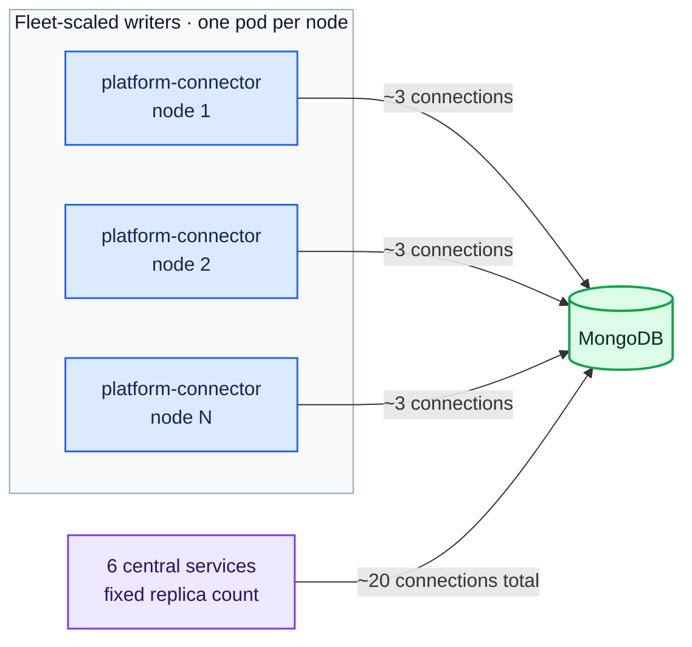
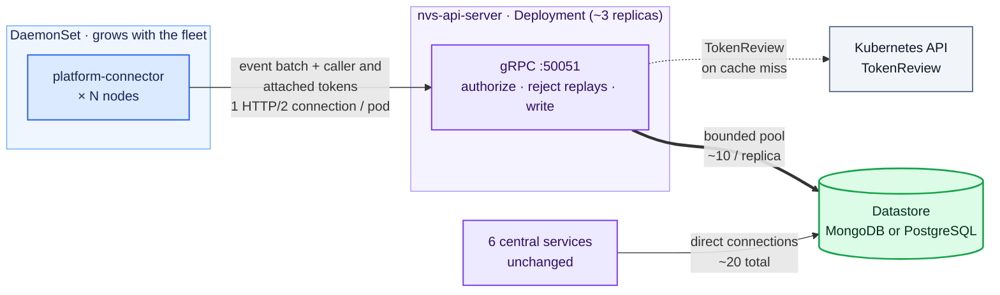
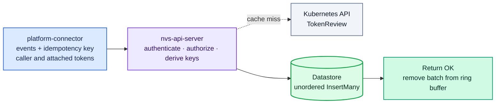
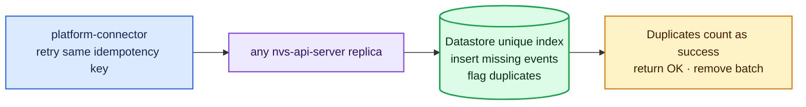
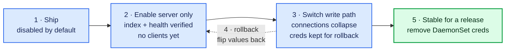
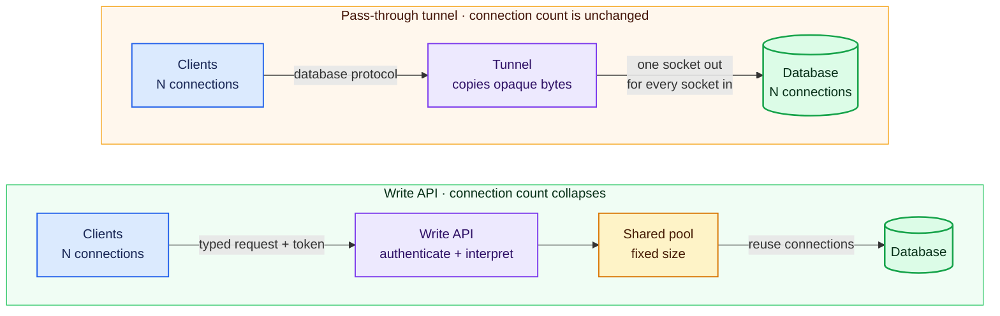

# ADR-050: NVS API Server

## Context

Every NVSentinel component that needs the datastore talks to MongoDB (or
PostgreSQL) through the shared `store-client` library. Most of these components
are small, single-replica Deployments. One of them is not: platform-connectors
runs as a DaemonSet, one pod on every node, and every pod opens its own
connections to the database.

Each platform-connector pod holds about 3 MongoDB connections: heartbeat
connections that the driver keeps to each replica set member, plus the
connections used for actual writes. The database pays memory (roughly 0.2 MB)
for every open connection, even an idle one. Because the pod count grows with
the fleet, the connection count grows with it:

| Fleet size    | Connections from platform-connectors |
|---------------|---------------------------------------|
| 1,000 nodes   | ~3,000                                |
| 10,000 nodes  | ~30,000                               |
| 100,000 nodes | ~300,000                              |

At 100k nodes, MongoDB spends about 61 GiB of memory just keeping those
connections open, before storing a single byte of data
([issue #1595](https://github.com/NVIDIA/NVSentinel/issues/1595)).

What makes this fixable is how little each pod does with those connections.
The platform-connector store connector
(`platform-connectors/pkg/connectors/store/store_connector.go`) performs
exactly one operation: batched inserts of health events. It never reads.

The other datastore clients are the opposite: few in number, rich in usage.
Six single-replica Deployments (fault-quarantine, node-drainer,
health-events-analyzer, fault-remediation, event-exporter, csp-health-monitor)
use change streams, resume tokens, finds, updates and aggregations. Together
they hold a small, constant number of connections (~20) no matter how large
the fleet is. They are not part of the scaling problem, and this design
leaves them untouched.



Issue #1595 originally suggested deploying
[mongobetween](https://github.com/coinbase/mongobetween), a third-party
MongoDB connection pooler by Coinbase. This ADR proposes building our own
component instead; the review of mongobetween and why it is not used is under
"Alternatives Considered".

Options considered:

1. Deploy `mongobetween` as-is.
2. Build an NVSentinel nvs-api-server exposing a gRPC write API for
   platform-connectors, while the central services keep connecting to the
   database directly as they do today. This is the proposal.
3. The same nvs-api-server plus a pass-through tunnel that also carries the
   central services' traffic. Deferred: the tunnel adds network control, not
   scale, so it is recorded under "Future scope" instead of this iteration.

Background on why a write API collapses connections while a pass-through
tunnel cannot is in the appendix.

## Decision

Build a new service, the **nvs-api-server**, that exposes a gRPC write
API. Platform connectors stores health events through it, authenticated on
every request with projected ServiceAccount tokens, and the nvs-api-server writes
to the database through `store-client` using a small fixed connection pool.
The six central services keep their direct database connections, unchanged.

## Implementation

### Architecture



Database connections from the fleet become constant: at 100k nodes, the write
path goes from roughly 300,000 connections down to a few dozen. One detail
matters for the arithmetic: MongoDB applies `maxPoolSize` per server, not
per client. With a write-only workload the pool fills on the primary, so
each nvs-api-server replica holds about 10 pooled connections plus a few
monitoring connections to each replica set member: call it ~16 per replica,
about 50 total at 3 replicas. Even the theoretical ceiling, with pools
filled on every member of a 3-member set, is about 110. The central
services' ~20 direct connections stay exactly as they are today.

### The write API

The nvs-api-server implements the existing `PlatformConnector` gRPC service
(`data-models/protobufs/health_event.proto`, `HealthEventOccurredV1`). No new
service definition is needed: this is the same service that
platform-connectors itself serves, and the same one the gRPC sink connector
(ADR-033) already knows how to call from the client side.

On the platform-connectors side, the store path gets a new mode. Instead of
the store connector writing to the database through `store-client`, it sends
the same batches to the nvs-api-server over gRPC. The existing gRPC sink connector
code is the starting point for this client, and the delivery guarantees match
the path being replaced:

- Today's store connector retries a failed insert with backoff up to a
  configurable ceiling (`mongodbStore.maxRetries`, default 3) and then drops
  the batch; the optional external sink (ADR-033) behaves the same way. The
  new mode keeps these semantics and the same knob, so switching modes does
  not silently change delivery behavior.
- Because the nvs-api-server is a hop that can fail independently of the
  database, deployments may want a higher retry ceiling for this mode; the
  ceiling stays configurable for exactly that reason. Making the store path
  stronger than today (retrying until success) would be an independent
  change and is out of scope here.

Because the client retries, a batch could be stored twice if a write
succeeded but the OK reply got lost. To prevent that, each batch carries a
client-generated idempotency key, sent as an `idempotency-key` gRPC header
following the standard
[HTTP Idempotency-Key](https://developer.mozilla.org/en-US/docs/Web/HTTP/Reference/Headers/Idempotency-Key)
semantics; `HealthEvents` itself does not change. The nvs-api-server refuses to store the same batch
twice. This check has to live in the database itself, because a retry may
land on a different replica, and one replica's memory knows nothing about
what another replica stored.

The check is per event, not per batch, because a batch can be stored
partially. MongoDB does not insert a batch atomically: each document insert
is atomic on its own, so if the call fails or the connection drops halfway,
the documents written so far stay written. (A database transaction would
make the batch all-or-nothing on both providers and is an acceptable
implementation alternative; the idempotency key is needed either way,
because a lost OK can follow a fully committed batch, and a retried
committed batch then simply hits duplicates and counts as stored. A MongoDB
bulk write is not a transaction; it has the same per-document semantics as
insertMany.) So each event gets a
unique key made from the batch's idempotency key plus its position in the
batch, a unique index enforces it, and inserts run unordered with duplicate
keys counted as success. A retry then fills in exactly the missing events
and never stores anything twice, on any replica.

Three contract details. The key is stored with the batch in the ring
buffer, so every retry of that batch reuses it. The key follows the usual
Idempotency-Key semantics: the client must resend the same payload under
the same key, because the server detects duplicates by key alone and does
not compare payloads. And the unique index must exist before this mode is
enabled, which the rollout plan sequences. The index is partial, covering
only documents that carry the key, so records written before this design
are exempt and need no backfill; both MongoDB and PostgreSQL support
partial unique indexes.

**Normal write:**



**Retry if the OK response is lost:**



On the nvs-api-server side, the handler validates the caller (next section)
and then writes the same documents the store connector writes today,
including the same per-event wrapping: status, creation timestamp and trace
metadata are added before `InsertMany`, with the conversion code lifted from
the store connector so a document looks identical whichever path wrote it.
Two small semantic shifts come with that move. The creation timestamp is
now assigned at the nvs-api-server rather than on the node. And trace
continuity crosses the gRPC hop explicitly. The store-mode client carries
the batch's span context on the call via OpenTelemetry gRPC
instrumentation; the shared `grpcclient` only attaches auth metadata today,
so this is part of the new client. The nvs-api-server extracts that context
and stores the same trace fields the store connector stores now: the batch
trace ID in `MetadataKeyTraceID`, and each event's span ID under
`HealthEventStatus.SpanIds` for the platform-connector service key.
Downstream consumers read those fields, so both write paths must produce
them identically. Event transformation and
deduplication stay in the platform-connector pipeline, unchanged; beyond the
wrapping, the nvs-api-server is a thin persistence endpoint. The
nvs-api-server configures an explicit `maxPoolSize` on its database client.
Two small `store-client` changes are prerequisites for this design. First,
pool limits must become configurable so that `maxPoolSize` truly applies:
today MongoDB gets the driver default of 100 and PostgreSQL is hardcoded to
25, and the connection numbers in this document assume the configured pool
is what actually runs. Second, `InsertMany` must support unordered inserts
and report per-document duplicate-key errors: MongoDB's default is ordered,
which stops at the first duplicate and would break the retry mechanism
above, and the current interface exposes neither the option nor the error
detail.

How this behaves at fleet scale (connection handling and the TokenReview
arithmetic) is consolidated under "Scaling and availability".

### Authentication on the write API

This reuses the ServiceAccount token machinery that already authenticates
health event publishers to platform-connectors
(`docs/configuration/authentication.md`) and the janitor to the
janitor-provider (ADR-030):

- Clients attach a projected, audience-scoped, short-lived ServiceAccount
  token to every request using `commons/pkg/grpcclient`.
- The nvs-api-server validates tokens with the Kubernetes TokenReview API using
  `commons/pkg/grpcauth` (including its result cache), with a dedicated
  audience, for example `nvs-api-server.nvsentinel.nvidia.com`.
- The nvs-api-server only accepts writes from an allowlist of identities, by
  default just the platform-connector ServiceAccount derived from the release
  namespace, the same derivation pattern the publisher auth uses.
- Tokens must be pod-bound, so a token extracted from a manifest or minted
  without a pod reference is refused.

A health event is therefore authenticated twice on its way to the database,
once at each hop, and that is deliberate. Platform-connector must validate
the publisher, because the same events also update node conditions through
the k8s connector. The nvs-api-server must validate its own caller, so that
only platform-connector's pipeline can write, not anything that happens to
reach its port. This is the same hop-by-hop pattern as the janitor to
janitor-provider connection. It is also an interim state: in the long-term
plan ("Future scope: absorbing platform-connector into the nvs-api-server"),
publishers authenticate directly to the central service, and the event path
is back to a single TokenReview.

The second review is cheap because verdicts are cached; the full
arithmetic, including its ceilings, cache capacity and retry limits, is
consolidated under "Scaling and availability".

Per-event node binding is enforced twice, so that a stolen
platform-connector token is not enough to forge events about other nodes.
The first check is at the platform-connector layer, as today: a publisher
may only report events about its own node unless its identity is on the
cross-node allowlist (`docs/configuration/authentication.md`). Nothing
changes there.

The second check is at the nvs-api-server, and it is the same for every
batch: each batch carries an attached token, and the batch's allowed node
scope comes from that token. When the publisher presented a token,
platform-connector attaches that one. When it did not (token-less callers
on the local socket), platform-connector attaches its own node-scoped
token, minted for the platform-connector audience alongside its caller
token (one extra projected volume on the DaemonSet). The nvs-api-server
then applies one rule: if the attached identity is on the cross-node
allowlist, the batch may name any node; otherwise every event must name
the node in the attached token's own claim. A token stolen from node X
therefore cannot submit an event about node Y, and an attacker who skips
platform-connector entirely and calls the write API directly hits exactly
the same rule.

The attached token is never accepted as a caller credential; callers must
always present a platform-connector token minted for the nvs-api-server
audience, and on its own an attached token is inert at the nvs-api-server.
Mechanically the attachment check is a second validator, not a mode on the
first: the grpcauth validator is built for one audience, so the
nvs-api-server runs two instances, one for callers (the nvs-api-server
audience, allowlisting the platform-connector identity) and one for
attachments (the platform-connector audience, carrying the cross-node
allowlist, with its own cache). The attached token travels under its own
metadata key and only ever reaches the attachment validator, which makes
"never a caller credential" true by construction rather than by policy.

Why this closes the gap: cross-node power exists only in the tokens of the
four cluster-wide publishers (csp-health-monitor,
kubernetes-object-monitor, slurm-drain-monitor, health-events-analyzer),
and those publishers must run on system or control-plane nodes, away from
tenant GPU nodes. The publisher auth guide already directs this placement,
but as guidance; the charts should pin it with a nodeSelector so the
guarantee does not depend on scheduling luck. With that in place, no token
that can name foreign nodes ever exists on a GPU node. An attacker with
root on a GPU node holds only tokens scoped to that node, so they can only
submit events about the node they already control. An attacker who
compromises a system node could steal a cross-node publisher's token, but
that attacker already controls the publisher itself, so the attachment
gives them nothing new.

Two details. Expiry: an attached token could expire while its batch waits
out an outage in the ring buffer. The cross-node publishers use a longer
token lifetime (the existing `tokenExpirationSeconds` knob; hours is fine
on system nodes), and for node-scoped tokens the bounded retry window
keeps the exposure small; a batch whose attached token has expired is
rejected and retried like any other failure. This freshness coupling is
interim by nature: absorption stage 2 removes attachment entirely.
Observability: the nvs-api-server counts every batch rejected for naming a
node outside its attached token's scope under a dedicated violation
reason, the same label pattern the publisher auth metrics already use, and
logs the caller identity, without a per-pod metric label that would
explode cardinality at fleet scale.

The token crosses the pod network in gRPC metadata, so the nvs-api-server
serves TLS by default: cert-manager issues its server certificate and
platform connectors verify it against the mounted CA bundle, the same
pattern already used for the janitor-provider (ADR-030) and the admission
webhooks. That protects tokens in transit; the token's own protections
(short lifetime, single audience, pod binding) plus NetworkPolicies bound
the damage if one still leaks.

NetworkPolicies restricting the nvs-api-server port to platform-connector pods,
and restricting the database to its existing clients plus the nvs-api-server, are
recommended as defense in depth, consistent with ADR-033.

### Scaling and availability

The nvs-api-server scales horizontally, and the design keeps that true in
three ways:

- It is stateless. All durable state, including the idempotency check, lives
  in the database, so any replica can serve any request and a retried batch
  can land on any replica.
- Each platform-connector pod holds a single HTTP/2 connection to the
  nvs-api-server, carrying all its calls. 100k idle HTTP/2 connections are
  cheap compared to 300k MongoDB connections, and they terminate at the
  nvs-api-server, not at the database.
- The nvs-api-server sets gRPC `MaxConnectionAge` and `MaxConnectionIdle`.
  The first makes long-lived connections reconnect periodically, so load
  spreads evenly and a newly added replica picks up its share within
  minutes. The second closes connections that have gone quiet (in a
  healthy, deduplicated fleet many pods write rarely), and the pod
  transparently reconnects on its next batch. Both use jitter, because
  closing many connections on the same schedule invites a synchronized
  reconnect burst after a fleet-wide event.

Adding a replica costs the database a small, fixed amount: its bounded pool
(~10 connections, filled on the primary) plus monitoring connections to
each replica set member, call it ~16. Capacity therefore grows with replica
count while database connections stay a small multiple of it, and replica
count grows with load, never with fleet size. A horizontal pod autoscaler
is possible later; a fixed replica count is enough to start.

The other scale concern is TokenReview, and the second review is cheap. The
shared validator caches a positive verdict for 2 minutes (`cacheTTL` in
`commons/pkg/grpcauth`), so:

- A cache hit is an in-memory lookup on the nvs-api-server: no network call,
  effectively free. Every request a pod makes after its first in a window is
  a hit.
- A cache miss costs one TokenReview round trip to the Kubernetes API
  server, a few milliseconds inside a cluster. Each platform-connector pod
  can cause at most one miss per 2 minutes, and only in windows where it
  actually sends a batch. Only the request that triggers the miss waits
  those few milliseconds; every other request in the window is unaffected.

| Fleet activity                                 | TokenReviews per second |
|------------------------------------------------|-------------------------|
| Every pod writes in every window (worst case)  | ~830 (~280 per replica) |
| 5% of pods write per window                    | ~40                     |
| Quiet fleet                                    | near zero               |
| Reconnect wave, transient until caches rewarm  | up to ~2,500            |

The worst case assumes every node produces fresh events every 2 minutes,
which deduplication makes rare. Caches are per replica, but each pod holds
one connection and talks to one replica at a time, so the steady-state
ceiling holds; only a reconnect wave (connection age or idle closures) can
briefly multiply misses toward pods times replicas, and the reconnect
jitter spreads that out. If the ceiling ever matters, the cache window can
be widened (a fixed constant in grpcauth today, a one-line change), but
that is a trade, not a free win: a cached verdict also skips the check that
notices a deleted pod, so the cache window is the revocation blind spot.
Ten minutes divides the ceiling by five and accepts a deleted pod's token
for up to ten minutes.

Two more constants belong in this arithmetic. The verdict cache holds 4,096
entries per replica (`cacheMaxEntries`), while a 100k fleet puts roughly
33,000 active caller tokens on each of 3 replicas, and every batch also
validates an attached token (about 3 publisher tokens per node plus
platform-connector's own), so the capacity must be raised to fleet scale
(like the TTL, it is a constant today), or evictions will create misses
well beyond the once-per-window estimate. And a failed TokenReview retries
with backoff inside an 8 second window, so during a control-plane incident
the API request budget can briefly exceed the steady miss rate; the
existing validator metrics already separate that state from real auth
failures.

For scale context, this is not a new kind of load. With publisher
authentication enabled, platform-connector already does about one
TokenReview per monitor pod per window (monitors re-send results
continuously, which is why deduplication exists). At roughly 3 node-local
monitors per node, that is about three times what the nvs-api-server adds.

### Helm and configuration

A new deployment in the NVSentinel chart, disabled by default:

```yaml
nvsApiServer:
  enabled: false
  replicas: 3
  grpcPort: 50051
  tls:
    enabled: true   # cert-manager issued server certificate (ADR-030 pattern)
  auth:
    audience: "nvs-api-server.nvsentinel.nvidia.com"
    tokenExpirationSeconds: 3600
    # attachment validation reuses global.platformConnectorAuth.audience
  datastore:
    maxPoolSize: 10   # database connections per replica
```

The client side is a Helm switch, so rollout and rollback are value flips:
platform-connectors gets a store connector mode that selects direct database
writes (today's behavior, the default) or writes via the nvs-api-server.

### Rollout plan

1. Ship the nvs-api-server disabled. Nothing changes.
2. Enable the nvs-api-server on its own. It comes up, creates or verifies
   the partial idempotency unique index (existing records lack the key and
   are exempt, so there is no backfill), connects to the database and
   reports healthy, while every client still writes directly. Nothing
   depends on it yet.
3. Switch the platform-connectors store path to the gRPC write API. This is
   the step where database connections collapse. The DaemonSet keeps its
   database credentials mounted through this phase, so rollback stays a
   pure value flip with nothing to re-provision.
4. Rollback at any point is flipping the values back; direct database
   access keeps working throughout the migration.
5. After the new path has been stable for a release, remove the database
   credentials from the DaemonSet. Only this step realizes the credential
   cleanup benefit, and from here a rollback first needs the credentials
   restored.



### Future scope: a pass-through tunnel for the central services

A follow-up iteration can add a second door to the nvs-api-server: an
authenticated TCP pass-through tunnel carrying the central services' database
traffic. The nvs-api-server would validate a ServiceAccount token once per
connection (a small preamble frame carrying the token and the intended
database address), then copy bytes without interpreting them, so change
streams, transactions and the database's own end-to-end TLS and X.509
authentication keep working unchanged.

The tunnel does not reduce connection counts (one connection in is one
connection out), which is why it is not part of this iteration. What it adds
is network control:

- Only the nvs-api-server needs reachability, DNS and firewall access to the
  database; every other service reaches only the nvs-api-server. This matters
  most with an external managed MongoDB (Atlas and similar), where a single
  controlled egress point to the external database is usually required.
- A workload-identity gate in front of the database port in clusters that do
  not enforce NetworkPolicies (ADR-030 notes OCI as an example).
- One place to freeze or redirect database connections during a datastore
  migration.
- Every database connection becomes attributable to a Kubernetes identity.

Two findings, written down now so they are not rediscovered later:

- A naive tunnel gets silently bypassed for replica sets: drivers discover
  the member addresses from the replica set itself and dial each member
  directly. The client side must therefore be a custom dialer in
  `store-client` that routes every connection through the tunnel, naming
  the true destination in the preamble.
- The nvs-api-server must check requested destinations against its
  configured database backends. Otherwise the tunnel is an authenticated
  relay to anywhere on the network.

Triggers that would revive this work: a deployment with an external managed
database, a target environment without NetworkPolicy enforcement, a planned
datastore migration, or an audit requirement to attribute database
connections to workloads.

### Future scope: absorbing platform-connector into the nvs-api-server

This nvs-api-server is also the first step of a longer arc. The intent is to
move platform-connector's responsibilities into the central service stage by
stage, until the per-node DaemonSet is no longer needed and can be
deprecated. The name nvs-api-server is deliberately not datastore-specific,
so it keeps its name as the role grows. The staging:

1. This iteration: the datastore write path moves. The DaemonSet keeps every
   other duty.
2. Publisher authentication moves: monitors publish directly to the central
   service over the network, with tokens minted for its audience. This is
   the point where the event path drops from two TokenReviews back to one,
   and the token attachment in the authentication section becomes
   unnecessary.
3. Node condition updates (the k8s connector) move to the central service.
4. The remaining pipeline work (transformation, deduplication) and whatever
   else is left moves, after which the DaemonSet is deprecated.

Each stage needs its own design. Known challenges, written down now so they
are not rediscovered later:

- Monitors only send when the local Unix socket exists; that is how they
  detect that platform-connector is up. A networked receiver needs a new
  liveness signal.
- Publishers without tokens are accepted on the socket and pinned to the
  node. There is no network equivalent, so tokens become mandatory before
  authentication can move.
- Node binding changes meaning: from "the token was minted on my node" to
  "the token was minted on the node the event names".
- Node-name stamping for local callers needs a replacement.
- Connections grow from one platform-connector per node to several monitor
  pods per node dialing the central service. HTTP/2 connections are cheap,
  but this needs deliberate sizing.

None of this changes anything in the current iteration. It is direction, not
commitment, and it is why the two-TokenReview state in the authentication
section is documented as interim.

## Rationale

- Database connections stop growing with the fleet: at 100k nodes the write
  path drops from roughly 300,000 connections to about 50, freeing about
  60 GiB of database memory, while the central services stay unchanged.
- The pieces already exist and are proven: the `PlatformConnector` gRPC
  service and its client (ADR-033), the ServiceAccount token auth stack from
  the publisher auth work and ADR-030 (`commons/pkg/grpcauth`,
  `commons/pkg/grpcclient`), and `store-client` for the actual writes.
- Database credentials leave the fleet. Today, in deployments with X.509
  auth, every node's platform-connector pod carries a database client
  certificate. After the rollout's final step no DaemonSet pod does (the
  credentials stay mounted during the transition so rollback stays a value
  flip), and rotation on the write path then touches 3 pods instead of the
  whole fleet.
- The write path becomes datastore-agnostic on the wire: platform-connectors
  no longer knows or cares whether the backend is MongoDB or PostgreSQL. The
  PostgreSQL provider benefits equally (its per-client pool is hardcoded to
  25 connections, which would scale even worse with the fleet).
- No dependency on an unmaintained third-party proxy, and no need to
  understand or re-implement the MongoDB wire protocol.

## Consequences

### Positive

- Connection count and database connection memory stop growing with the fleet.
- Per-request authentication on the write path, using the standard NVSentinel
  token mechanism, where today a stolen database credential is enough.
- Node binding survives token theft: every token on a GPU node is scoped to
  that node, so a stolen token can only submit events about the node the
  attacker already controls. Naming other nodes requires an allowlisted
  publisher token, which exists only on system nodes.
- The read path is untouched: an nvs-api-server outage cannot affect change
  streams or any central service, only delay writes.
- A foundation for later iterations (the pass-through tunnel, or purpose-built
  APIs for other clients) without a big-bang rewrite.

### Negative

- A new component sits on the critical write path. If the nvs-api-server is down,
  health events do not reach the database until it returns, within the same
  bounded-retry window that a database outage has today.
- The write path gains one network hop of latency.
- The nvs-api-server must handle very many concurrent gRPC connections at large
  fleet sizes and becomes a component to size, monitor and page on.
- The token attachment is interim machinery by design: absorption
  stage 2 makes it unnecessary, so it is built knowing it will be removed.

### Mitigations

- The platform-connector ring buffer already absorbs store outages: batches
  back off and retry exactly as they do during a database outage today, so an
  nvs-api-server restart is indistinguishable from a database restart. The
  nvs-api-server runs multiple replicas with anti-affinity and a
  PodDisruptionBudget, and the retry ceiling is configurable for deployments
  that want a wider window.
- The added hop is microseconds to low milliseconds inside a cluster, against
  a write path whose RPC timeout is 10 seconds; it does not change any
  user-visible latency.
- HTTP/2 connections are cheap to hold and the nvs-api-server is stateless (all
  state is in the database), so it scales horizontally; standard gRPC and
  auth metrics (same families as ADR-033 and the publisher auth work) make
  it observable.

## Alternatives Considered

### Deploy mongobetween as-is

**Rejected** because: clients cannot authenticate to it by design (its
handshake advertises no auth mechanisms, so database credentials sit in the
proxy protected only by network reachability, which fails our requirement to
authenticate callers with ServiceAccount tokens); it fronts `mongos` shard
routers and its own README calls direct replica set use not battle tested,
while NVSentinel's default deployment is a replica set; it is MongoDB-only
while NVSentinel also supports PostgreSQL; and it has been unmaintained for
about two years on Go 1.18, reaching into the Go driver's private structures
via reflection and freezing its handshake at MongoDB 4.2's wire version. Its
lessons and parts of its code remain reusable (Apache 2.0) if a pooled
MongoDB-protocol endpoint is ever needed.

### Forward the publishers' tokens instead of authenticating platform-connector

The idea: platform-connector stashes each publisher's token with its batch
and forwards it, so only the nvs-api-server runs TokenReview and the write path
is validated once instead of twice.

**Rejected** because: it moves a review rather than removing one, and it
weakens the token model on the way.

- Platform-connector must validate publishers no matter what, because the
  same events also update node conditions through the k8s connector, in
  parallel with the store path. If validation moved downstream, a fake event
  could flip a node condition even though the nvs-api-server rejected it later.
- The nvs-api-server must still authenticate its own caller. If it accepted
  forwarded monitor tokens, anyone holding a captured monitor token could
  write events directly to it, bypassing deduplication, node conditions and
  the rest of the pipeline. Its check exists to authenticate the pipeline,
  not the original reporter.
- Monitor tokens are minted for the platform-connector audience. Accepting
  them as the caller credential at the nvs-api-server would make a token
  issued for one service open the door of another, which audiences exist to
  prevent; minting every monitor a second token for the nvs-api-server
  audience would instead turn every monitor ServiceAccount into a valid
  writer there. Either way, more identities are trusted, not fewer.
- A forwarded token is a snapshot taken at submission. Tokens expire and
  rotate on their own schedule while batches wait in the ring buffer and
  retry, so legitimately accepted events could be rejected at delivery time
  through no fault of the publisher.

Hop-by-hop authentication, where each service validates its immediate
caller, is the pattern the janitor to janitor-provider connection already
uses, and the second review is cheap: results are cached, so the nvs-api-server
performs roughly one TokenReview per platform-connector pod per cache
window, not one per request (the arithmetic is under "Scaling and
availability"). The eventual single-review state comes from the absorption plan
under "Future scope", where publishers authenticate directly to the central
service, not from forwarding tokens.

This is different from the attachment the design does adopt: there, a token
is attached to every batch as node-scope evidence on top of both hops' own
authentication, never replacing either and never acting as a caller
credential. What this alternative proposes, and what the reasons above
reject, is replacing the platform-connector hop's authentication with
forwarding.

## Notes

- Non-goal: changing the event pipeline (transformation and deduplication
  stay in platform-connectors) or the shape of stored events, beyond the
  added idempotency key and its unique index. The `store-client` changes
  are limited to the two prerequisites named in the write API section.
- Non-goal: a general query API. The central services keep their direct
  database connections in this iteration.
- Non-goal: a pooled MongoDB-protocol endpoint. If one is ever needed,
  mongobetween is the reference implementation to borrow from (Apache 2.0).
- The external gRPC sink use case from ADR-033 is unchanged; the nvs-api-server
  reuses its client pattern for the store path.

## References

- [Issue #1595: Deploy a MongoDB connection proxy to keep connection count constant as fleet scales](https://github.com/NVIDIA/NVSentinel/issues/1595)
- [mongobetween](https://github.com/coinbase/mongobetween) and Coinbase's
  [scaling write-up](https://blog.coinbase.com/scaling-connections-with-ruby-and-mongodb-99204dbf8857)
- [ADR-033: gRPC Sink Connector for Platform-Connectors](033-grpc-sink-connector.md)
- [ADR-030 file: gRPC TLS and Authentication for Janitor-Provider Connection](030-grpc-tls-authentication.md)
- [Publisher authentication reference](../configuration/authentication.md)
- [ADR-002: Storage Layer Selection](002-storage-layer-selection.md)

## Appendix: a middleman can do one of two jobs

A middleman between clients and a database can work in one of two ways, and
the difference decides what it can and cannot fix.

The first way is a **pass-through tunnel**. The middleman accepts a client
connection, opens its own connection to the database, and copies bytes in both
directions without understanding them. Everything keeps working through it
(change streams, cursors, transactions, end-to-end TLS), because nothing about
the database protocol changes. But a tunnel is always one client connection to
one database connection. It cannot merge two clients onto a shared connection,
because merging requires understanding where one request ends and which reply
belongs to which client. A tunnel therefore gives you a single controlled
doorway, but no reduction in connection count.

The second way is an **API in front of the database**. The client never talks
to the database at all: it sends a request to the middleman ("store these 5
health events, here is my token"), and the middleman checks the token, then
performs the database write itself using a small pool of connections it owns.
Because it understands requests, it can funnel 100k clients through a handful
of database connections. The cost is that it only supports the operations you
teach it.



The fleet-scaling client (platform-connectors) needs the API treatment,
because that is the only way to collapse connections. A tunnel would give the
central services a controlled doorway but no reduction, which is why it is
future scope rather than part of this design.
