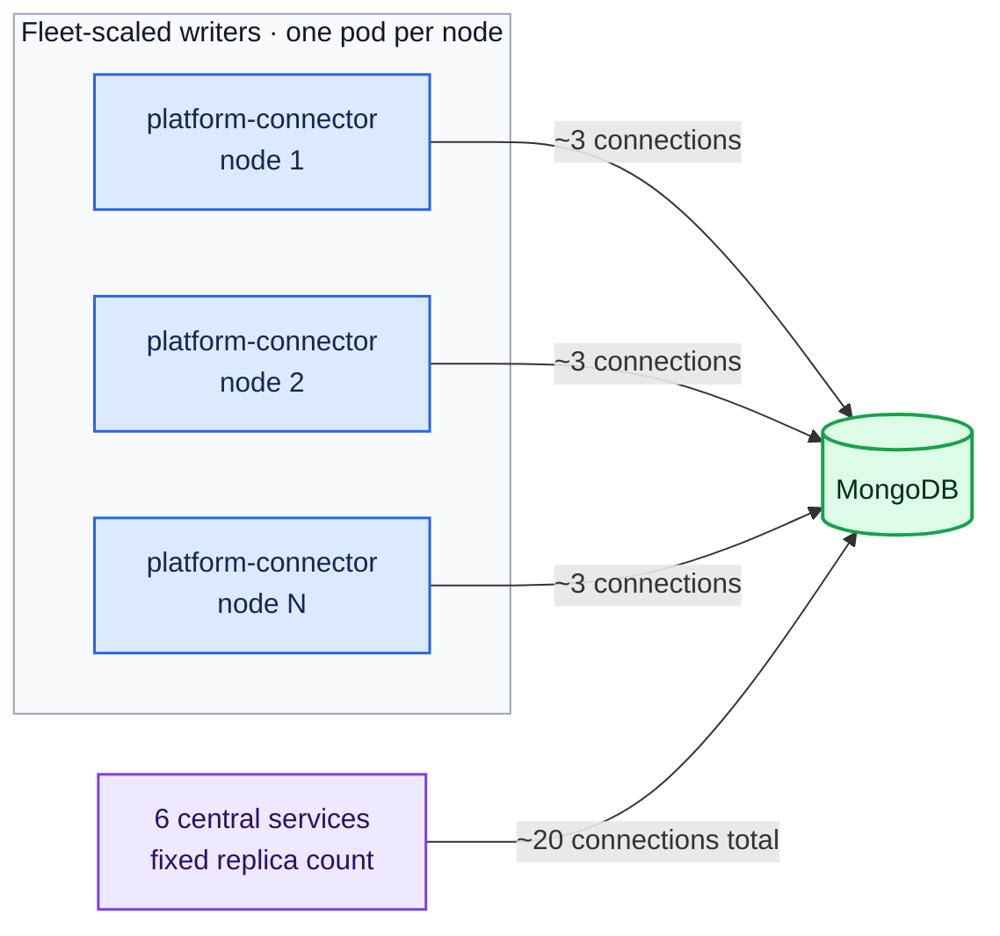
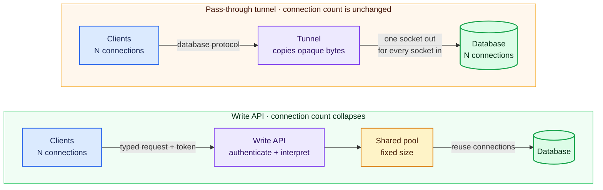
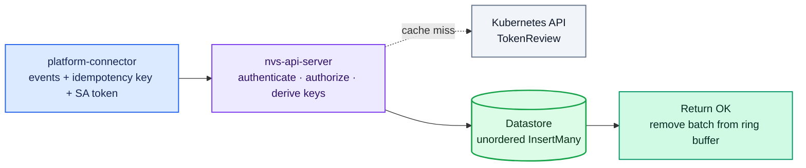
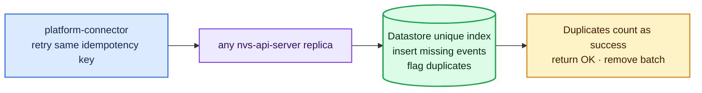
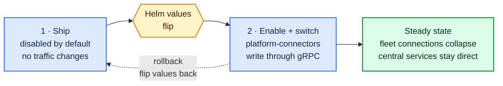

# ADR-050: NVS API Server

## Context

Every NVSentinel component that needs the datastore talks to MongoDB (or
PostgreSQL) through the shared `store-client` library. Most of these components
are small, single-replica Deployments. One of them is not: platform-connectors
runs as a DaemonSet, one pod on every node, and every pod opens its own
connections to the database.

Each platform-connector pod holds about 3 MongoDB connections: heartbeat
connections that the driver keeps to each replica set member, plus the
connections used for actual writes. The database pays memory (roughly 0.2 MB)
for every open connection, even an idle one. Because the pod count grows with
the fleet, the connection count grows with it:

| Fleet size    | Connections from platform-connectors |
|---------------|---------------------------------------|
| 1,000 nodes   | ~3,000                                |
| 10,000 nodes  | ~30,000                               |
| 100,000 nodes | ~300,000                              |

At 100k nodes, MongoDB spends about 61 GiB of memory just keeping those
connections open, before storing a single byte of data
([issue #1595](https://github.com/NVIDIA/NVSentinel/issues/1595)).

What makes this fixable is how little each pod does with those connections.
The platform-connector store connector
(`platform-connectors/pkg/connectors/store/store_connector.go`) performs
exactly one operation: batched inserts of health events. It never reads.

The other datastore clients are the opposite: few in number, rich in usage.
Six single-replica Deployments (fault-quarantine, node-drainer,
health-events-analyzer, fault-remediation, event-exporter, csp-health-monitor)
use change streams, resume tokens, finds, updates and aggregations. Together
they hold a small, constant number of connections (~20) no matter how large
the fleet is. They are not part of the scaling problem, and this design
leaves them untouched.



Issue #1595 originally suggested deploying
[mongobetween](https://github.com/coinbase/mongobetween), a third-party
MongoDB connection pooler by Coinbase. This ADR proposes building our own
component instead; the review of mongobetween and why it is not used is under
"Alternatives Considered".

Options considered:

1. Deploy `mongobetween` as-is.
2. Build an NVSentinel nvs-api-server exposing a gRPC write API for
   platform-connectors, while the central services keep connecting to the
   database directly as they do today. This is the proposal.
3. The same nvs-api-server plus a pass-through tunnel that also carries the
   central services' traffic. Deferred: the tunnel adds network control, not
   scale, so it is recorded under "Future scope" instead of this iteration.

### Background: a middleman can do one of two jobs

A middleman between clients and a database can work in one of two ways, and
the difference decides what it can and cannot fix.

The first way is a **pass-through tunnel**. The middleman accepts a client
connection, opens its own connection to the database, and copies bytes in both
directions without understanding them. Everything keeps working through it
(change streams, cursors, transactions, end-to-end TLS), because nothing about
the database protocol changes. But a tunnel is always one client connection to
one database connection. It cannot merge two clients onto a shared connection,
because merging requires understanding where one request ends and which reply
belongs to which client. A tunnel therefore gives you a single controlled
doorway, but no reduction in connection count.

The second way is an **API in front of the database**. The client never talks
to the database at all: it sends a request to the middleman ("store these 5
health events, here is my token"), and the middleman checks the token, then
performs the database write itself using a small pool of connections it owns.
Because it understands requests, it can funnel 100k clients through a handful
of database connections. The cost is that it only supports the operations you
teach it.



The fleet-scaling client (platform-connectors) needs the API treatment,
because that is the only way to collapse connections. A tunnel would give the
central services a controlled doorway but no reduction, which is why it is
future scope rather than part of this design.

## Decision

Build a new service, the **nvs-api-server**, that exposes a gRPC write
API. Platform connectors stores health events through it, authenticated on
every request with projected ServiceAccount tokens, and the nvs-api-server writes
to the database through `store-client` using a small fixed connection pool.
The six central services keep their direct database connections, unchanged.

(Throughout this document, "nvs-api-server" always means this new service, never
the Kubernetes API server.)

## Implementation

### Architecture


Database connections from the fleet become constant: at 100k nodes, the write
path goes from roughly 300,000 connections down to roughly 40 (3 replicas
with a pool of ~10 each, plus their own heartbeats). The central services'
~20 direct connections stay exactly as they are today.

### The write API

The nvs-api-server implements the existing `PlatformConnector` gRPC service
(`data-models/protobufs/health_event.proto`, `HealthEventOccurredV1`). No new
service definition is needed: this is the same service that
platform-connectors itself serves, and the same one the gRPC sink connector
(ADR-033) already knows how to call from the client side.

On the platform-connectors side, the store path gets a new mode. Instead of
the store connector writing to the database through `store-client`, it sends
the same batches to the nvs-api-server over gRPC. The existing gRPC sink connector
code is the starting point for this client, and the delivery guarantees match
the path being replaced:

- Today's store connector retries a failed insert with backoff up to a
  configurable ceiling (`mongodbStore.maxRetries`, default 3) and then drops
  the batch; the optional external sink (ADR-033) behaves the same way. The
  new mode keeps these semantics and the same knob, so switching modes does
  not silently change delivery behavior.
- Because the nvs-api-server is a hop that can fail independently of the
  database, deployments may want a higher retry ceiling for this mode; the
  ceiling stays configurable for exactly that reason. Making the store path
  stronger than today (retrying until success) would be an independent
  change and is out of scope here.

Because the client retries, a batch could be stored twice if a write
succeeded but the acknowledgement was lost. Each batch therefore carries a
client-generated idempotency key, sent as gRPC metadata under an
`idempotency-key` header, mirroring the standard HTTP Idempotency-Key
convention; `HealthEvents` itself stays unchanged and existing callers stay
compatible. The nvs-api-server refuses to apply the same batch twice, and the
duplicate check must live in the datastore itself: a retried batch may arrive
at a different nvs-api-server replica, so an in-memory record of applied keys
on one replica cannot catch it.

Partial application is also possible, which is why the mechanism below is
per event rather than per batch. A MongoDB multi-document insert is not
atomic across documents: only each individual document insert is atomic, so
an error or a dropped connection mid-call leaves the documents written so
far in place. (The PostgreSQL provider can wrap a batch in a transaction,
but the design does not depend on that.) Concretely, each event in a batch
gets a unique key derived from the batch's idempotency key and its position
in the batch, a unique index enforces it, and inserts run unordered with
duplicate-key results treated as success. That way a retry, on any replica,
even after a batch was only partially applied, stores exactly the missing
events and nothing twice.

**Normal write:**



**Retry if the OK response is lost:**



On the nvs-api-server side, the handler validates the caller (next section) and
then calls `store-client` `InsertMany`, exactly as the store connector does
today. Event transformation and deduplication stay in the platform-connector
pipeline, unchanged; the nvs-api-server is a thin persistence endpoint. The
nvs-api-server configures an explicit `maxPoolSize` on its database client.
(Today no component sets pool limits for MongoDB; the driver default of 100
applies. For PostgreSQL the pool limits are currently hardcoded in
`store-client`, so honoring this setting there requires making them
configurable, a small change.)

Two practical notes for scale:

- Each platform-connector pod holds a single HTTP/2 connection to the
  nvs-api-server, carrying all its calls. 100k idle HTTP/2 connections are cheap
  compared to 300k MongoDB connections, and they terminate at the nvs-api-server,
  not at the database.
- The nvs-api-server sets gRPC `MaxConnectionAge` and `MaxConnectionIdle`. The
  first makes long-lived connections reconnect periodically, so load spreads
  evenly across replicas as the nvs-api-server scales. The second closes
  connections that have gone quiet (in a healthy, deduplicated fleet many
  pods write rarely), so idle pods do not hold sockets open forever; the pod
  transparently reconnects on its next batch. Both use jitter, because
  closing many connections on the same schedule invites a synchronized
  reconnect burst after a fleet-wide event.

### Authentication on the write API

This reuses the ServiceAccount token machinery that already authenticates
health event publishers to platform-connectors
(`docs/configuration/authentication.md`) and the janitor to the
janitor-provider (ADR-030):

- Clients attach a projected, audience-scoped, short-lived ServiceAccount
  token to every request using `commons/pkg/grpcclient`.
- The nvs-api-server validates tokens with the Kubernetes TokenReview API using
  `commons/pkg/grpcauth` (including its result cache), with a dedicated
  audience, for example `nvs-api-server.nvsentinel.nvidia.com`.
- The nvs-api-server only accepts writes from an allowlist of identities, by
  default just the platform-connector ServiceAccount derived from the release
  namespace, the same derivation pattern the publisher auth uses.
- Tokens must be pod-bound, so a token extracted from a manifest or minted
  without a pod reference is refused.

This means a health event is authenticated twice on its way to the database,
once at each hop, and that is deliberate: platform-connector validates the
publisher (it must, because the same events also update node conditions
through the k8s connector, in parallel with the store path), and the
nvs-api-server validates that batches really come from platform-connector's
pipeline rather than from anything that can reach its port. This is the same
hop-by-hop pattern as the janitor to janitor-provider connection. It is also
an accepted interim state: the long-term direction (see "Future scope:
absorbing platform-connector into the nvs-api-server") ends with publishers
authenticating directly to the central service, at which point the event
path is back to a single TokenReview.

The second review is cheap, and the numbers are worth writing down. The
shared validator caches a positive verdict for 2 minutes (`cacheTTL` in
`commons/pkg/grpcauth`), so:

- A cache hit is an in-memory lookup on the nvs-api-server: no network call,
  effectively free. Every request a pod makes after its first in a window is
  a hit.
- A cache miss costs one TokenReview round trip to the Kubernetes API
  server, a few milliseconds inside a cluster. Each platform-connector pod
  can cause at most one miss per 2 minutes, and only in windows where it
  actually sends a batch. Only the request that triggers the miss waits
  those few milliseconds; every other request in the window is unaffected.

The worst case is therefore bounded: 100,000 pods all writing in every
window is 100,000 / 120 s, about 830 TokenReviews per second fleet-wide
(about 280 per nvs-api-server replica at 3 replicas). That ceiling assumes every
single node produces fresh events every 2 minutes, which deduplication in
platform-connector makes rare in a healthy fleet: if 5% of nodes write in a
given window the rate is about 40 reviews per second, and a quiet fleet
approaches zero. If the ceiling ever matters, the cache window is the lever:
tokens live for an hour, so remembering verdicts for 10 minutes instead of 2
is safe and divides the ceiling by five (the window is currently a fixed
constant in grpcauth, so widening it is a one-line change).

For context, this is not a new kind of load. In deployments with publisher
authentication enabled, platform-connector already performs about one
TokenReview per monitor pod per window (monitors re-send results
continuously, which is why deduplication exists), and with roughly 3
node-local monitors per node that is about three times the review volume the
nvs-api-server adds at the same fleet size. The second review is an increment on
an existing, already-cached pattern, not a new pattern.

Per-event node binding (a caller may only report events about its own node)
is enforced at the platform-connector layer, which knows which node each
publisher runs on. The nvs-api-server does not repeat the check, because a
platform-connector pod legitimately forwards cross-node events accepted
upstream from allowlisted publishers, and the nvs-api-server cannot tell
those apart from the rest without the original publisher's token.

That leaves a real but bounded gap: an attacker with root on a GPU node can
steal that node's platform-connector token and call the write API directly
with events naming other nodes. Three things bound it: the token expires
within the hour and dies with its pod, the caller allowlist means only
platform-connector identities can write at all, and the same attacker today
steals a database certificate instead, which grants unbounded reads and
writes with no expiry, so the gap is strictly narrower than the status quo.
Closing it fully requires exactly what the second absorption stage delivers:
publishers presenting their own tokens directly to the central service,
where the node claim inside the token is checked against the node named in
the event. Re-checking earlier than that, by forwarding publisher tokens
alongside batches, does not survive the buffered path (see the rejected
alternative below): a forwarded token can expire while its batch waits and
retries, and any fallback for expired tokens is the same door an attacker
would walk through.

The token crosses the pod network in gRPC metadata, so the nvs-api-server
serves TLS by default: cert-manager issues its server certificate and
platform connectors verify it against the mounted CA bundle, the same
pattern already used for the janitor-provider (ADR-030) and the admission
webhooks. That protects tokens in transit; the token's own protections
(short lifetime, single audience, pod binding) plus NetworkPolicies bound
the damage if one still leaks.

NetworkPolicies restricting the nvs-api-server port to platform-connector pods,
and restricting the database to its existing clients plus the nvs-api-server, are
recommended as defense in depth, consistent with ADR-033.

### Scaling and availability

The nvs-api-server scales horizontally, and two design choices above exist to
keep that true:

- It is stateless. All durable state, including the idempotency check, lives
  in the database, so any replica can serve any request and a retried batch
  can land on any replica.
- `MaxConnectionAge` keeps redistributing the long-lived client connections,
  so a newly added replica picks up its share of load within minutes instead
  of sitting idle behind connections pinned to older replicas.

Adding a replica costs the database a small, fixed amount: its bounded pool
(~10 connections) plus a few heartbeat connections, call it ~13. Capacity
therefore grows with replica count while database connections stay a small
multiple of it, and replica count grows with load, never with fleet size. A
horizontal pod autoscaler is possible later; a fixed replica count is enough
to start.

One boundary worth stating plainly: token validation caches are per replica,
so a mass reconnect wave briefly multiplies TokenReview calls to the
Kubernetes API server. The `commons/pkg/grpcauth` cache bounds this, and the
existing auth metrics already distinguish an unavailable validator from real
auth failures.

### Helm and configuration

A new deployment in the NVSentinel chart, disabled by default:

```yaml
nvsApiServer:
  enabled: false
  replicas: 3
  grpcPort: 50051
  tls:
    enabled: true   # cert-manager issued server certificate (ADR-030 pattern)
  auth:
    audience: "nvs-api-server.nvsentinel.nvidia.com"
    tokenExpirationSeconds: 3600
  datastore:
    maxPoolSize: 10   # database connections per replica
```

The client side is a Helm switch, so rollout and rollback are value flips:
platform-connectors gets a store connector mode that selects direct database
writes (today's behavior, the default) or writes via the nvs-api-server.

### Rollout plan

1. Ship the nvs-api-server disabled. Nothing changes.
2. Enable it and switch the platform-connectors store path to the gRPC write
   API. This is the step where database connections collapse.
3. Rollback is flipping the values back; direct database access keeps working
   throughout the migration.



### Future scope: a pass-through tunnel for the central services

A follow-up iteration can add a second door to the nvs-api-server: an
authenticated TCP pass-through tunnel carrying the central services' database
traffic. The nvs-api-server would validate a ServiceAccount token once per
connection (a small preamble frame carrying the token and the intended
database address), then copy bytes without interpreting them, so change
streams, transactions and the database's own end-to-end TLS and X.509
authentication keep working unchanged.

The tunnel does not reduce connection counts (one connection in is one
connection out), which is why it is not part of this iteration. What it adds
is network control:

- Only the nvs-api-server needs reachability, DNS and firewall access to the
  database; every other service reaches only the nvs-api-server. This matters
  most with an external managed MongoDB (Atlas and similar), where a single
  controlled egress point to the external database is usually required.
- A workload-identity gate in front of the database port in clusters that do
  not enforce NetworkPolicies (ADR-030 notes OCI as an example).
- One place to freeze or redirect database connections during a datastore
  migration.
- Every database connection becomes attributable to a Kubernetes identity.

Two implementation findings are recorded now so they are not rediscovered
later. First, a naive tunnel would be silently bypassed for replica sets:
drivers discover the member addresses from the replica set itself and dial
each member directly, so the client side must be a custom dialer in
`store-client` that routes every connection through the tunnel with its true
destination named in the preamble. Second, the nvs-api-server must check
requested destinations against its configured database backends, otherwise
the tunnel becomes an authenticated relay to anywhere on the network.

Triggers that would revive this work: a deployment with an external managed
database, a target environment without NetworkPolicy enforcement, a planned
datastore migration, or an audit requirement to attribute database
connections to workloads.

### Future scope: absorbing platform-connector into the nvs-api-server

This nvs-api-server is also the first step of a longer arc. The intent is to
move platform-connector's responsibilities into the central service stage by
stage, until the per-node DaemonSet is no longer needed and can be
deprecated. The name nvs-api-server is deliberately not datastore-specific,
so it keeps its name as the role grows. The staging:

1. This iteration: the datastore write path moves. The DaemonSet keeps every
   other duty.
2. Publisher authentication moves: monitors publish directly to the central
   service over the network, with tokens minted for its audience. This is
   the point where the event path drops from two TokenReviews back to one.
3. Node condition updates (the k8s connector) move to the central service.
4. The remaining pipeline work (transformation, deduplication) and whatever
   else is left moves, after which the DaemonSet is deprecated.

Each of those stages needs its own design. Known challenges are recorded now
so they are not rediscovered later: monitors currently gate their sends on
the local Unix socket existing, which is how they detect that
platform-connector is up, so the liveness signal needs a network equivalent;
publishers without tokens are currently accepted on the socket and pinned to
the reporting node, which has no network equivalent, so tokens become
mandatory before authentication can move; node binding changes meaning from
"the token was minted on my node" to "the token was minted on the node the
event names"; node-name stamping for local callers needs a replacement; and
connection count grows from one platform-connector per node to several
monitor pods per node dialing the central service (cheap HTTP/2 connections,
but worth sizing deliberately).

None of this changes anything in the current iteration. It is direction, not
commitment, and it is why the two-TokenReview state in the authentication
section is documented as interim.

## Rationale

- Database connections stop growing with the fleet: at 100k nodes the write
  path drops from roughly 300,000 connections to roughly 40, freeing about
  60 GiB of database memory, while the central services stay unchanged.
- The pieces already exist and are proven: the `PlatformConnector` gRPC
  service and its client (ADR-033), the ServiceAccount token auth stack from
  the publisher auth work and ADR-030 (`commons/pkg/grpcauth`,
  `commons/pkg/grpcclient`), and `store-client` for the actual writes.
- Database credentials leave the fleet. Today, in deployments with X.509
  auth, every node's platform-connector pod carries a database client
  certificate; after this change no DaemonSet pod does, and rotation on the
  write path touches 3 pods instead of the whole fleet.
- The write path becomes datastore-agnostic on the wire: platform-connectors
  no longer knows or cares whether the backend is MongoDB or PostgreSQL. The
  PostgreSQL provider benefits equally (its per-client pool is hardcoded to
  25 connections, which would scale even worse with the fleet).
- No dependency on an unmaintained third-party proxy, and no need to
  understand or re-implement the MongoDB wire protocol.

## Consequences

### Positive

- Connection count and database connection memory stop growing with the fleet.
- Per-request authentication on the write path, using the standard NVSentinel
  token mechanism, where today a stolen database credential is enough.
- The read path is untouched: an nvs-api-server outage cannot affect change
  streams or any central service, only delay writes.
- A foundation for later iterations (the pass-through tunnel, or purpose-built
  APIs for other clients) without a big-bang rewrite.

### Negative

- A new component sits on the critical write path. If the nvs-api-server is down,
  health events do not reach the database until it returns, within the same
  bounded-retry window that a database outage has today.
- The write path gains one network hop of latency.
- The nvs-api-server must handle very many concurrent gRPC connections at large
  fleet sizes and becomes a component to size, monitor and page on.

### Mitigations

- The platform-connector ring buffer already absorbs store outages: batches
  back off and retry exactly as they do during a database outage today, so an
  nvs-api-server restart is indistinguishable from a database restart. The
  nvs-api-server runs multiple replicas with anti-affinity and a
  PodDisruptionBudget, and the retry ceiling is configurable for deployments
  that want a wider window.
- The added hop is microseconds to low milliseconds inside a cluster, against
  a write path whose RPC timeout is 10 seconds; it does not change any
  user-visible latency.
- HTTP/2 connections are cheap to hold and the nvs-api-server is stateless (all
  state is in the database), so it scales horizontally; standard gRPC and
  auth metrics (same families as ADR-033 and the publisher auth work) make
  it observable.

## Alternatives Considered

### Deploy mongobetween as-is

**Rejected** because: clients cannot authenticate to it by design (its
handshake advertises no auth mechanisms, so database credentials sit in the
proxy protected only by network reachability, which fails our requirement to
authenticate callers with ServiceAccount tokens); it fronts `mongos` shard
routers and its own README calls direct replica set use not battle tested,
while NVSentinel's default deployment is a replica set; it is MongoDB-only
while NVSentinel also supports PostgreSQL; and it has been unmaintained for
about two years on Go 1.18, reaching into the Go driver's private structures
via reflection and freezing its handshake at MongoDB 4.2's wire version. Its
lessons and parts of its code remain reusable (Apache 2.0) if a pooled
MongoDB-protocol endpoint is ever needed.

### Include the pass-through tunnel in the first iteration

**Deferred** because: the tunnel does not contribute to the problem this
design solves. It is one client connection to one database connection by
definition, so it cannot reduce anything, and the six services it would carry
hold a small constant number of connections today. It would also place the
nvs-api-server on the read path, so an nvs-api-server outage would touch change
streams as well as writes. The network-control use cases it does serve, and
the implementation findings already made, are recorded under "Future scope"
with the triggers that would revive the work.

### Forward the publishers' tokens instead of authenticating platform-connector

The idea: platform-connector stashes each publisher's token with its batch
and forwards it, so only the nvs-api-server runs TokenReview and the write path
is validated once instead of twice.

**Rejected** because: it moves a review rather than removing one, and it
weakens the token model on the way.

- Platform-connector must validate publishers no matter what, because the
  same events also update node conditions through the k8s connector, in
  parallel with the store path. If validation moved downstream, a fake event
  could flip a node condition even though the nvs-api-server rejected it later.
- The nvs-api-server must still authenticate its own caller. If it accepted
  forwarded monitor tokens, anyone holding a captured monitor token could
  write events directly to it, bypassing deduplication, node conditions and
  the rest of the pipeline. Its check exists to authenticate the pipeline,
  not the original reporter.
- Monitor tokens are minted for the platform-connector audience. Accepting
  them at the nvs-api-server would make a token issued for one service usable at
  another, which audiences exist to prevent; minting every monitor a second
  token for the nvs-api-server would instead turn every monitor ServiceAccount
  into a valid writer there. Either way, more identities are trusted, not
  fewer.
- A forwarded token is a snapshot taken at submission. Tokens expire and
  rotate on their own schedule while batches wait in the ring buffer and
  retry, so legitimately accepted events could be rejected at delivery time
  through no fault of the publisher.

Hop-by-hop authentication, where each service validates its immediate
caller, is the pattern the janitor to janitor-provider connection already
uses, and the second review is cheap: results are cached, so the nvs-api-server
performs roughly one TokenReview per platform-connector pod per cache
window, not one per request (the arithmetic is in the authentication
section). The eventual single-review state comes from the absorption plan
under "Future scope", where publishers authenticate directly to the central
service, not from forwarding tokens.

## Notes

- Non-goal: changing the datastore schema, the `store-client` interface, or
  the event pipeline (transformation and deduplication stay in
  platform-connectors).
- Non-goal: a general query API. The central services keep their direct
  database connections in this iteration.
- Non-goal: a pooled MongoDB-protocol endpoint. If one is ever needed,
  mongobetween is the reference implementation to borrow from (Apache 2.0).
- The external gRPC sink use case from ADR-033 is unchanged; the nvs-api-server
  reuses its client pattern for the store path.

## References

- [Issue #1595: Deploy a MongoDB connection proxy to keep connection count constant as fleet scales](https://github.com/NVIDIA/NVSentinel/issues/1595)
- [mongobetween](https://github.com/coinbase/mongobetween) and Coinbase's
  [scaling write-up](https://blog.coinbase.com/scaling-connections-with-ruby-and-mongodb-99204dbf8857)
- [ADR-033: gRPC Sink Connector for Platform-Connectors](033-grpc-sink-connector.md)
- [ADR-030 file: gRPC TLS and Authentication for Janitor-Provider Connection](030-grpc-tls-authentication.md)
- [Publisher authentication reference](../configuration/authentication.md)
- [ADR-002: Storage Layer Selection](002-storage-layer-selection.md)
