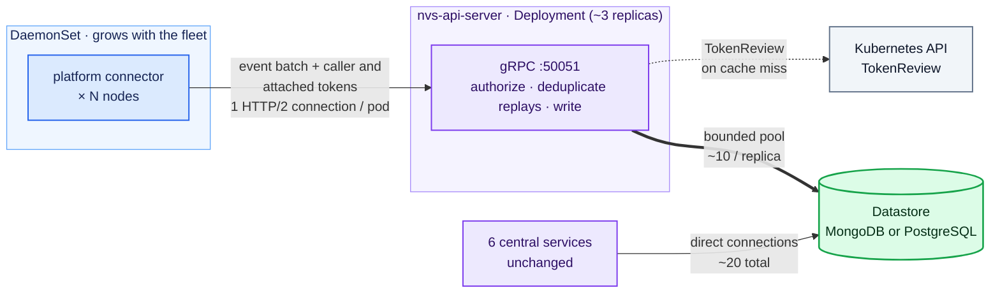
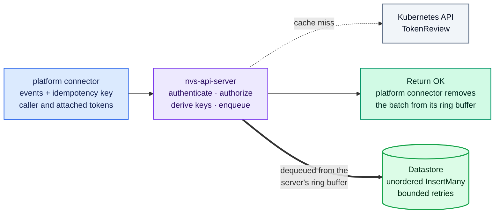
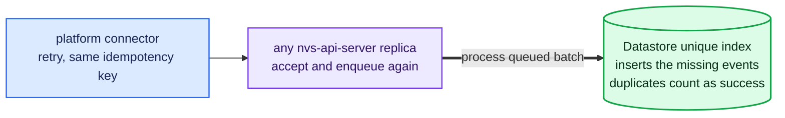
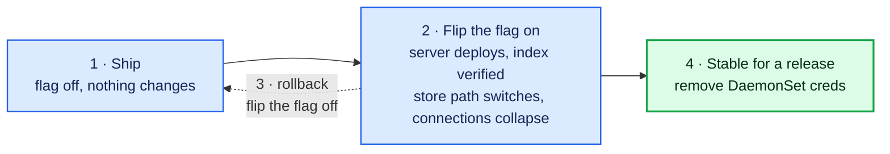
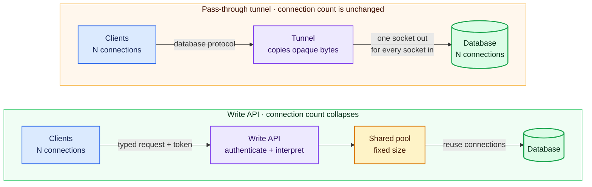

# ADR-050: NVS API Server

## Context

Every NVSentinel component that needs the datastore connects to MongoDB (or
PostgreSQL) through the shared `store-client` library. Most of these components
are small, single-replica Deployments. The platform connector is the exception. It
runs as a DaemonSet with one pod on every node, and each pod opens its own
database connections.

Each platform connector pod holds about 3 MongoDB connections. These include
heartbeat connections that the driver maintains to each replica set member
and connections used for writes. Each open connection consumes roughly 0.2 MB
of database memory, even when idle. Because the number of pods grows with the
fleet, so does the number of connections:

| Fleet size    | Connections from platform connectors |
|---------------|---------------------------------------|
| 1,000 nodes   | ~3,000                                |
| 10,000 nodes  | ~30,000                               |
| 100,000 nodes | ~300,000                              |

At 100,000 nodes, MongoDB spends about 61 GiB of memory just keeping those
connections open, before storing a single byte of data
([issue #1595](https://github.com/NVIDIA/NVSentinel/issues/1595)).

This can be fixed because each pod uses those connections for only one task.
The platform connector store connector
(`platform-connectors/pkg/connectors/store/store_connector.go`) performs
exactly one operation: batched inserts of health events. It never reads.

The other datastore clients are few in number but use a broader set of
database features. Six single-replica Deployments (fault-quarantine, node-drainer,
health-events-analyzer, fault-remediation, event-exporter, csp-health-monitor)
use change streams, resume tokens, queries, updates, and aggregations. Together,
they hold a small, constant number of connections (~20) no matter how large
the fleet is. They are not part of the scaling problem, and this design
leaves them untouched.


Issue #1595 originally proposed deploying
[mongobetween](https://github.com/coinbase/mongobetween), a third-party
MongoDB connection pooler by Coinbase. This ADR proposes building our own
component instead. The review of mongobetween, including the reasons for not
using it, appears under "Alternatives Considered".

Options considered:

1. Deploy `mongobetween` as-is.
2. Build an NVSentinel nvs-api-server that exposes a gRPC write API for
   platform connectors, while the central services keep connecting to the
   database directly as they do today. This is the proposal, and the server
   reuses the platform connector's code instead of introducing a separate
   implementation (see "How the server is built").
3. Extend the nvs-api-server with a pass-through tunnel for the central
   services' traffic. This is deferred because it adds network control but
   does not solve the connection-scaling problem. It is described under
   "Future scope: a pass-through tunnel for the central services" instead.

Background on why a write API collapses connections while a pass-through
tunnel cannot is in the appendix.

## Decision

Build the **nvs-api-server**, a central service that exposes a gRPC write
API. The service is a second binary assembled from the platform connector's
existing packages, with only the changes required for its central role (see
"How the server is built"). Platform connectors send health events to this
service, authenticating every request with projected ServiceAccount tokens.
The nvs-api-server writes the events through `store-client` using a small,
fixed connection pool. The six central services continue to connect directly
to the database.

## Implementation

### Architecture



This architecture makes the write path's connection count independent of
fleet size. At 100,000 nodes, it drops from roughly 300,000 database
connections to a few dozen. One detail affects
this estimate: MongoDB applies `maxPoolSize` per server, not per client. For a
write-only workload, the pool fills on the primary. Each nvs-api-server replica
therefore holds about 10 pooled connections, plus a few monitoring connections
to each replica set member. This is about 16 connections per replica, or 50
across 3 replicas. Even if the pools filled on every member of a 3-member set,
the theoretical ceiling would be about 110. The central services retain their
~20 direct connections.

### How the server is built

The nvs-api-server is assembled from the platform connector's existing
packages rather than written from scratch. It reuses the same gRPC service
implementation, ring buffer, and store connector. The source is shared at the
package level, not copied, so the two binaries cannot drift because of manual
copying. A proof of concept using this approach was tested end to end on a kind
cluster. It covered authentication, idempotency, connection collapse,
change-stream delivery, and rollback. The central role requires the following
changes, all of which were either implemented in or identified by the proof of
concept:

| Change for the central role | Why |
|-----------------------------|-----|
| TCP listener with TLS, serving the same `PlatformConnector` gRPC service | Replaces the node-local Unix socket |
| Interceptor that validates the caller token and the attached token (see "Authentication on the write API") | Replaces the existing node-binding check. In the DaemonSet, that check uses the pod's node because callers and connectors share a node. A central pod's assigned node is unrelated to the caller or event, so it cannot provide that reference. Each batch's attached token provides the node scope instead. |
| Per-event idempotency keys stamped from the `idempotency-key` header before enqueueing | See "The write API" |
| Event pipeline and k8s connector disabled | Transformation, deduplication, and node-condition updates stay in the DaemonSet; the central binary handles persistence only |
| Remove the store connector's node-name requirement | The connector currently refuses to start without a node name, but a central pod is not tied to one node |
| gRPC `MaxConnectionAge`/`MaxConnectionIdle` and bounded graceful shutdown | Manages connections at fleet scale (see "Scaling and availability") and prevents one unresponsive client from blocking shutdown indefinitely |
| Rename or relabel metrics | The reused packages export `platform_connector_*` metrics, which would collide with those from the DaemonSet |
| OpenTelemetry context extracted from the incoming call | The handler captures the caller's span context when it enqueues a batch, and the store connector stamps each stored document from a span linked to that capture. On the node, the publisher's request supplies the context. Centrally it must cross the gRPC hop, so the client sends its trace context and the server extracts it from the incoming call (see "The write API"). Without this, the stored IDs no longer belong to the caller's trace (all zeroes in the proof of concept), which breaks the trace links downstream consumers rely on |
| Add an ingress NetworkPolicy for the gRPC port | Namespaces with default isolation would otherwise block the new port |

Reusing the ring buffer preserves the current reply semantics: OK means that
the batch was accepted and queued, not that it was stored. This is the same
meaning that OK has on the node-local socket today. The server then writes the
batch from its own ring buffer using the existing bounded retry policy. The
new path therefore contains two short in-memory queues, both of which retry
and then drop a batch after reaching the configured limit. A crash can lose
the data still held in either queue. This is the same type of risk that exists
in the DaemonSet today, but it now exists in two places. "Alternatives
Considered" describes the option of writing before replying.

This reuse also supports the incremental absorption plan described under
"Future scope: absorbing the platform connector into the nvs-api-server."
Each later stage can enable code already included in the binary instead of
porting features to a separate implementation.

### The write API

The nvs-api-server implements the existing `PlatformConnector` gRPC service
(`data-models/protobufs/health_event.proto`, `HealthEventOccurredV1`). No new
service definition is needed. The platform connector already serves this API, and
the gRPC sink connector (ADR-033) already implements its client side.

On the platform connector side, the store path gains a new mode. Instead of
writing directly to the database through `store-client`, the store connector
sends the same batches to the nvs-api-server over gRPC. The existing gRPC sink
connector provides the starting point for this client. The new path preserves
the existing delivery guarantees:

- The current store connector retries a failed insert with backoff up to a
  configurable ceiling (`mongodbStore.maxRetries`, default 3) and then drops
  the batch; the optional external sink (ADR-033) behaves the same way. The
  new mode keeps these semantics and the same knob, so switching modes does
  not silently change delivery behavior.
- Because the nvs-api-server can fail independently of the database,
  deployments may want a higher retry ceiling for this mode; the
  ceiling stays configurable for exactly that reason. Making the store path
  stronger than today (retrying until success) would be an independent
  change and is out of scope here.
- An OK response from the nvs-api-server means accepted and queued, not stored,
  matching what OK means on the node-local socket today ("How the server is
  built" explains why).

Because the client retries, a batch could be stored twice if the server
accepted it but the OK response was lost. To prevent this, each batch carries
a client-generated idempotency key in the `idempotency-key` gRPC header,
following the standard
[HTTP Idempotency-Key](https://developer.mozilla.org/en-US/docs/Web/HTTP/Reference/Headers/Idempotency-Key)
semantics. The `HealthEvents` message itself does not change. The database
must enforce idempotency because a retry may reach a different nvs-api-server
replica. An in-memory check on one replica cannot account for batches handled
by another.

Idempotency is enforced per event rather than per batch because a batch can be
stored partially. MongoDB does not insert a batch atomically. Each document
insert is atomic, but documents written before a failure remain stored. A
bulk write has the same behavior because it is not a transaction. A database
transaction could make a batch atomic on either provider and remains an
acceptable implementation option. However, a transaction would not remove
the need for an idempotency key: the full batch could commit even if the client
never received the OK response, and the server must recognize the retry.

Each event therefore receives a unique key derived from the batch's
idempotency key and the event's position in that batch. A unique index enforces
the key, and inserts run unordered, treating duplicate-key errors as success.
A retry inserts only the missing events, regardless of which replica handles
it.

Three contract details are important. First, the key is stored with the batch
in the ring buffer so every retry reuses it. Second, the client must send the
same payload whenever it reuses a key. The server detects duplicates by key
and does not compare payloads, following the usual Idempotency-Key semantics.
Third, the unique index must exist before the server stores any batch. The
server creates or verifies the index before reporting ready. A batch sent
before then is retried according to the ring buffer's backoff policy (see
"Rollout plan"). The partial index covers only documents that contain the key,
so existing records require no backfill. Both MongoDB and PostgreSQL support
partial unique indexes.

**Normal write:**



**Retry if the OK response is lost:**



On the nvs-api-server, the handler validates the caller (see the next section),
adds the derived key to each event, and enqueues the batch. The same store
connector code that runs on every node then performs the write. It adds the
status, creation timestamp, and trace metadata before `InsertMany`, so both
paths produce the same document format. Event transformation and
deduplication remain unchanged in the platform connector pipeline. At this
stage, the nvs-api-server is only a persistence endpoint.

The move introduces two small semantic changes. First, the nvs-api-server
assigns the creation timestamp instead of the node. Second, trace continuity
must cross the gRPC hop explicitly. The store-mode client sends the batch's
span context through OpenTelemetry gRPC instrumentation. The shared
`grpcclient` currently attaches only authentication metadata, so the new client
must add this instrumentation. The nvs-api-server extracts the context and
stores the same trace fields as the current store connector: the batch trace ID
in `MetadataKeyTraceID`, and each event's span ID in
`HealthEventStatus.SpanIds` under the platform connector service key.
Downstream consumers read these fields, so both write paths must populate them
identically.

The nvs-api-server sets an explicit `maxPoolSize` on its database client. This
design requires three small changes to `store-client`:

1. Make pool limits configurable. MongoDB currently uses the driver default of
   100, while PostgreSQL is hardcoded to 25. The connection estimates in this
   document assume that the configured limit is applied.
2. Allow `InsertMany` to use unordered inserts and report duplicate-key errors
   per document. MongoDB uses ordered inserts by default, which stop at the
   first duplicate and would break the retry mechanism. The current interface
   exposes neither the unordered option nor the required error details.
3. Add a small index-management operation. The nvs-api-server must create or
   verify the partial unique index at startup before reporting ready (see
   "Rollout plan"), but `store-client` does not currently manage indexes.

"Scaling and availability" describes how connection handling and TokenReview
behave at fleet scale.

### Authentication on the write API

The write API reuses the ServiceAccount token mechanism that already
authenticates health event publishers to platform connectors
(`docs/configuration/authentication.md`) and the janitor to the
janitor-provider (ADR-030):

- Clients attach a projected, audience-scoped, short-lived ServiceAccount
  token to every request using `commons/pkg/grpcclient`.
- The nvs-api-server uses `commons/pkg/grpcauth`, including its result cache,
  to validate tokens through the Kubernetes TokenReview API. It uses a
  dedicated audience, such as `nvs-api-server.nvsentinel.nvidia.com`.
- The nvs-api-server accepts writes only from allowlisted identities. By
  default, the allowlist contains only the platform connector ServiceAccount
  derived from the release namespace, following the same pattern as publisher
  authentication.
- Tokens must be pod-bound, so a token extracted from a manifest or minted
  without a pod reference is refused.

A health event is deliberately authenticated at both network hops.
The platform connector validates the publisher because the event can also update
node conditions through the k8s connector. The nvs-api-server separately
validates its immediate caller so that only the platform connector pipeline
can write to the database; reaching the port is not sufficient. This matches
the hop-by-hop authentication used between janitor and janitor-provider. It is
an interim design. In the long-term plan described under "Future scope:
absorbing the platform connector into the nvs-api-server," publishers authenticate
directly to the central service, returning the event path to one TokenReview.

Cached verdicts limit the cost of the second review. "Scaling and availability"
provides the full calculation, including rate ceilings, cache capacity, and
retry limits.

Per-event node binding is also enforced at both hops. As a result, a stolen
platform connector token alone cannot be used to forge events about other
nodes. The first check remains at the platform connector: a publisher may report
events only about its own node unless its identity is on the cross-node
allowlist (`docs/configuration/authentication.md`).

The second check occurs at the nvs-api-server. Every batch carries an attached
token that defines its allowed node scope. If the publisher supplied a token,
the platform connector attaches it. For token-less callers on the local socket,
the platform connector instead attaches its own node-scoped token. This token is
minted for the platform connector audience alongside the caller token and
requires one additional projected volume on the DaemonSet.

The nvs-api-server applies the same authorization rule to every batch. If the
attached identity is on the cross-node allowlist, the batch may name any node.
Otherwise, every event must name the node in the attached token's claim. A
token stolen from node X therefore cannot submit an event about node Y. The
same restriction applies to an attacker who bypasses the platform connector and
calls the write API directly.

The attached token is never accepted as the caller credential. Every caller
must present a platform connector token minted for the nvs-api-server audience;
an attached token alone grants no access to the nvs-api-server.

The implementation uses two separate validators because the `grpcauth`
validator supports one audience. The caller validator uses the nvs-api-server
audience and allowlists the platform connector identity. The attachment
validator uses the platform connector audience, applies the cross-node
allowlist, and maintains its own cache. The attached token uses a separate
metadata key and is passed only to the attachment validator. This separation
prevents it from acting as a caller credential by construction.

Only four cluster-wide publishers have tokens that allow them to name other
nodes: csp-health-monitor, kubernetes-object-monitor, slurm-drain-monitor, and
health-events-analyzer. These publishers must run on system or control-plane
nodes, away from tenant GPU nodes. The publisher authentication
guide already recommends this placement. The charts should also enforce it
with a `nodeSelector` so the guarantee does not depend on where the scheduler
places a pod. With that enforcement, no token capable of naming another node
exists on a GPU node. An attacker with root access to a GPU node can obtain only
tokens scoped to that node and can submit events only about the node already
under their control. An attacker who compromises a system node could steal a
cross-node publisher token, but that attacker already controls the publisher;
the attachment does not grant additional authority.

An attached token can expire while its batch waits in the ring buffer during
an outage. Cross-node publishers use a longer lifetime through the existing
`tokenExpirationSeconds` setting; a lifetime of several hours is acceptable on
system nodes. For node-scoped tokens, the bounded retry window limits the
chance of expiry. If a token has expired, the batch is rejected and retried like
any other failed request. This dependency between token freshness and delivery
is temporary because absorption stage 2 removes the attachment.

For observability, the nvs-api-server counts each batch rejected for naming a
node outside the attached token's scope. It uses a dedicated violation reason
that follows the existing publisher authentication metric labels, and it logs
the caller identity. The metric intentionally omits a per-pod label to avoid
unbounded cardinality at fleet scale.

The token crosses the pod network in gRPC metadata, so the nvs-api-server uses
TLS by default. Cert-manager issues the server certificate, and
platform connectors verify it against the mounted CA bundle. This follows the
pattern used for janitor-provider (ADR-030) and the admission webhooks. TLS
protects tokens in transit. Short lifetimes, a single audience, pod binding,
and NetworkPolicies limit the impact if a token is still exposed.

The chart includes a NetworkPolicy that allows only platform connector pods to
reach the nvs-api-server port. As defense in depth, deployments should also
restrict database access to the existing clients and the nvs-api-server,
consistent with ADR-033.

### Scaling and availability

The nvs-api-server can scale horizontally for three reasons:

- It is stateless. All durable state, including the idempotency check, lives
  in the database, so any replica can serve any request and a retried batch
  can land on any replica.
- Each platform connector pod uses one HTTP/2 connection for all calls to the
  nvs-api-server. At 100,000 nodes, maintaining these idle HTTP/2 connections
  is much less expensive than maintaining 300,000 MongoDB connections. They
  also terminate at the nvs-api-server rather than the database.
- The nvs-api-server sets gRPC `MaxConnectionAge` and `MaxConnectionIdle`.
  `MaxConnectionAge` periodically reconnects long-lived clients so that load
  is redistributed and a new replica begins receiving traffic within minutes.
  `MaxConnectionIdle` closes inactive connections; many pods in a healthy,
  deduplicated fleet write infrequently. A pod reconnects automatically when
  it sends the next batch. Both settings use jitter to avoid synchronized
  reconnection bursts after fleet-wide events.

Each additional replica adds a small, fixed database cost: a bounded pool of
about 10 connections on the primary, plus monitoring connections to each
replica set member, bringing that replica's total to about 16. Service
capacity therefore grows with the replica count while the number of database
connections remains a small
multiple of that count. Replicas scale with workload rather than directly with
fleet size. A fixed replica count is sufficient initially; a horizontal pod
autoscaler can be added later if needed.

TokenReview is the other scaling concern. A token's lifetime (1 hour by
default, longer for the four cross-node publishers) determines when kubelet
rotates the token file. It does not determine the review rate. The verdict cache does:
`cacheTTL` in `commons/pkg/grpcauth` is 2 minutes for every token. In the
calculations below, a "window" means this 2-minute period. The cache is keyed
by token, with one caller token per pod:

- A cache hit is an in-memory lookup on the nvs-api-server and requires no
  network call. After the first request in a window, subsequent requests from
  that pod are cache hits.
- A cache miss costs one TokenReview round trip to the Kubernetes API
  server, typically a few milliseconds within the cluster. Each
  platform connector pod can cause at most one miss per 2 minutes, and only
  during windows in which it sends a batch. Only the request that triggers the
  miss waits those few milliseconds; every other request in the window is
  unaffected.

The rates below assume the 100,000-node target. The formula is the number of
pods that write during a window divided by 120 seconds. At 10,000 nodes, the
maximum is about 83 reviews per second.

| Fleet activity                                 | TokenReviews per second |
|------------------------------------------------|-------------------------|
| Every pod writes in every window (worst case)  | ~830 (~280 per replica) |
| 5% of pods write per window                    | ~40                     |
| Quiet fleet                                    | near zero               |
| Reconnect wave, transient until caches rewarm  | up to ~2,500            |

The worst case assumes that every node produces a new event every 2 minutes,
which should be rare after deduplication. Each replica has its own cache, but a
pod maintains one connection to one replica at a time, so the steady-state
ceiling still applies. A reconnection wave caused by connection-age or idle
timeouts can briefly multiply misses toward the number of pods times the
number of replicas. Jitter spreads these reconnections over time.

If this ceiling becomes a problem, the cache window can be increased. It is a
fixed constant in `grpcauth` today and requires a small code change. However,
a longer window also delays detecting a deleted pod because a cached verdict
skips TokenReview. For example, increasing the window to 10 minutes reduces
the review ceiling by a factor of five but may accept a deleted pod's token for
up to 10 minutes.

Two additional constants affect this calculation. First, `cacheMaxEntries`
limits the verdict cache to 4,096 entries per replica. With 100,000 nodes and 3
replicas, each replica handles roughly 33,000 active caller tokens. Batches
also carry attached tokens: about 3 publisher tokens per node, plus
the platform connector's own token. The cache capacity is currently fixed and must
be increased for fleet scale. Otherwise, evictions will cause far more misses
than the once-per-window estimate.

Second, a failed TokenReview retries with backoff for up to 8 seconds. During a
control-plane incident, retries can briefly push the Kubernetes API request
rate above the steady-state miss rate. Existing validator metrics distinguish
this condition from actual authentication failures.

This TokenReview load is not new to the system. With publisher authentication
enabled, the platform connector already performs about one TokenReview per monitor
pod per window. Monitors continuously resend results, which is why
deduplication exists. At roughly 3 node-local monitors per node, the current
load is about three times the additional load from the nvs-api-server.

### Helm and configuration

The NVSentinel chart gains a Deployment controlled by one feature flag:
`nvsApiServer.enabled`. Enabling the flag deploys the server and switches the
platform connector store path to it in the same upgrade. Disabling the flag
reverts both changes. No other configuration is required to adopt or abandon
the feature.

```yaml
nvsApiServer:
  enabled: false    # the feature flag: deploys the server and switches
                    # the platform connector store path to it
  replicas: 3
  grpcPort: 50051
  tls:
    enabled: true   # cert-manager issued server certificate (ADR-030 pattern)
  auth:
    audience: "nvs-api-server.nvsentinel.nvidia.com"
    tokenExpirationSeconds: 3600
    # attachment validation reuses global.platformConnectorAuth.audience
  datastore:
    maxPoolSize: 10   # database connections per replica

platformConnector:
  store:
    mode: auto        # auto | direct | nvs-api-server
```

The store connector gains three modes. `direct` preserves the current database
write path. `nvs-api-server` sends batches to the write API. The default,
`auto`, follows `nvsApiServer.enabled`. This default provides the single-flag
behavior and keeps the client and server configuration consistent. The
explicit modes support the staged rollout described below, in which the server
can run while clients remain pinned to `direct`.

### Rollout plan

The normal path is one flag with two states:

1. Ship with `nvsApiServer.enabled: false`. Nothing changes.
2. Enable the flag. The same upgrade deploys the server and switches the
   DaemonSet store path. Before reporting ready, the server creates or verifies
   the partial idempotency index. Existing records do not contain the key, so
   they are excluded from the partial index and require no backfill. If a batch
   is sent before the server becomes ready, the ring buffer retries it using
   the same backoff applied during a database restart. A fleet can safely run
   both paths during the rollout because they produce identical documents (see
   "The write API"). Deployments that need a longer transition window can
   increase the store path's retry limit.
3. To roll back, disable the flag. Platform connectors return to direct writes,
   and the server is removed. The DaemonSet retains its database credentials
   during this phase, so rollback requires no reprovisioning. Any data still in
   the server's ring buffer when it is removed can be lost, matching the
   bounded-loss risk of a server crash (see "How the server is built").
4. After the new path has been stable for a release, remove the database
   credentials from the DaemonSet. Only this step realizes the credential
   cleanup benefit, and from here a rollback first needs the credentials
   restored.

A staged rollout is available for fleets that want to observe the server before
routing traffic to it. Enable the server with
`platformConnector.store.mode: direct`, verify index creation and health with
no clients connected, and then return the mode to `auto`. The final state is
the same; the staged option only requires additional configuration changes.
The `direct` mode remains available until the nvs-api-server path has been
the default for long enough that no deployment depends on it. Deprecating the
DaemonSet itself is a separate, staged effort ("Future scope: absorbing the
platform connector into the nvs-api-server").



### Future scope: a pass-through tunnel for the central services

A later iteration could add an authenticated TCP pass-through tunnel to the
nvs-api-server for the central services' database traffic. The nvs-api-server
would validate a ServiceAccount token once per connection. A small preamble
frame would carry the token and intended database address. The server would
then copy bytes without interpreting them, allowing change streams,
transactions, and the database's end-to-end TLS and X.509 authentication to
continue working unchanged.

The tunnel would not reduce connection counts because every incoming
connection requires one outgoing connection. It is therefore outside this
iteration, which focuses on connection scaling. Its benefit would be network
control:

- Only the nvs-api-server needs reachability, DNS and firewall access to the
  database; every other service reaches only the nvs-api-server. This matters
  most with an external managed MongoDB (Atlas and similar), where a single
  controlled egress point to the external database is usually required.
- It provides a workload-identity gate in front of the database port for
  clusters that do not enforce NetworkPolicies (ADR-030 notes OCI as an
  example).
- It provides one place to freeze or redirect connections during a datastore
  migration.
- It makes every database connection attributable to a Kubernetes identity.

Two technical constraints are already known:

- A basic tunnel would be bypassed for replica sets because drivers discover
  member addresses from the replica set and connect to each member directly.
  `store-client` would therefore need a custom dialer that routes every
  connection through the tunnel and names the actual destination in the
  preamble.
- The nvs-api-server must check requested destinations against its
  configured database backends. Otherwise the tunnel is an authenticated
  relay to anywhere on the network.

This work should be reconsidered for deployments that use an external managed
database, run without NetworkPolicy enforcement, plan a datastore migration,
or must attribute database connections to workloads for auditing.

### Future scope: absorbing the platform connector into the nvs-api-server

The nvs-api-server is also the first step in a longer migration. The goal is to
move platform connector responsibilities into the central service gradually
until the per-node DaemonSet can be deprecated. The name nvs-api-server is
intentionally not datastore-specific and remains appropriate as the service's
role expands. Because the binary already contains the platform connector's
packages, each stage can enable existing code instead of porting it to another
implementation. The stages are:

1. Move the database write. This is the current iteration, described by the
   rest of this document: platform connector pods stop writing to the database
   and send their batches to the nvs-api-server instead. Every other
   responsibility (receiving publisher events and authenticating them,
   transformation, deduplication, node-condition updates) stays in the
   DaemonSet.
2. Move publisher authentication. Monitors publish directly to the central
   service over the network using tokens minted for its audience. The event
   path then returns from two TokenReviews to one, and the token attachment
   described in the authentication section is no longer needed.
3. Move node-condition updates handled by the k8s connector.
4. Move the remaining pipeline work, including transformation and
   deduplication, and then deprecate the DaemonSet.

Each stage requires its own design. The known challenges are:

- Monitors only send when the local Unix socket exists; that is how they
  detect that the platform connector is up. A networked receiver needs a new
  liveness signal.
- Publishers without tokens are accepted on the socket and pinned to the
  node. There is no network equivalent, so tokens become mandatory before
  authentication can move.
- Node binding changes meaning: from "the token was minted on my node" to
  "the token was minted on the node the event names".
- Node-name stamping for local callers needs a replacement.
- Connections grow from one platform connector per node to several monitor
  pods per node connecting to the central service. HTTP/2 connections require
  relatively few resources, but this still needs deliberate sizing.

These stages do not change the scope of the current iteration. They describe a
possible direction rather than a commitment and explain why the authentication
section treats the two-TokenReview state as temporary.

## Rationale

- Database connections stop growing with the fleet: at 100,000 nodes the write
  path drops from roughly 300,000 connections to about 50, freeing about
  61 GiB of database memory, while the central services stay unchanged.
- The required pieces already exist and have been tested: the
  `PlatformConnector` gRPC service and its client (ADR-033), the ServiceAccount
  token authentication stack from
  the publisher auth work and ADR-030 (`commons/pkg/grpcauth`,
  `commons/pkg/grpcclient`), and `store-client` for the actual writes. The
  server assembles the platform connector's packages into a second binary, so
  it inherits the existing write behavior instead of reimplementing it. A
  proof of concept using this design ran end to end on a kind cluster.
- Database credentials leave the fleet. Today, in deployments with X.509
  auth, every node's platform connector pod carries a database client
  certificate. After the rollout's final step no DaemonSet pod does (the
  credentials stay mounted during the transition so rollback stays a value
  flip), and rotation on the write path then touches 3 pods instead of the
  whole fleet.
- The write path becomes datastore-agnostic on the wire: the platform connector
  no longer needs to know whether the backend is MongoDB or PostgreSQL. The
  PostgreSQL provider benefits equally (its per-client pool is hardcoded to
  25 connections, which would scale even worse with the fleet).
- No dependency on an unmaintained third-party proxy, and no need to
  understand or re-implement the MongoDB wire protocol.

## Consequences

### Positive

- Connection count and database connection memory stop growing with the fleet.
- The write path uses the standard NVSentinel token mechanism to authenticate
  every request. Today, a stolen database credential alone is sufficient to
  write data.
- Node binding survives token theft: every token on a GPU node is scoped to
  that node, so a stolen token can only submit events about the node the
  attacker already controls. Naming other nodes requires an allowlisted
  publisher token, which exists only on system nodes.
- The read path remains unchanged. An nvs-api-server outage can delay writes
  but cannot affect change streams or the central services.
- A foundation for later iterations (the pass-through tunnel, or purpose-built
  APIs for other clients) without a big-bang rewrite.

### Negative

- A new component sits on the critical write path. If the nvs-api-server is
  unavailable, health events cannot reach the database until it returns. The
  same bounded retry window used for database outages applies.
- The write path gains one network hop of latency.
- At large fleet sizes, the nvs-api-server must handle many concurrent gRPC
  connections. It must be sized, monitored, and included in alerting.
- The token attachment is interim machinery by design: absorption
  stage 2 makes it unnecessary, so it is built knowing it will be removed.
- The platform connector's packages now ship in two workloads: a DaemonSet and
  a central Deployment. Although they share code, they require distinct metric
  names, configurations, and dashboards.

### Mitigations

- The platform connector ring buffer already absorbs store outages. Batches
  use the same backoff and retry policy for an nvs-api-server restart as for a
  database restart. The nvs-api-server runs multiple replicas with
  anti-affinity and a PodDisruptionBudget. Deployments that need a longer
  recovery window can increase the retry limit.
- The added hop is microseconds to low milliseconds inside a cluster, against
  a write path whose RPC timeout is 10 seconds; it does not change any
  user-visible latency.
- HTTP/2 connections require relatively few resources, and the nvs-api-server
  is stateless because durable state lives in the database. It can therefore
  scale horizontally. Standard gRPC and authentication metrics, using the same
  families as ADR-033 and the publisher authentication work, provide
  observability.

## Alternatives Considered

### Write the nvs-api-server from scratch as a purpose-built service

An earlier revision described a new, small service with its own handler for the
existing gRPC interface. It would copy the store connector's document-wrapping
logic, perform the write within the request, and return OK only after the insert
succeeded.

**Rejected in favor of assembling the server from the platform connector's
own packages.** The migration requires both write paths to produce the same
document shape and use the same retry and drop behavior. Sharing the code
guarantees this behavior, while a separate implementation could drift. Reuse
also limits the new code to configuration, the listener, the authentication
interceptor, and idempotency-key handling. It supports the incremental
absorption plan because each stage can enable code already in the binary.

The purpose-built option would provide a stronger response contract: OK would
mean stored rather than accepted. However, this would change the meaning of OK
while the fleet was transitioning between paths and would keep each request
open during the write and its retries. Preserving the existing contract during
migration was considered safer. A later change could still make the assembled
server write synchronously through the store connector instead of enqueueing.

### Deploy mongobetween as-is

**Rejected** because:

- Clients cannot authenticate to it by design: its handshake advertises no
  authentication mechanisms. Database credentials in the proxy would
  therefore be protected only by network reachability, which does not satisfy
  the requirement to authenticate callers with ServiceAccount tokens.
- It fronts `mongos` shard routers, and its README describes direct replica set
  use as not battle tested. NVSentinel's default deployment is a replica set.
- It is MongoDB-only, while NVSentinel also supports PostgreSQL.
- It has been unmaintained for about two years and remains on Go 1.18. It uses
  reflection to access private structures in the Go driver, and its handshake
  is fixed at the MongoDB 4.2 wire version.

Its lessons and parts of its code remain reusable (Apache 2.0) if a pooled
MongoDB-protocol endpoint is ever needed.

### Forward the publishers' tokens instead of authenticating the platform connector

In this option, the platform connector would store each publisher token with its
batch and forward the token to the nvs-api-server. Only the nvs-api-server would
then perform TokenReview, reducing the write path from two reviews to one.

**Rejected** because it moves a review rather than removing one and weakens the
token model.

- The platform connector must validate publishers no matter what, because the
  same events also update node conditions through the k8s connector, in
  parallel with the store path. If validation moved downstream, a fake event
  could change a node condition even if the nvs-api-server later rejected it.
- The nvs-api-server must still authenticate its own caller. If it accepted
  forwarded monitor tokens, anyone holding a captured monitor token could
  write events directly to it, bypassing deduplication, node conditions and
  the rest of the pipeline. Its check exists to authenticate the pipeline,
  not the original reporter.
- Monitor tokens are minted for the platform connector audience. Accepting
  them as the caller credential at the nvs-api-server would make a token
  issued for one service open the door of another, which audiences exist to
  prevent; minting every monitor a second token for the nvs-api-server
  audience would instead turn every monitor ServiceAccount into a valid
  writer there. Either way, more identities are trusted, not fewer.
- A forwarded token is a snapshot taken at submission. Tokens expire and
  rotate on their own schedule while batches wait in the ring buffer and
  retry, so legitimately accepted events could be rejected at delivery time
  through no fault of the publisher.

Hop-by-hop authentication requires each service to validate its immediate
caller and matches the existing janitor-to-janitor-provider pattern. Cached
results limit the second review to roughly one TokenReview per
platform connector pod per cache window, rather than one per request. "Scaling
and availability" provides the calculation. The future absorption plan reaches
a single-review state by having publishers authenticate directly to the central
service, not by forwarding tokens.

This differs from the attachment used by the selected design. The selected
design attaches a token only as evidence of node scope, in addition to the
authentication performed at both hops. The attached token never replaces
authentication or acts as a caller credential. This rejected alternative
would instead replace authentication at the platform connector hop by
forwarding the token.

## Notes

- Non-goal: changing the event pipeline (transformation and deduplication
  stay in platform connectors) or the shape of stored events, beyond the
  added idempotency key and its unique index. The `store-client` changes
  are limited to the three prerequisites named in the write API section.
- Non-goal: a general query API. The central services keep their direct
  database connections in this iteration.
- Non-goal: a pooled MongoDB-protocol endpoint. If one is ever needed,
  mongobetween is the reference implementation to borrow from (Apache 2.0).
- The external gRPC sink use case from ADR-033 is unchanged; the nvs-api-server
  reuses its client pattern for the store path.

## References

- [Issue #1595: Deploy a MongoDB connection proxy to keep connection count constant as fleet scales](https://github.com/NVIDIA/NVSentinel/issues/1595)
- [mongobetween](https://github.com/coinbase/mongobetween) and Coinbase's
  [scaling write-up](https://blog.coinbase.com/scaling-connections-with-ruby-and-mongodb-99204dbf8857)
- [ADR-033: gRPC Sink Connector for Platform-Connectors](033-grpc-sink-connector.md)
- [ADR-030 file: gRPC TLS and Authentication for Janitor-Provider Connection](030-grpc-tls-authentication.md)
- [Publisher authentication reference](../configuration/authentication.md)
- [ADR-002: Storage Layer Selection](002-storage-layer-selection.md)

## Appendix: a middleman can do one of two jobs

A service between clients and a database can operate in two ways. The choice
determines whether it can reduce database connections.

A **pass-through tunnel** accepts a client connection, opens a corresponding
database connection, and copies bytes in both directions without interpreting
them. Database features such as change streams, cursors, transactions, and
end-to-end TLS continue to work because the protocol is unchanged. However,
each client connection still requires its own database connection. Sharing a
connection would require understanding request boundaries and routing each
response to the correct client. A tunnel therefore provides one controlled
network path but does not reduce the connection count.

An **API in front of the database** accepts application-level requests instead
of database-protocol connections. For example, a client sends a request to
store a batch of health events and includes its token. The API validates the
token and performs the write through a small shared connection pool. Because
the API understands each request, it can serve 100,000 clients with a small number
of database connections. The tradeoff is that it supports only the operations
implemented by the API.



The platform connector requires the API approach because it is the only option that
reduces connections as the fleet grows. A tunnel could give the central
services a controlled network path, but it would not reduce their connection
count. It therefore remains future scope rather than part of this design.
