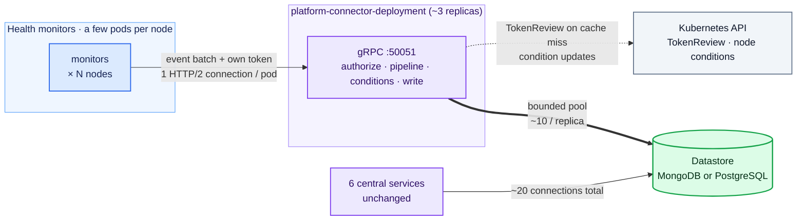
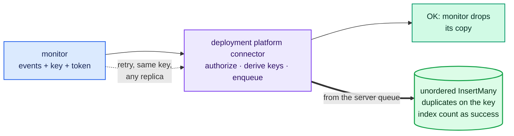
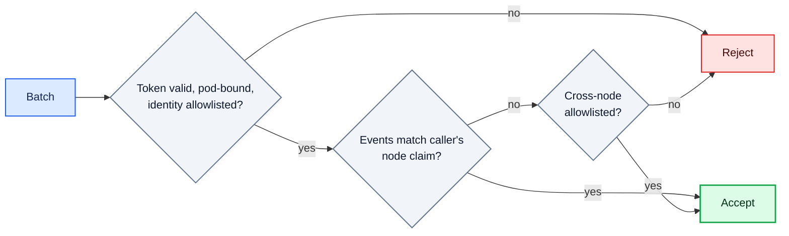
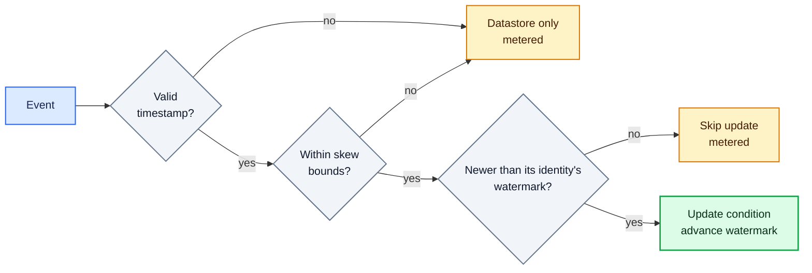
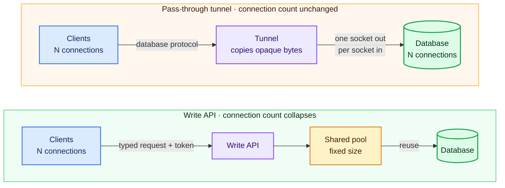

# ADR-052: Deployment Platform Connector

## Summary

- **This mode will not be the default.** It is meant for large fleets; small clusters lose nothing by staying on the default DaemonSet setup.
- The cost that motivates it: every platform connector pod opens about 3 database connections, all landing on the MongoDB primary; at 100,000 nodes that is about 300,000 connections, pushing the primary's memory limit to 91 GiB ([issue #1595](https://github.com/NVIDIA/NVSentinel/issues/1595)).
- The platform connector gets a new mode: a small central Deployment (the **deployment platform connector**) that health monitors publish their health events to directly over gRPC.
- Each monitor authenticates every request with its own projected ServiceAccount token, and its events stay pinned to the node the token was minted on.
- The central service runs the same pipeline, node condition updates and datastore writes as today, through a small fixed pool of database connections.
- It is the same platform connector binary and image, selected by a mode flag; there is no second build or release path.
- Monitors keep their events through outages: each client holds a bounded retry queue, every batch carries an idempotency key, and the datastore enforces that key with a unique index, so a retried batch is never stored twice.
- Events from one node are applied in the order they were sent, and a per-fault-identity watermark lets several replicas update node conditions concurrently without an older, delayed event overwriting a newer one.
- The server protects itself with per-node and per-identity quotas and tells a rejected client why and when to retry, so one noisy node or component cannot crowd out the rest.
- Only the few components that legitimately report about other nodes may name them, through an allowlist backed by a runtime node-label check; every other caller is pinned to the node its token was minted on.
- Database connections stop growing with the fleet: about 300,000 connections at 100,000 nodes become a handful.
- One global flag enables the mode and a per-monitor flag picks where each monitor publishes; rollout ordering and rollback are deliberately a separate design.

## Context

This ADR adds a deployment mode to the platform connector so that database connections stop growing with the fleet.

Every NVSentinel component that needs the datastore connects to MongoDB (or PostgreSQL) through the shared `store-client` library. Most of these components are small, single-replica Deployments. The platform connector is the exception: it runs as a DaemonSet with one pod on every node, and each pod opens its own database connections (about 3, and they land on the MongoDB primary). Each open connection costs roughly 0.27 MB of database memory even when idle, so the count grows with the fleet:

| Fleet size    | Connections from platform connectors |
|---------------|---------------------------------------|
| 1,000 nodes   | ~3,000                                |
| 10,000 nodes  | ~30,000                               |
| 100,000 nodes | ~300,000                              |

At 100,000 nodes, just keeping those connections open pushes the primary's memory limit to 91 GiB ([issue #1595](https://github.com/NVIDIA/NVSentinel/issues/1595)).

Each pod uses those connections for one task: the store connector (`platform-connectors/pkg/connectors/store/store_connector.go`) performs batched inserts of health events and never reads. The six central services (fault-quarantine, node-drainer, health-events-analyzer, fault-remediation, event-exporter, csp-health-monitor) use change streams, queries and updates, hold about 20 connections regardless of fleet size, and their database connections are untouched by this design (two of them also publish health events, so their publish path changes like any monitor's).

Options considered:

1. Deploy [mongobetween](https://github.com/coinbase/mongobetween), the third-party MongoDB connection pooler issue #1595 originally proposed. Rejected; the review is under ["Alternatives Considered"](#alternatives-considered).
2. Run the platform connector as a central Deployment that health monitors publish to directly, so the per-node DaemonSet (and its per-node database connections) can be removed. This is the proposal.

Background on why a write API collapses connections while a pass-through tunnel cannot is in ["Appendix: a middleman can do one of two jobs"](#appendix-a-middleman-can-do-one-of-two-jobs).

## Decision

Run the platform connector as a small central Deployment, the **deployment platform connector**. Health monitors publish their health events directly to it over gRPC, authenticating every request with projected ServiceAccount tokens. It runs the event pipeline, updates node conditions, and writes to the datastore through `store-client` with a small fixed connection pool. The per-node DaemonSet is no longer needed; the six central services keep connecting to the database directly.

The switchover is controlled by a single global flag, with a per-monitor flag to select where each monitor publishes. Rollout mechanics (ordering, staging, rollback procedure) are deliberately out of scope for this ADR and will be designed separately once the end state is agreed.

Throughout this document, "deployment platform connector" means the platform connector running as this central Deployment; the Kubernetes objects are named `platform-connector-deployment` so they cannot collide with the DaemonSet's.

## Implementation

### Architecture



The write path's connection count becomes independent of fleet size: at 100,000 nodes it drops from roughly 300,000 connections to a few dozen. MongoDB applies `maxPoolSize` per server and a write-only workload fills the pool on the primary, so each server replica holds about 10 pooled connections plus a few monitoring connections per replica set member, about 16 per server replica or 50 across 3. The central services retain their ~20.

### How the Deployment differs from the DaemonSet

The deployment platform connector and the DaemonSet are one binary and one image, selected by a mode flag: the central role adds the code changes below, so the shared binary grows, but there is no second build, image or release path. It reuses the gRPC service implementation, ring buffer, event pipeline, k8s connector and store connector; the pipeline and condition updates simply run centrally, since the events now arrive centrally. The central role requires these changes:

| Change for the central role | Why |
|-----------------------------|-----|
| A mode flag selecting the central role | One image, one extra argument; the config surface and metric names stay separate per role |
| A bound on the ingest queue | The reused queue is unbounded, acceptable for one node's events but not the fleet's during a datastore outage; see ["Admission control"](#admission-control) |
| TCP listener with TLS, serving the same `PlatformConnector` gRPC service | Replaces the node-local Unix socket |
| Node metadata lookups move from per-node GET calls to a shared informer | The per-node read pattern multiplies Kubernetes API calls at fleet scale (["The pipeline runs centrally"](#the-pipeline-runs-centrally)) |
| Caller authentication pinned to the token's node claim | Replaces the node-binding check, which compares against the pod's own node and means nothing centrally (["Authentication"](#authentication)) |
| Per-event idempotency keys | Monitors retry over the network, so replays must be detectable (["Idempotency"](#idempotency)) |
| Remove the store connector's node-name requirement | A central pod is not tied to one node |
| gRPC `MaxConnectionAge`/`MaxConnectionIdle`, jittered, and bounded graceful shutdown | Manages connections at fleet scale and prevents one unresponsive client from blocking shutdown |
| A fleet observability contract | The reused packages log payloads and every auth success at info and label metrics by node: fine per node, a volume and cardinality problem centrally. Centrally: no payloads at info, auth success sampled or debug, rejections audited, node and pod labels dropped or bounded |
| Configurable worker pools | The reused consume loops are single-worker. The store pool writes concurrently (safe under per-event idempotency); the k8s pool partitions by node name to keep each node's condition updates ordered |
| OpenTelemetry context extracted from the incoming call | Without extraction the stored trace fields are zeroes and downstream trace links break |
| An ingress NetworkPolicy for the gRPC port | Namespaces with default isolation would otherwise block it |

#### Reply semantics: what OK means

Reusing the ring buffer preserves the current reply semantics: OK means the batch was accepted and queued, not stored, the same meaning OK has on the node-local socket today. The server then writes from its queue under an elapsed-time budget (`platformConnector.deployment.datastore.retryWindow`) and drops batches that outlive it. A replica crash loses whatever its queue holds, the same in-memory loss the DaemonSet's ring buffer has today; the planned fix is backing the queue with disk (["Future scope: a disk-backed queue"](#future-scope-a-disk-backed-queue)). "Alternatives Considered" records the option of writing before replying.

#### Admission control

The reused queue is unbounded, which is harmless for one node's events but not the fleet's during a datastore outage. The central role adds admission control:

- The bound is in items and bytes and covers everything the server holds: queued, in flight, and waiting on a retry. Request-size, per-batch event count and distinct-node limits keep single requests bounded. Counting bytes accurately, and enforcing the size limit before decoding a request, are requirements on the implementation, not tunables.
- Admission happens before any side effect: capacity is reserved across every queue the server feeds (store, Kubernetes, optional sink) at once, and nothing (including pipeline dedup state) is mutated for a rejected batch.
- Quota is keyed by the caller token's node claim, in batches and bytes; cross-node callers draw from a per-identity quota counted in events. Quotas are enforced per replica, so the effective fleet bound is the configured value times the replica count, and the values are sized with that multiplier in mind.
- Rejection is typed, because the correct client reaction differs: admission rejections return RESOURCE_EXHAUSTED with a reason and a retry delay. A replica-full rejection makes the client reconnect (gRPC balances only at connection establishment, so a client pinned to a saturated replica would otherwise retry it forever); a quota rejection makes it back off on the same connection. Rejected clients back off with jitter.
- A full server pushes pressure back into the monitors' bounded client queues (["What a monitor needs"](#what-a-monitor-needs)).

These limits, with the caches and informer, sum to a pod resource target from which the chart's resource requests are derived.

#### Replica lifecycle

Acknowledged batches live in pod memory, so a replica drains its queues before every planned way it stops:

- Draining is measured by an outstanding-admissions gauge, not queue length (the workqueue reads zero while writes are in flight); a reservation is held from acceptance until every side effect completes or is abandoned. The Kubernetes side keeps its existing bounded retry ceiling, and the grace period is sized to the datastore window, the longer budget.
- On termination a replica turns unready, stops admitting, and drains to zero bounded by a `terminationGracePeriodSeconds` sized to the datastore retry window; whatever the bound forces it to abandon is counted under a forced-drop metric.
- Rolling updates use `maxSurge: 0` with `maxUnavailable: 1`, which serializes drains; scale-down goes one replica at a time; the PodDisruptionBudget covers Eviction-API disruptions; replicas spread with anti-affinity so one node failure cannot take several queues at once.

A crash (OOM kill, process fault, node failure) skips the drain; the loss is bounded by the admission limits but not metered per batch: it shows up only as the gap between client send counts and stored documents, the price of acknowledging before persistence, listed under negative consequences.

### The write API

The deployment platform connector serves the existing `PlatformConnector` gRPC service (`data-models/protobufs/health_event.proto`, `HealthEventOccurredV1`), which the DaemonSet already serves on the socket; no new service definition is needed. Monitors switch the target from the socket path to the service address: a standard ClusterIP Service (`platform-connector-deployment`, resolved by cluster DNS and carried in each monitor chart's configuration, with the same names in the server certificate). gRPC clients hold one connection each and are balanced only at TCP establishment by the Service, which is why replica-full rejections force a reconnect and why `MaxConnectionAge` recycles connections.

#### Delivery guarantees

- A monitor's publishing client retries a failed send with backoff for an elapsed-time window (minutes by default) and then drops the batch: bounded best-effort, the same terminal behavior the store path has today, with the window sized to ride out server restarts and rollouts.
- The window covers only the path up to the server's OK. After OK the client's copy is gone and a separate server-side budget (`platformConnector.deployment.datastore.retryWindow`) governs the datastore write. The two budgets protect different failures and neither implies the other.
- The client contract by status code: transport failures, UNAVAILABLE and deadline expiries retry with backoff inside the window (the idempotency key makes repeats safe); RESOURCE_EXHAUSTED follows the typed admission reasons, and UNAVAILABLE keeps its transport meaning and never signals admission; authentication and authorization failures also retry within the window, since a validator flap is indistinguishable from a real rejection and the window bounds both.
- OK means accepted and queued, not stored (["Reply semantics"](#reply-semantics-what-ok-means)).

Delivery is best effort within the retry windows, and the datastore suppresses duplicates. Events can also persist out of generation order and up to the two windows late (concurrent workers, several replicas, retries), so consumers must order by the event's own `generatedTimestamp` rather than insertion order, as the condition guard does. Fault-quarantine and health-events-analyzer act on change-stream events in insertion order today with no staleness guard. Before the switchover, either each gains a guard on the last `generatedTimestamp` seen per fault identity (the datastore analogue of the condition guard under "Node condition updates"), or the server preserves per-node insert order with node-sticky single-worker store queues. One of these, not an open-ended investigation, gates the switchover. Kubernetes side effects follow the same shape: they run zero or more times, replays are kept idempotent by the ordering guard, and an occasional duplicate informational node Event is accepted. The datastore write and the Kubernetes side effects complete independently after OK; one can succeed while the other exhausts its budget. That divergence is accepted and observable through a counter of each completion combination, including the awkward direction where a node condition exists with no stored document behind it; making the outcomes atomic would mean ordering Kubernetes effects after datastore success and holding batches through datastore outages, an availability trade this design does not take.

#### Idempotency

Because clients retry, a batch could be stored twice if the server accepted it but the OK response was lost. Every batch therefore carries a client-generated idempotency key in the `idempotency-key` gRPC header, following the standard [HTTP Idempotency-Key](https://developer.mozilla.org/en-US/docs/Web/HTTP/Reference/Headers/Idempotency-Key) semantics; the key is mandatory for every caller. The database must enforce idempotency because a retry may reach a different replica; an in-memory check on one replica cannot see batches handled by another.

Enforcement is per event rather than per batch, because MongoDB does not insert a batch atomically: documents written before a failure remain stored (a bulk write behaves the same way, and a transaction would still not remove the need for the key, since a committed batch whose OK was lost still gets retried). The server derives each event's key from the caller's pod UID, the client's key and the event's position in the batch, so keys are scoped to the producer and two callers reusing the same key cannot collide or suppress each other's writes; retries keep working because a batch only ever retries from the pod that queued it. It validates the client key's format, always overwrites the metadata field rather than trusting an incoming value, and rejects missing keys. A partial unique index enforces the key, inserts run unordered, and a duplicate on the idempotency index counts as success (a duplicate on any other unique constraint stays an error), so a retry inserts only the missing events on whichever replica handles it.

Contract details:

1. The client holds the key stable for the whole retry window and must send the same payload whenever it reuses a key; the server detects duplicates by key and does not compare payloads (a payload fingerprint that would surface key misuse is recorded as optional hardening).
2. The index is created once by a plain release Job with no Helm hooks (a post-install hook deadlocks under `helm --wait`, and GitOps engines map hooks to sync phases unreliably), named by a hash of its migration content so a changed migration produces a new Job despite Job immutability. The Job retries internally until the datastore accepts, and the build never runs independently in every replica: a unique index build over an existing collection is expensive, and PostgreSQL's `CREATE INDEX CONCURRENTLY` cannot run in a transaction.
3. Every replica verifies the full index definition (key path, uniqueness, partial predicate, build completion) before reporting ready, so clients are held off until the index exists. The partial index covers only documents that contain the key, so existing records need no backfill; both MongoDB and PostgreSQL support partial unique indexes.

**Normal write and retry:**



#### Document shape and traces

The handler validates the caller, derives the per-event keys, runs the pipeline, and enqueues; the same store connector code that runs on every node today performs the write, so the document shape stays backward compatible, with the idempotency key added to the event's metadata and the creation timestamp assigned centrally. Trace continuity crosses the gRPC hop explicitly: the publishing client sends the batch's span context (an addition to the shared `grpcclient`), the server extracts it and stores the same trace fields the store connector writes today; without extraction the stored IDs are zeroes.

#### Changes required in store-client

1. Make pool limits configurable (MongoDB currently uses the driver default of 100; PostgreSQL is hardcoded to 25). The connection estimates in this document assume the configured limit is applied.
2. Allow unordered `InsertMany` reporting duplicate-key errors per document and identifying the violated index, so only idempotency-index duplicates count as success.
3. Add a small index-management operation (create once, verify full definition), since `store-client` does not currently manage indexes.

### Authentication

The write API reuses the ServiceAccount token mechanism that already authenticates publishers to the platform connector today (`docs/configuration/authentication.md`, ADR-030), relocated to the central service. This keeps the event path at exactly one token validation, the same count as today:

- Every monitor attaches a projected, audience-scoped, short-lived, pod-bound ServiceAccount token to every request using `commons/pkg/grpcclient`. Tokens that are not pod-bound are refused.
- The server validates tokens through the Kubernetes TokenReview API with `commons/pkg/grpcauth` and its verdict cache, under a dedicated audience (`platform-connector-deployment.nvsentinel.nvidia.com`), and accepts writes only from allowlisted monitor identities, derived from the release namespace.
- Every batch is pinned to its caller token's node claim: a token minted on node X carries authority over node X only, wherever it is presented. A token without a node claim cannot scope events and is rejected.
- Only the cluster-wide publishers that legitimately report about other nodes (csp-health-monitor, kubernetes-object-monitor, slurm-drain-monitor, health-events-analyzer) go on a cross-node allowlist that lifts the pinning for their own token; the chart derives their identities from the enabled components, with `crossNodePublishers` as an override.

If TokenReview itself is unavailable, the server fails closed: requests are rejected and clients retry within their windows, bridged by the two-minute verdict cache and the validator's own retries. The socket path's degraded fall-open-to-own-node mode has no central equivalent, because a central replica has no own node to pin events to; an audit (log-only) enforcement mode mirroring the socket path's remains available for bring-up.



#### Placement is enforced, not recommended

The four cross-node publishers must run on system or control-plane nodes, away from tenant GPU nodes; this design makes the existing placement recommendation an invariant. Enabling any cross-node identity requires an administrator-controlled system-node selector; the chart rejects a cross-node allowlist with an empty one. The selector must use a label under the `node-restriction.kubernetes.io/` prefix, which a node's own kubelet cannot set (the Node authorizer with the NodeRestriction admission plugin is a prerequisite). As a runtime backstop, the server grants cross-node scope only when the caller's node claim matches a node the selector currently selects. The result: every credential on a GPU node authorizes events about that node only.

#### Transport security and observability

Tokens cross the pod network in gRPC metadata, so TLS is an invariant, not a toggle: the chart refuses a plaintext listener unless an explicitly named insecure development mode is set. Cert-manager issues the server certificate, clients verify it against the mounted CA bundle (the ADR-030 pattern), and the server reloads the certificate per handshake so rotation needs no restart. A NetworkPolicy admits only publisher pods to the gRPC port (every publishing component labels its pods for it, including the central publishers health-events-analyzer and csp-health-monitor), and as defense in depth deployments should also restrict database access to the existing clients and the deployment platform connector, consistent with ADR-033. Scope violations are counted under a dedicated rejection reason and logged with the caller identity, without per-pod metric labels. Liveness is process health only; readiness is index-verified and not-draining, and replicas stay ready while full or during a datastore outage (rejecting or buffering with backpressure) so the Service never empties. The alertable signals are the forced-drop counter, admission rejections, the outstanding-admissions gauge and queue pressure.

### Node condition updates

The k8s connector runs centrally, sharing one informer cache instead of every node performing its own reads. Correctness with several replicas needs one guard, not routing: the update loop already re-reads the node and retries on conflict, so the Kubernetes API server's optimistic concurrency prevents two replicas from corrupting each other's writes, and the remaining gap is a replica re-applying an older event after a conflict re-read.

The guard's granularity is the fault identity, the same key the condition's message aggregation uses (the entity set and error code within a check). Each identity's last-applied time is recorded with its entry in the condition, and the filter is per event: discard an event at or below its own identity's watermark, apply the rest in order, advance each identity's watermark. Watermarks are encoded compactly alongside the condition's message entries. A fixed share of the condition-message length limit is reserved for fault text, and the records may use all of the rest, so fault text is shortened before any guard record is dropped. Records are kept after an identity clears, for far longer than the delivery retry window, so a delayed stale fault cannot resurrect a cleared entry while its record survives. A record is dropped only when more identities clear at once than the message can hold; the drop is metered, and in that rare case a delayed stale fault can reappear briefly until the monitor's next periodic publish sets the condition right again. Coarser granularities fail both ways: a batch-level check lets a mixed delayed batch resurrect a cleared fault, and a condition-wide watermark discards a delayed GPU-0 fault merely because a GPU-1 event arrived later. Equal values are skipped too, an accepted trade (equality cannot distinguish a replay from a distinct same-nanosecond event); monitors' own timestamps are monotonic, making that vanishingly rare, and the skip is metered.

The ordering time is the event's own `generatedTimestamp`, the only value identical on every retry. An event with a missing or invalid timestamp is stored but never updates conditions, counted under its own metric. Broken clocks are bounded at the server: an event timestamp further in the future than a small bound, or older than the delivery retry window, is stored but excluded from condition updates and metered; the check runs on every attempt, since a stateless server cannot remember earlier attempts of the same batch. Two consequences are accepted: a fast clock can disturb condition ordering by at most its own skew for at most the window, and publishers must re-emit current state after an outage, which today's monitors do by publishing periodically. Sticky routing by node name would only reduce conflict retries and is an optional optimization; correctness cannot depend on it. A proof of concept verified the guard live (a replayed older batch did not regress a condition, and dual writers converged without errors), though it guarded per batch: the per-identity watermark, the equal-value skip and the skew bounds are stricter than what it exercised.



Node-scale constants become central-role configuration (Kubernetes client rate limits, worker pool sizes, the node-Event name cache), the central role needs the node and event RBAC the DaemonSet already has, and the central writer reports ready only after its informer has synced. Each replica's Node informer costs the control plane a full-fleet LIST at start and a watch stream of every Node write (including this design's own condition updates, fanned out to all replicas): the same full-Node informer pattern fault-quarantine and node-drainer already run, multiplied by the replica count, and a stated control-plane requirement alongside TokenReview. Its sync time also extends each replica's unready window under the serialized rollout; if either cost becomes a problem, the documented fallback is a metadata-only informer.

### The pipeline runs centrally

The event pipeline (transformation, dedup, metadata enrichment) runs in the deployment platform connector, since that is where events now arrive. Two components change shape:

- Node metadata lookup moves from a small per-node cache to a shared informer with a field-stripping transform; a metadata miss never blocks storage (enrichment is best-effort), and conflict recovery keeps its live reads rather than trusting informer staleness.
- The dedup window gets maximum key and byte settings with oldest-first eviction (metered), so suppression stays best-effort and never blocks admission. Deduplication does not suppress datastore writes: every duplicate is persisted, and within the window a duplicate unhealthy event is downgraded so it carries no cluster-mutating side effects (ADR-039). What replicas multiply is therefore remediation eligibility, not stored volume: with R replicas the same key can stay eligible up to R times per window, plus after a restart, an eviction, or a connection moving between replicas mid-window. Whether downstream remediation is idempotent under duplicate eligible observations is an open verification item, checked before the switchover; if it proves non-idempotent the fallback is node-sticky routing or shared dedup state, decided then, since a strict bound is otherwise deliberately avoided.

### What a monitor needs

A monitor publishes directly with these changes, and the last two are what make it outage-safe, because today it leans on the platform connector's ring buffer for outage tolerance and its own publisher gives up after a bounded burst of retries:

1. A projected token for the deployment platform connector audience.
2. The service address in place of the socket path, dropping the wait for the socket file (the gRPC client's reconnect logic replaces that liveness signal).
3. A bounded local queue with an elapsed-time retry window and jitter, with drop and queue-pressure metrics.
4. A stable idempotency key held for the whole retry window.

Items 3 and 4, and the server's lifecycle contract, live in shared publishing clients rather than in each monitor: the shared Go publishing library five of the six monitors publish through, and a shared Python client extracted from the GPU health monitor's publisher; the remaining first-party publishers (the health-events-analyzer's and csp-health-monitor's own publishers) adopt one of the two or implement the same contract. A monitor adopts them by upgrading its client plus configuration. Crash loss of the non-durable client queue is accepted, as it is for the ring buffer today; the disk-backed queue under future scope shrinks what the client buffer must cover, and if bounded client queues ever prove insufficient for outage tolerance, the recorded fallback is keeping the DaemonSet as a thin node-local spooler, written down so that trade is made deliberately.

All first-party monitors must support direct publishing before the switchover. The one open product decision is what to do with publishers whose identity cannot be allowlisted: custom and token-less socket publishers cannot present a node-bound token over the network, and the injected preflight-check publishers run under tenant workload ServiceAccounts that the identity allowlist and the monitor NetworkPolicy exclude by construction. Each must either be deprecated with the socket, keep a thin node-local shim, or get a deliberate, stated identity and network carve-out; that decision is out of this ADR's scope but must be made before the DaemonSet is removed.

### Scaling and availability

#### Connections

The deployment platform connector scales horizontally: it needs no durable replica-local state (the idempotency check and every other durable fact live in the database, so any replica can serve any request), each monitor pod holds one HTTP/2 connection, and `MaxConnectionAge`/`MaxConnectionIdle` (jittered) redistribute and reap connections so standing connections track active senders rather than pod count. Each added replica costs only the small fixed database footprint from ["Architecture"](#architecture) (~16 connections), so capacity grows with replica count while database connections stay a small multiple of it. A fixed replica count is sufficient initially; a horizontal pod autoscaler can be added later.

At 100,000 nodes, with a few monitor pods per node, the server sees roughly 300,000 idle HTTP/2 connections at peak; these are far cheaper than database connections, terminate at the server, and are reaped when idle (the proof of concept observed zero standing connections between bursts). The modeled ingest rate is roughly one small batch per monitor pod per check interval, on the order of a few thousand batches per second fleet-wide at the target; the load test runs at these rates, and the per-replica connection and file-descriptor budget is part of the pod resource target.

#### TokenReview

Token validation volume does not grow over today: these are the same validations publisher authentication performs at the platform connector socket, relocated to the central service, still one cached validation per token per cache window. The verdict cache (`cacheTTL` in `commons/pkg/grpcauth`, 2 minutes) sets the rate: a hit is a local lookup, a miss costs one TokenReview round trip, and each pod causes at most one miss per window, only in windows where it sends.

At the 100,000-node target with about three monitor pods per node (~300,000 caller tokens):

| Fleet activity                                | TokenReviews per second |
|-----------------------------------------------|-------------------------|
| Every pod writes in every window (worst case) | ~2,500 (~830 per replica at 3 replicas) |
| 5% of pods write per window                   | ~125                    |
| Reconnect wave, transient until caches rewarm | ~2,500 fleet-wide (~833 per replica at 3 replicas) |

The worst case is best treated as steady state, because dedup does not suppress sends. Two of today's constants become sized configuration: cache capacity (sized to the full token population plus rotation overlap per replica, ~450,000 entries where today's limit is a fixed 4,096, because undersizing breaks the once-per-window bound) and TokenReview client QPS/burst (with per-token miss coalescing and a cap on in-flight authentications). The reconnect wave is additionally documented as a control-plane requirement lasting one cache window. These bounds assume a connection stays on one replica for at least a cache window: a reconnect lands on a cold replica's cache, so `MaxConnectionAge`/`MaxConnectionIdle` must sit well above the cache window or steady-state misses rise toward the wave ceiling. A failed TokenReview retries with backoff for up to 8 seconds, which can briefly push the request rate above the steady-state miss rate during a control-plane incident; existing validator metrics distinguish this from authentication failures. The cache window can be widened if the ceiling ever matters, at the cost of accepting a deleted pod's token for the wider window.

### Helm and configuration

```yaml
platformConnector:
  deployment:
    enabled: false    # the switchover flag: deploys the deployment platform
                      # connector (with its index migration Job); monitors
                      # follow their publishTo setting
    replicas: 3
    grpcPort: 50051
    tls:
      mode: required  # cert-manager issued server certificate (ADR-030
                      # pattern); the only alternative is the explicitly
                      # named insecureDevelopmentMode, refused outside dev
    auth:
      audience: "platform-connector-deployment.nvsentinel.nvidia.com"
      tokenExpirationSeconds: 3600
      crossNodePublishers: []   # override for the derived list of
                                # identities allowed to name any node
      systemNodeSelector: {}    # must be non-empty (a node-restriction.kubernetes.io/
                                # label) before any cross-node identity is enabled
    datastore:
      maxPoolSize: 10   # database connections per replica
      retryWindow: 5m   # server-side budget for acknowledged batches;
                        # also sizes terminationGracePeriodSeconds

gpuHealthMonitor:     # every monitor chart exposes the same knob
  publishTo: socket   # socket | deployment; the switchover sets these
```

Tuning values (queue bounds, request limits, cache capacities, TokenReview client rates) are configuration rather than design decisions: they are chosen during implementation and the load test, not in a separate document. What is deferred to a separate design is only the transition procedure that flips these flags across a fleet, and its rollback; the only ordering constraint this ADR imposes is that the index migration Job and server readiness precede monitor traffic, which the readiness gate enforces. The DaemonSet is removed by turning off its own enable flag once every monitor's `publishTo` is `deployment`; sequencing that flip belongs to the deferred rollout design.

### Future scope: a pass-through tunnel for the central services

A later iteration could add an authenticated TCP pass-through tunnel for the central services' database traffic: the server would validate a token per connection, then copy bytes without interpreting them, so change streams, transactions and the database's end-to-end TLS keep working. It would not reduce connection counts (every incoming connection needs one outgoing), so it is outside this iteration. Its benefit is network control: a single controlled egress point to the database (which matters most with an external managed MongoDB), a workload-identity gate for clusters without NetworkPolicy enforcement, one place to freeze or redirect connections during a datastore migration, and attribution of every database connection to a Kubernetes identity. Two known constraints: drivers discover replica set members and connect directly, so `store-client` would need a custom dialer routing through the tunnel; and the tunnel must check requested destinations against its configured backends.

### Future scope: a disk-backed queue

The server's queue is in memory by design, which is why admission pushes back into the monitors' client queues and why a crash can lose acknowledged batches within the admission bounds. Backing the queue with disk would remove the crash-loss window, absorb datastore outages without leaning on backpressure, and shrink the client queues monitors need. The costs are a stateful Deployment and a disk write per batch. The in-memory design should prove itself first; the queue sits behind one interface, the natural seam to add durability later.

## Rationale

- Database connections stop growing with the fleet: at 100,000 nodes the write path drops from roughly 300,000 connections to about 50, while the central services stay unchanged.
- The pieces already exist and are tested: the `PlatformConnector` gRPC service and client (ADR-033), the ServiceAccount token stack (ADR-030, `commons/pkg/grpcauth`, `commons/pkg/grpcclient`), and `store-client`. The central role inherits the existing pipeline, condition and write behavior instead of reimplementing it, verified end to end by a proof of concept on a kind cluster.
- Database credentials leave the fleet: with the DaemonSet gone, no per-node pod carries a database credential, and rotation on the write path touches 3 pods instead of the whole fleet.
- The write path becomes datastore-agnostic on the wire, and the PostgreSQL provider benefits equally (its per-client pool is hardcoded to 25).
- No dependency on an unmaintained third-party proxy and no need to re-implement the MongoDB wire protocol.

## Consequences

### Positive

- Connection count and database connection memory stop growing with the fleet.
- Write access is governed by per-request workload identity instead of possession of the database credential alone, and node binding holds wherever a token travels: a GPU node's tokens authorize events about that node only.
- The event path keeps exactly one token validation, relocated from the node-local socket to the central service.
- The read path is unchanged: an outage of the deployment platform connector delays writes but cannot affect change streams or the central services' database reads.

### Negative

- A new central workload sits on the critical write path and must be sized, monitored and alerted on; monitors ride out its outages with their bounded client queues, the same bounded-then-drop behavior a database outage has today.
- The write path gains one network hop of latency. The budget: a cache-hit request adds sub-millisecond server work, a miss one TokenReview round trip of a few milliseconds, against an RPC timeout of 10 seconds; the load-test gate validates this at the modeled rates rather than assuming it.
- Every first-party publisher must carry the client-queue, retry-window and key logic (via the shared publishing clients) before the switchover, and custom or token-less socket publishers need an explicit product decision (["What a monitor needs"](#what-a-monitor-needs)).
- The first production exposure of the central write path, admission tuning, TokenReview load and the condition guard happens together at the switchover; the load test is the gate, and rollout design is deferred.
- A replica crash loses its in-memory queue (bounded by admission limits, not metered per batch), and monitor crash loss of client queues is likewise accepted; both match the in-memory loss the DaemonSet has today.
- Several behaviors are not eliminated, only kept within known bounds: equal-timestamp condition updates can collide, a fast clock can disturb condition ordering within the retry window, duplicate remediation-eligible observations can reach downstream because dedup suppresses side effects per replica, not writes, and Kubernetes side effects run zero or more times (["Delivery guarantees"](#delivery-guarantees)).
- Until the consumer staleness guards exist, an unhealthy event that persists after its own recovery (possible for up to the two retry windows) can re-quarantine a recovered node and trigger a drain; those guards, not the flag alone, gate the switchover (["Delivery guarantees"](#delivery-guarantees)).

## Alternatives Considered

### Write the central service from scratch as a purpose-built component

**Rejected** in favor of running the platform connector binary centrally. The document shape, pipeline behavior and condition semantics must match exactly; sharing the code guarantees that, while a separate implementation could drift, and one binary means one image and no second build, scan or allowlist path. The purpose-built option would allow a stronger response contract (OK meaning stored rather than accepted); preserving the existing contract was considered safer, and a later change could still make the server write synchronously through the store connector.

### Deploy mongobetween as-is

**Rejected** because clients cannot authenticate to it by design (its handshake advertises no authentication mechanisms, so database credentials in the proxy would be protected only by network reachability); it fronts `mongos` shard routers and its README describes direct replica set use as not battle tested, while NVSentinel's default deployment is a replica set; it is MongoDB-only while NVSentinel also supports PostgreSQL; and it has been unmaintained for about two years (Go 1.18, reflection into driver internals, a MongoDB 4.2 wire-version handshake). Its lessons and parts of its code remain reusable (Apache 2.0) if a pooled MongoDB-protocol endpoint is ever needed.

## Notes

- Non-goal: changing what the event pipeline does. It runs centrally with the same transformations, and the stored event shape is unchanged beyond the idempotency key and its unique index.
- Non-goal: a general query API; the central services keep their direct database connections.
- Non-goal: a pooled MongoDB-protocol endpoint; mongobetween is the reference to borrow from if one is ever needed.
- The optional external gRPC sink (ADR-033) runs centrally as another attached queue under the same admission reservation. It has no idempotency index, so external consumers keep duplicate-tolerant at-least-once delivery, which its contract already requires.

## References

- [Issue #1595: Deploy a MongoDB connection proxy to keep connection count constant as fleet scales](https://github.com/NVIDIA/NVSentinel/issues/1595)
- [mongobetween](https://github.com/coinbase/mongobetween) and Coinbase's [scaling write-up](https://blog.coinbase.com/scaling-connections-with-ruby-and-mongodb-99204dbf8857)
- [ADR-033: gRPC Sink Connector for Platform-Connectors](033-grpc-sink-connector.md)
- [ADR-030: gRPC TLS and Authentication for Janitor-Provider Connection](030-grpc-tls-authentication.md)
- [Publisher authentication reference](../configuration/authentication.md)
- [ADR-002: Storage Layer Selection](002-storage-layer-selection.md)

## Appendix: a middleman can do one of two jobs

A service between clients and a database can operate in two ways, and the choice determines whether it can reduce database connections.

A **pass-through tunnel** copies bytes in both directions without interpreting them. Database features (change streams, cursors, transactions, end-to-end TLS) keep working because the protocol is unchanged, but each client connection still requires its own database connection, so a tunnel provides a controlled network path without reducing the connection count.

An **API in front of the database** accepts application-level requests instead of database-protocol connections: a client sends a typed request with its token, and the API performs the write through a small shared pool. Because it understands each request, it can serve 100,000 clients with a handful of database connections; the trade is that it supports only the operations it implements.



The write path requires the API approach because it is the only option that reduces connections as the fleet grows; the tunnel remains future scope for network control.
