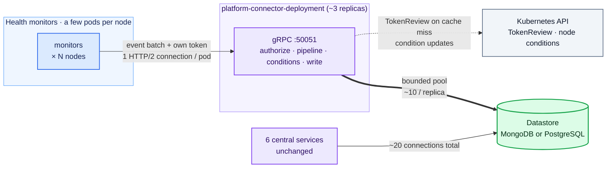
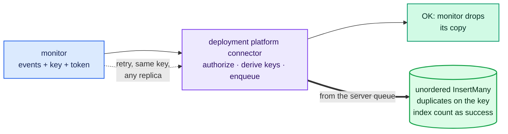
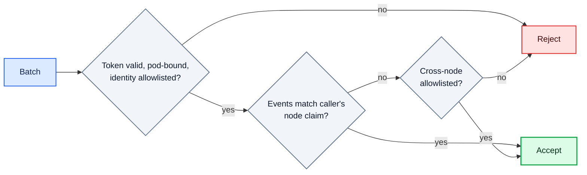
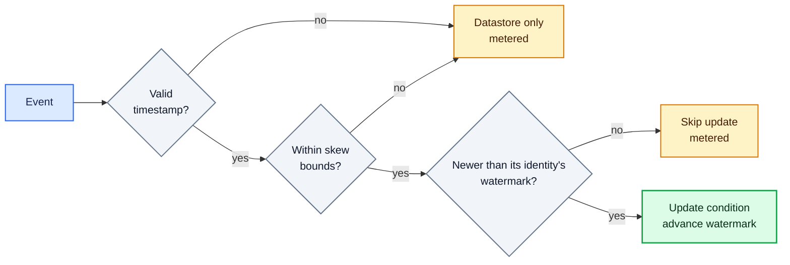
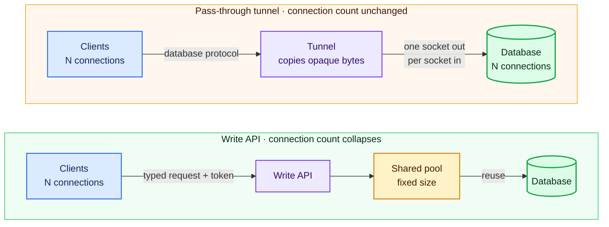

# ADR-052: Deployment Platform Connector

## Summary

- **This mode is not the default.** You need it above roughly 20,000 nodes. At that size the platform connectors' database connections alone take about 16 GiB of memory on the MongoDB primary (20,000 nodes × 3 connections × 0.27 MiB), and the number keeps growing with every node you add. Smaller clusters should stay on the DaemonSet setup.
- Why: every platform connector pod opens about 3 database connections, and they all land on the MongoDB primary. At 100,000 nodes that is about 300,000 connections, which pushes the primary's memory limit to 91 GiB ([issue #1595](https://github.com/NVIDIA/NVSentinel/issues/1595)).
- The change: health monitors send their events straight to a small central Deployment, the **deployment platform connector**, over gRPC, each using its own ServiceAccount token. Today they send to the platform connector pod on their own node.
- The central service does the same work as today (pipeline, node condition updates, datastore writes), but through a small fixed pool of database connections, so connections stop growing with the fleet.
- Monitors now send over the network and several replicas share the work, so three protections are added: an idempotency key on every batch so a retried batch is never stored twice, per-node and per-component quotas so one noisy sender cannot crowd out the rest, and a guard so several replicas can update node conditions safely.
- Two Helm settings control it: one global flag deploys the central service, and each monitor has its own `publishTo` setting that says whether it keeps sending to the platform connector on its node (`socket`) or to the central service (`deployment`).

## Contents

- [Context](#context)
- [Decision](#decision)
- [Implementation](#implementation)
  - [Architecture](#architecture)
  - [Changes from the DaemonSet role](#changes-from-the-daemonset-role): [Admission control](#admission-control), [Replica lifecycle](#replica-lifecycle)
  - [Write API](#write-api): [Delivery guarantees](#delivery-guarantees), [Idempotency](#idempotency), [store-client changes](#store-client-changes)
  - [Authentication](#authentication): [Transport security and observability](#transport-security-and-observability)
  - [Node condition updates](#node-condition-updates)
  - [Event pipeline](#event-pipeline)
  - [Publisher requirements](#publisher-requirements)
  - [Scaling and availability](#scaling-and-availability): [Connections](#connections), [TokenReview load](#tokenreview-load)
  - [Configuration](#configuration)
  - [Future scope: pass-through tunnel](#future-scope-pass-through-tunnel), [Future scope: disk-backed queue](#future-scope-disk-backed-queue)
- [Rationale](#rationale)
- [Consequences](#consequences)
- [Alternatives Considered](#alternatives-considered)
- [Notes](#notes)
- [References](#references)
- [Appendix: tunnel versus write API](#appendix-tunnel-versus-write-api)

## Context

This ADR adds a deployment mode to the platform connector so that database connections stop growing with the fleet.

Every NVSentinel component that needs the datastore connects to MongoDB (or PostgreSQL) through the shared `store-client` library. Most of them are small, single-replica Deployments. The platform connector is different: it runs as a DaemonSet, one pod on every node, and each pod opens its own database connections (about 3, all to the MongoDB primary). Each open connection costs roughly 0.27 MB of database memory even when idle, so the count grows with the fleet:

| Fleet size    | Connections from platform connectors |
|---------------|---------------------------------------|
| 1,000 nodes   | ~3,000                                |
| 10,000 nodes  | ~30,000                               |
| 100,000 nodes | ~300,000                              |

At 100,000 nodes, just keeping those connections open pushes the primary's memory limit to 91 GiB ([issue #1595](https://github.com/NVIDIA/NVSentinel/issues/1595)).

The platform connector only inserts health events; it never reads. The six central services (fault-quarantine, node-drainer, health-events-analyzer, fault-remediation, event-exporter, csp-health-monitor) use change streams and queries, hold about 20 connections no matter how big the fleet is, and are not touched by this design. (Two of them also publish health events, so their publish path changes like any monitor's.)

We looked at two options:

1. Deploy [mongobetween](https://github.com/coinbase/mongobetween), the third-party MongoDB connection pooler that issue #1595 originally proposed. Rejected; see ["Alternatives Considered"](#alternatives-considered).
2. Run the platform connector as a central Deployment that health monitors publish to directly, so the per-node DaemonSet and its database connections can go away. This is the proposal.

["Appendix: tunnel versus write API"](#appendix-tunnel-versus-write-api) explains why a write API collapses connections while a pass-through tunnel cannot.

## Decision

Run the platform connector as a small central Deployment, the **deployment platform connector**. Health monitors send their health events directly to it over gRPC and authenticate every request with a projected ServiceAccount token. It runs the event pipeline, updates node conditions and writes to the datastore through `store-client` with a small fixed connection pool. The per-node DaemonSet is no longer needed. The six central services keep connecting to the database directly.

One global flag turns the mode on, and a per-monitor flag chooses where each monitor publishes. How to roll this out across a fleet (ordering, staging, rollback) is out of scope here and will be designed separately once the end state is agreed.

In this document, "deployment platform connector" means the platform connector running as this central Deployment. Its Kubernetes objects are named `platform-connector-deployment` so they cannot collide with the DaemonSet's.

## Implementation

### Architecture



The write path's connection count no longer depends on fleet size: at 100,000 nodes it drops from roughly 300,000 connections to a few dozen. Each server replica holds about 10 pooled connections plus a few monitoring connections, about 16 per replica or 50 across 3. The central services keep their ~20.

### Changes from the DaemonSet role

The deployment platform connector and the DaemonSet are one binary and one image, selected by a mode flag. The central role reuses the gRPC service, ring buffer, event pipeline, k8s connector and store connector as they are, and adds the changes below. Anything not listed here works as it does today.

| Change for the central role | Why |
|-----------------------------|-----|
| A mode flag selecting the central role | One image, one extra argument; config and metric names stay separate per role |
| A bound on the ingest queue | Today's queue is unbounded, which is fine for one node's events but not for the whole fleet's during a datastore outage; see ["Admission control"](#admission-control) |
| TCP listener with TLS, serving the same `PlatformConnector` gRPC service | Replaces the node-local Unix socket |
| Node metadata comes from a shared informer instead of per-node GET calls | Per-node reads would multiply Kubernetes API calls at fleet scale (["Event pipeline"](#event-pipeline)) |
| Caller authentication pinned to the token's node claim | Replaces the node-binding check, which compares against the pod's own node and means nothing centrally (["Authentication"](#authentication)) |
| Per-event idempotency keys | Monitors retry over the network, so replays must be detectable (["Idempotency"](#idempotency)) |
| The store connector no longer requires a node name | A central pod is not tied to one node |
| gRPC `MaxConnectionAge`/`MaxConnectionIdle`, jittered, and a bounded graceful shutdown | Keeps connections manageable at fleet scale and stops one unresponsive client from blocking shutdown |
| Quieter logging and metrics | The reused packages log payloads and every auth success at info and label metrics by node. That is fine per node but too much centrally, so: no payloads at info, auth success at debug, rejections logged, node and pod labels dropped or bounded |
| Configurable worker pools | The reused consume loops have one worker each. The store pool writes concurrently (safe because of per-event idempotency), and each node's batches go to one worker so their order is kept |
| OpenTelemetry context read from the incoming call | Without it the stored trace fields are zeroes and downstream trace links break |
| An ingress NetworkPolicy for the gRPC port | Namespaces with default isolation would otherwise block it |

#### Admission control

Today's queue is unbounded. That is fine for one node's events but not for the whole fleet's during a datastore outage, so the central role adds admission control:

- Limits in items and bytes cover everything the server holds: queued, in flight, and waiting on a retry. There are also limits on request size, events per batch and distinct nodes per batch. The size limit is checked before a request is decoded.
- Admission happens before any side effect. Capacity is reserved across every queue the server feeds at once, and a rejected batch changes nothing.
- Quotas are per node (taken from the caller's node claim), in batches and bytes. Cross-node callers get a per-component quota in events. Quotas are enforced per replica, and a client stays on one replica for the life of its connection, so the fleet-wide bound is the configured value times the replica count.
- Every rejection carries a reason and a retry delay. When a replica is full, the client reconnects, because gRPC picks a replica only when a connection is opened and a client stuck on a full replica would otherwise retry it forever. When a quota is hit, the client backs off on the same connection.

These limits, together with the caches and the informer, add up to a pod resource target, and the chart's resource requests are derived from it.

#### Replica lifecycle

Acknowledged batches live in pod memory, so a replica drains before every planned stop:

- Draining is measured by a gauge of outstanding admissions, not by queue length. A reservation is held from the moment a batch is accepted until every side effect has completed or been abandoned.
- On termination a replica turns unready, stops admitting and drains within `terminationGracePeriodSeconds`, which is sized to the datastore retry window. Whatever it has to abandon is counted under a forced-drop metric.
- Rolling updates use `maxSurge: 0` and `maxUnavailable: 1`, so replicas drain one at a time. A PodDisruptionBudget and anti-affinity protect against evictions and node loss.

A crash skips the drain. The loss is bounded by the admission limits but not counted per batch; it shows up only as the gap between what clients sent and what was stored.

### Write API

Monitors call the same `PlatformConnector` gRPC service as today, just at the `platform-connector-deployment` Service address instead of the socket path. Each client holds one connection, and the Service picks a replica only when that connection is opened. That is why a full replica has to tell the client to reconnect, and why `MaxConnectionAge` recycles connections.

#### Delivery guarantees

- The monitor's client retries a failed send with backoff for a time window (minutes by default) and then drops the batch. This is bounded best effort, and the window is sized to ride out server restarts and rollouts. Every kind of failure is retried within the window; the idempotency key makes repeats safe.
- OK keeps its meaning: the batch was accepted and queued, not stored. After OK the server writes from its queue within `platformConnector.deployment.datastore.retryWindow` and drops batches that outlive it. A replica crash loses that queue. Because one replica holds batches from many nodes, such a crash loses more than one DaemonSet pod's crash does today. The loss is capped by the admission limits, planned stops drain first, and the disk-backed queue under future scope would remove it. If the datastore is down for longer than both windows (about ten minutes), batches are dropped and counted. Today's unbounded queue instead grows until the pod is killed for memory and everything queued is lost.
- Events can be stored out of order and up to two windows late (retries, several replicas), so consumers must order by the event's own `generatedTimestamp`. The server writes each node's batches through one store worker, which keeps them in send order. Whether fault-quarantine and health-events-analyzer also need a staleness check on `generatedTimestamp` is decided before the switchover.
- The datastore write and the Kubernetes side effects finish independently after OK; one can succeed while the other gives up. That is accepted and counted. Making them atomic would mean holding batches through datastore outages.

#### Idempotency

Clients retry, so a batch could be stored twice if the server accepted it but the OK got lost. Every batch therefore carries a client-generated idempotency key in the `idempotency-key` gRPC header (the standard [HTTP Idempotency-Key](https://developer.mozilla.org/en-US/docs/Web/HTTP/Reference/Headers/Idempotency-Key) semantics). The database enforces the key, because a retry may reach a different replica. It is enforced per event rather than per batch, because MongoDB does not insert a batch atomically. The server builds each event's key from the caller's pod UID, the client's key and the event's position in the batch, so two callers can never collide. A partial unique index rejects duplicates, and a duplicate on that index counts as success, so a retry inserts only the events that are still missing. The key is mandatory, its format is checked, and the server always overwrites the metadata field instead of trusting an incoming value.

- The client keeps the key for the whole retry window and always sends the same payload with it. The server checks the key, not the payload.
- The index is created once by a release Job (no Helm hooks, because a post-install hook deadlocks under `helm --wait`). Every replica verifies the full index definition before it reports ready, so clients are held off until the index exists.
- The partial index covers only documents that carry the key, so existing records need no backfill. MongoDB and PostgreSQL both support this.

**Normal write and retry:**



#### store-client changes

1. Make pool limits configurable (MongoDB uses the driver default of 100 today; PostgreSQL is hardcoded to 25).
2. Allow an unordered `InsertMany` that reports duplicate-key errors per document and names the violated index, so only idempotency-index duplicates count as success.
3. Add a small index-management operation: create once, verify the full definition.

### Authentication

Monitors keep authenticating the way they do today: projected ServiceAccount tokens checked through TokenReview (ADR-030). The check moves to the central service under its own audience, so the event path still has exactly one token validation. What is new is scope. On the socket, a token can only reach the platform connector on its own node. Over the network it can reach the central service from anywhere, so the server has to enforce scope itself:

- A batch may only contain events about the node named in the caller's token. Tokens with no node claim, or not bound to a pod, are rejected.
- Four components report about other nodes: csp-health-monitor, kubernetes-object-monitor, slurm-drain-monitor and health-events-analyzer. The chart puts their identities on a cross-node allowlist. They must run on system nodes: an administrator labels those nodes with a `node-restriction.kubernetes.io/` label (a node cannot set that label on itself), and on every request the server checks that the caller's own node carries it. If it does not, the caller is treated like any other publisher.
- If TokenReview is unavailable, the server rejects requests and clients retry within their windows. The socket path's fallback of trusting the local node does not exist centrally.



#### Transport security and observability

Tokens now cross the pod network, so TLS is required. Both the chart and the server refuse a plaintext listener unless an explicitly named insecure development mode is set. Cert-manager issues the certificate, and the server picks up rotated certificates without a restart. A NetworkPolicy lets only publisher pods reach the gRPC port; every publishing component labels its pods for this, including health-events-analyzer and csp-health-monitor. A replica is ready when the idempotency index is verified and it is not draining. Replicas stay ready while full or during a datastore outage, so the Service never empties. The signals to alert on are the forced-drop counter, admission rejections, the outstanding-admissions gauge and queue pressure.

### Node condition updates

The k8s connector code is unchanged, but several central replicas can now update the same node, and one of them can re-apply an older event after a conflict retry. A new guard prevents that:

- Each fault identity (the entity set and error code within a check) keeps a watermark: the time of the last event applied for it, stored next to the condition's message entries. Events at or below the watermark are skipped; newer events are applied and move it forward. Each identity is reported by one monitor, so its timestamps come from one clock and nothing needs to be ordered across nodes.
- Watermarks share the condition message with the fault text, and the fault text is shortened first. They are kept long after a fault clears, far longer than the delivery retry window. A watermark is dropped only when more identities clear at once than the message can hold. That drop is counted, and a stale fault can then reappear until the monitor's next periodic publish.
- The ordering time is the event's own `generatedTimestamp`. An event with a missing timestamp, a timestamp too far in the future, or one older than the delivery retry window is stored but never updates conditions. Each case is counted.



### Event pipeline

The pipeline (transformation, dedup, metadata enrichment) runs unchanged in the central service. Two details change:

- Node metadata comes from a shared node informer instead of per-node reads, and a replica reports ready only after that informer has synced. A metadata miss never blocks storage.
- Dedup state is per replica, so with R replicas the same duplicate can be treated as new up to R times per window. Dedup never suppresses datastore writes, only the cluster-mutating side effects of duplicates (ADR-039), so what multiplies is remediation eligibility, not stored volume. Whether downstream remediation tolerates that is checked before the switchover.

### Publisher requirements

A monitor publishes directly with four changes:

1. A projected token for the deployment platform connector audience.
2. The Service address in place of the socket path.
3. A bounded local queue with a time-based retry window and jitter, plus drop and queue-pressure metrics.
4. A stable idempotency key, kept for the whole retry window.

Items 3 and 4 are what make a monitor survive outages; today it relies on the platform connector's ring buffer for that. Both live in the shared publishing clients: the Go library that five of the six monitors use, and a Python client for the GPU health monitor. If a monitor crashes, its client queue is lost; that is accepted, as it is for the ring buffer today.

All first-party monitors must support direct publishing before the switchover. Some publishers cannot be put on the allowlist: custom or token-less socket publishers, and the injected preflight checks that run under tenant ServiceAccounts. Each of them must either be deprecated together with the socket, keep a thin node-local shim, or get an explicit identity and network carve-out. That decision is outside this ADR but has to be made before the DaemonSet is removed.

### Scaling and availability

#### Connections

Any replica can serve any request, because every durable fact lives in the database. So the service scales horizontally, and each added replica costs about 16 database connections. The plain ClusterIP Service balances connections, one replica per connection, with no extra load balancer. Each monitor pod holds one HTTP/2 connection, so at 100,000 nodes each of 3 replicas holds about 100,000 connections. A gRPC connection costs tens of kilobytes of server memory (its read and write buffers, both tunable), so this comes to several GiB per replica at default buffer sizes. It is part of the pod sizing, and the load test measures it. `MaxConnectionAge` recycles connections over time and `MaxConnectionIdle` closes silent ones. The expected ingest is one small batch per monitor pod per check interval, a few thousand batches per second across the fleet; the load test runs at these rates.

#### TokenReview load

The same token validations move from the socket to the central service, one cached validation per token per two-minute cache window, so the volume does not grow. At the 100,000-node target with about three monitor pods per node (~300,000 caller tokens):

| Fleet activity                                | TokenReviews per second |
|-----------------------------------------------|-------------------------|
| Every pod writes in every window (worst case) | ~2,500 (~830 per replica at 3 replicas) |
| 5% of pods write per window                   | ~125                    |
| Reconnect wave, transient until caches rewarm | ~2,500 fleet-wide (~833 per replica at 3 replicas) |

The worst case is treated as steady state because dedup does not suppress sends. Two of today's constants become configuration: the cache capacity (the full token population plus rotation overlap per replica, about 450,000 entries instead of today's fixed 4,096) and the TokenReview client's QPS and burst. A connection must stay on one replica for at least one cache window, so `MaxConnectionAge` sits well above it; otherwise misses climb toward the reconnect-wave ceiling.

### Configuration

```yaml
global:
  platformConnectorDeployment:   # facts the server and every publisher share
    grpcPort: 50051
    tls:
      mode: required   # cert-manager issued certificate; the only alternative is
                       # the explicitly named insecureDevelopmentMode
    auth:
      audience: "platform-connector-deployment.nvsentinel.nvidia.com"
      tokenExpirationSeconds: 3600

platformConnector:
  deployment:
    enabled: false     # the switchover flag; deploys the deployment platform
                       # connector and its index migration Job
    replicas: 3
    auth:
      crossNodePublishers: []   # override for the derived list of components
                                # allowed to name other nodes
      systemNodeSelector: {}    # must be non-empty (a node-restriction.kubernetes.io/
                                # label) before any cross-node component is enabled
    datastore:
      maxPoolSize: 10   # database connections per replica
      retryWindow: 5m   # server-side budget for acknowledged batches;
                        # also sizes terminationGracePeriodSeconds
  daemonset:
    enabled: true      # turn off once every monitor publishes to the deployment

gpuHealthMonitor:      # every monitor chart exposes the same knob
  publishTo: socket    # socket | deployment
```

Tuning values (queue bounds, request limits, cache capacities, TokenReview client rates) are configuration, chosen during implementation and the load test. The only ordering rule this ADR sets is that the index migration Job and server readiness come before monitor traffic, and the readiness gate enforces that. Everything else about the transition, including when the DaemonSet's flag is turned off, belongs to the separate rollout design.

### Future scope: pass-through tunnel

Later, an authenticated TCP pass-through tunnel could carry the central services' database traffic: the server would validate a token per connection and then copy bytes without looking at them, so change streams, transactions and the database's end-to-end TLS keep working. It would not reduce connection counts, so it is out of scope for now. Its value is network control: one controlled path to the database, an identity check for clusters that do not enforce NetworkPolicies, and a Kubernetes identity behind every database connection.

### Future scope: disk-backed queue

The server's queue is in memory on purpose. That is why admission pushes back into the monitors' client queues, and why a crash can lose acknowledged batches within the admission bounds. Backing the queue with disk would remove that crash-loss window, absorb datastore outages without backpressure, and shrink the client queues monitors need. The costs are a stateful Deployment and a disk write per batch. The in-memory design should prove itself first; the queue sits behind one interface, which is where durability can be added later.

## Rationale

- Database connections stop growing with the fleet: at 100,000 nodes the write path drops from roughly 300,000 connections to about 50, and the central services are unchanged.
- The central role reuses the existing gRPC service, token stack and `store-client`, so behavior stays the same as today. A proof of concept ran it end to end on a kind cluster.
- Database credentials leave the fleet: no per-node pod carries one, and rotating the write path's credential touches 3 pods instead of every node.
- No dependency on an unmaintained third-party proxy, and PostgreSQL benefits just as much.

## Consequences

### Positive

- Database connections, and the memory they cost, stop growing with the fleet.
- Write access is tied to each publisher's identity and its own node, wherever the token is used. No per-node pod carries a database credential.
- The read path is untouched. An outage of the deployment platform connector delays writes but cannot affect change streams or the central services.

### Negative

- A new central service sits on the write path. It must be sized, monitored and alerted on, and it adds one network hop. Admission tuning, TokenReview load and the condition guard all meet production for the first time at the switchover.
- Every first-party publisher must adopt the shared publishing client before the switchover, and custom or token-less publishers need a product decision.
- A replica crash loses its in-memory queue and a monitor crash loses its client queue. Both are bounded, but a replica holds many nodes' batches, so one crash loses more than one DaemonSet pod's crash does today.
- Events can arrive out of order or duplicated within the retry windows, so the condition guard, and the consumers' handling of stale events, must hold before the switchover.

### Mitigations

- The load test at the modeled rates is the gate before any switchover, and the mode is off by default.
- The shared Go and Python clients carry the queue, retry and key logic once, and the per-monitor flag lets monitors switch one at a time.
- Every drop is counted where it happens (forced drops, admission rejections, skipped condition updates). A disk-backed queue is recorded as future scope in case bounded in-memory loss turns out to be too tight.
- The per-fault watermark, the timestamp bounds and the per-node store workers keep ordering effects within known bounds.

## Alternatives Considered

### Purpose-built central service

**Rejected** because the document shape, pipeline behavior and condition semantics must match exactly. Running the platform connector binary centrally shares the code that guarantees that; a separate implementation could drift. One binary also means one image and no second build, scan or allowlist path. A purpose-built service could offer a stronger reply (OK meaning stored rather than accepted), but keeping the existing contract was judged safer, and a later change could still make the server write synchronously through the store connector.

### mongobetween

**Rejected** because clients cannot authenticate to it by design (its handshake advertises no authentication mechanisms, so the database credentials inside the proxy would be protected only by network reachability); it fronts `mongos` shard routers and its README calls direct replica set use not battle tested, while NVSentinel's default deployment is a replica set; it is MongoDB-only while NVSentinel also supports PostgreSQL; and it has been unmaintained for about two years (Go 1.18, reflection into driver internals, a MongoDB 4.2 wire-version handshake). Its lessons and parts of its code remain reusable (Apache 2.0) if a pooled MongoDB-protocol endpoint is ever needed.

## Notes

- Non-goal: changing what the event pipeline does. It runs centrally with the same transformations, and the stored event shape is unchanged apart from the idempotency key and its unique index.
- Non-goal: a general query API; the central services keep their direct database connections.
- Non-goal: a pooled MongoDB-protocol endpoint; mongobetween is the reference to borrow from if one is ever needed.
- The optional external gRPC sink (ADR-033) runs centrally as another attached queue under the same admission reservation. It has no idempotency index, so external consumers keep the duplicate-tolerant at-least-once delivery its contract already requires.

## References

- [Issue #1595: Deploy a MongoDB connection proxy to keep connection count constant as fleet scales](https://github.com/NVIDIA/NVSentinel/issues/1595)
- [mongobetween](https://github.com/coinbase/mongobetween) and Coinbase's [scaling write-up](https://blog.coinbase.com/scaling-connections-with-ruby-and-mongodb-99204dbf8857)
- [ADR-033: gRPC Sink Connector for Platform-Connectors](033-grpc-sink-connector.md)
- [ADR-030: gRPC TLS and Authentication for Janitor-Provider Connection](030-grpc-tls-authentication.md)
- [Publisher authentication reference](../configuration/authentication.md)
- [ADR-002: Storage Layer Selection](002-storage-layer-selection.md)

## Appendix: tunnel versus write API

A service between clients and a database can work in one of two ways, and the choice decides whether it can reduce database connections.

A **pass-through tunnel** copies bytes in both directions without interpreting them. Database features (change streams, cursors, transactions, end-to-end TLS) keep working because the protocol is unchanged, but each client connection still needs its own database connection. A tunnel gives a controlled network path, not fewer connections.

An **API in front of the database** accepts application-level requests instead of database-protocol connections: a client sends a typed request with its token, and the API does the write through a small shared pool. Because it understands each request, it can serve 100,000 clients with a handful of database connections. The trade-off is that it supports only the operations it implements.



The write path needs the API approach because it is the only option that reduces connections as the fleet grows. The tunnel stays future scope for network control.
