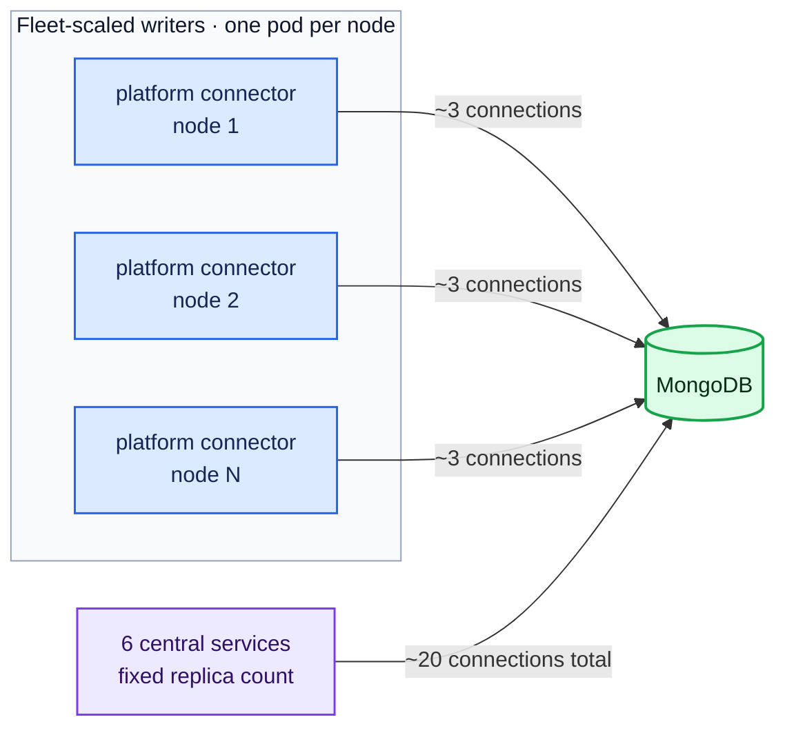
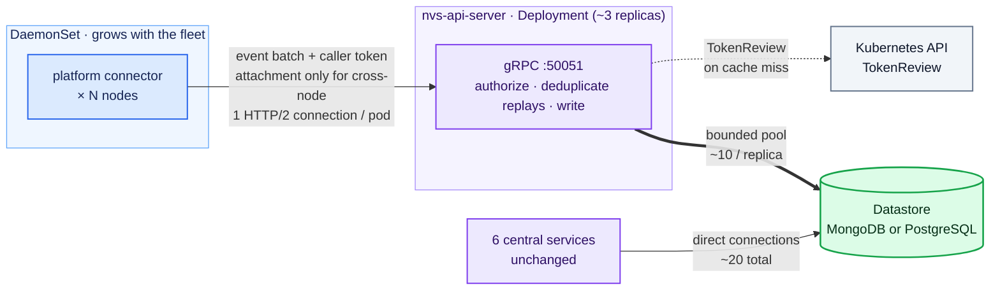
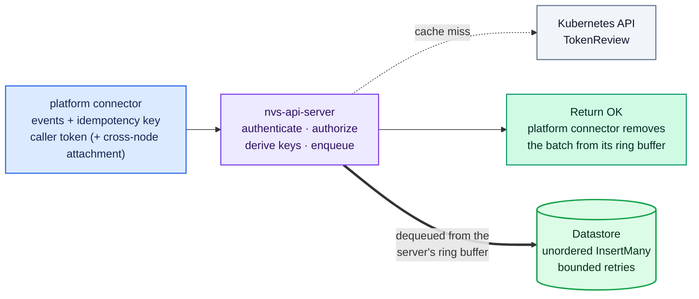
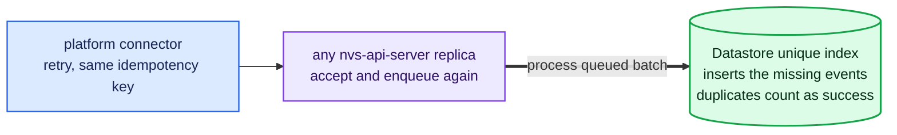
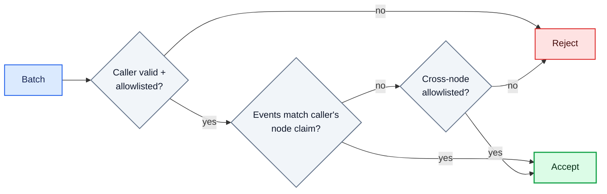
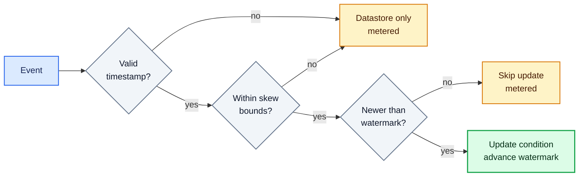
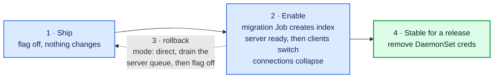
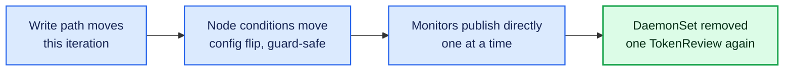
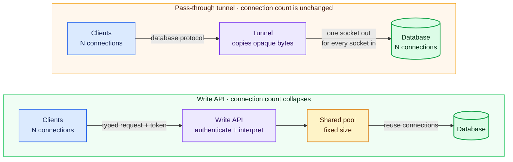

# ADR-052: NVS API Server

## Context

This ADR adds a cluster-wide mode to the platform connector so that database
connections stop growing with the fleet.

Every NVSentinel component that needs the datastore connects to MongoDB (or
PostgreSQL) through the shared `store-client` library. Most of these components
are small, single-replica Deployments. The platform connector is the exception. It
runs as a DaemonSet with one pod on every node, and each pod opens its own
database connections.

Each platform connector pod holds about 3 MongoDB connections. These include
heartbeat connections that the driver maintains to each replica set member
and connections used for writes. Each open connection consumes roughly 0.2 MB
of database memory, even when idle. Because the number of pods grows with the
fleet, so does the number of connections:

| Fleet size    | Connections from platform connectors |
|---------------|---------------------------------------|
| 1,000 nodes   | ~3,000                                |
| 10,000 nodes  | ~30,000                               |
| 100,000 nodes | ~300,000                              |

At 100,000 nodes, MongoDB spends about 61 GiB of memory just keeping those
connections open, before storing a single byte of data
([issue #1595](https://github.com/NVIDIA/NVSentinel/issues/1595)).

This can be fixed because each pod uses those connections for only one task.
The platform connector store connector
(`platform-connectors/pkg/connectors/store/store_connector.go`) performs
exactly one operation: batched inserts of health events. It never reads.

The six central services (fault-quarantine, node-drainer,
health-events-analyzer, fault-remediation, event-exporter, csp-health-monitor)
use change streams, queries, updates and aggregations, and together hold
about 20 connections regardless of fleet size. They are not the problem,
and this design leaves them untouched.



Options considered:

1. Deploy [mongobetween](https://github.com/coinbase/mongobetween), the
   third-party MongoDB connection pooler issue #1595 originally proposed.
   Rejected; the review is under
   ["Alternatives Considered"](#alternatives-considered).
2. Add a cluster-wide mode to the platform connector, deployed as a small
   central service (the nvs-api-server) that exposes a gRPC write API for
   the DaemonSet, while the central services keep connecting to the
   database directly as they do today. This is the proposal.
3. Extend the nvs-api-server with a pass-through tunnel for the central
   services' traffic. This is deferred because it adds network control but
   does not solve the connection-scaling problem. It is described under
   ["Future scope: a pass-through tunnel for the central services"](#future-scope-a-pass-through-tunnel-for-the-central-services) instead.

Background on why a write API collapses connections while a pass-through
tunnel cannot is in ["Appendix: a middleman can do one of two jobs"](#appendix-a-middleman-can-do-one-of-two-jobs).

## Decision

Add a cluster-wide mode to the platform connector. In this mode the same binary
runs as a small central Deployment, named the **nvs-api-server**, and
exposes a gRPC write API; a flag selects the mode, and
["How the server is built"](#how-the-server-is-built) lists the changes
the central role requires. Platform connector pods send their health event
batches to it, authenticating every request with projected ServiceAccount
tokens, and it writes them through `store-client` using a small, fixed
connection pool. The six central services continue to connect directly to
the database.

Two further moves are designed here as well, each behind its own flag:
node condition updates can run centrally
(["Moving node condition updates centrally"](#moving-node-condition-updates-centrally)),
and monitors can publish directly to the central service,
adopted one monitor at a time (["Direct publishing"](#direct-publishing-monitors-send-straight-to-the-central-service)).

## Implementation

### Architecture



This architecture makes the write path's connection count independent of
fleet size. At 100,000 nodes, it drops from roughly 300,000 database
connections to a few dozen. One detail affects
this estimate: MongoDB applies `maxPoolSize` per server, not per client. For a
write-only workload, the pool fills on the primary. Each nvs-api-server replica
therefore holds about 10 pooled connections, plus a few monitoring connections
to each replica set member. This is about 16 connections per replica, or 50
across 3 replicas. The central services retain their ~20 direct connections.

### How the server is built

The cluster-wide mode reuses the DaemonSet's gRPC service implementation, ring
buffer, k8s connector and store connector unchanged, in the same image both
workloads run. A proof of concept ran this shape end to end on a kind
cluster, covering authentication, idempotency, connection collapse,
change-stream delivery, central node condition updates, direct publishing
and rollback. The central role requires the following changes, all of which
the proof of concept implemented or identified:

| Change for the central role | Why |
|-----------------------------|-----|
| A mode flag selecting the central role | The central Deployment runs the platform connector image with one extra argument; the config surface and metric names stay separate per role |
| A bound on the ingest queue | The reused queue is unbounded, acceptable for one node's events but not the fleet's during an outage; a full server rejects with UNAVAILABLE and node-side buffers absorb the backpressure |
| TCP listener with TLS, serving the same `PlatformConnector` gRPC service | Replaces the node-local Unix socket |
| Interceptor that validates the caller token, plus the attached token on cross-node batches (see ["Authentication on the write API"](#authentication-on-the-write-api)) | Replaces the node-binding check, which compares against the pod's own node and means nothing centrally; the caller token's node claim provides the scope instead |
| Per-event idempotency keys stamped from the `idempotency-key` header before enqueueing | See ["The write API"](#the-write-api) |
| Event pipeline and k8s connector off by default | Batches from the daemonset are already transformed and deduplicated on the node. The k8s connector turns on centrally when condition updates move (["Moving node condition updates centrally"](#moving-node-condition-updates-centrally)); the pipeline runs centrally only for direct publishers (["Direct publishing"](#direct-publishing-monitors-send-straight-to-the-central-service)) |
| Remove the store connector's node-name requirement | The connector currently refuses to start without a node name, but a central pod is not tied to one node |
| gRPC `MaxConnectionAge`/`MaxConnectionIdle` and bounded graceful shutdown | Manages connections at fleet scale (see ["Scaling and availability"](#scaling-and-availability)) and prevents one unresponsive client from blocking shutdown indefinitely |
| Rename or relabel metrics, and adopt a fleet observability contract | The reused packages log full payloads and every successful authentication at info, and label metrics by node: fine per node, a log-volume and cardinality problem at fleet scale. Centrally: no payloads at info, auth success sampled or debug, rejections audited, node and pod labels dropped or bounded |
| Configurable worker pools for the store and k8s connectors | The reused consume loops are single-worker. The store pool writes concurrently (safe under per-event idempotency), the k8s pool partitions by node name to keep each node's updates ordered, and sizes come from a load test |
| OpenTelemetry context extracted from the incoming call | Stored trace fields are stamped from the caller's span context; without extraction they store as zeroes and downstream trace links break ("Document shape and traces") |
| Add an ingress NetworkPolicy for the gRPC port | Namespaces with default isolation would otherwise block the new port |

#### Reply semantics: what OK means

Reusing the ring buffer preserves the current reply semantics: OK means that
the batch was accepted and queued, not that it was stored. This is the same
meaning that OK has on the node-local socket today. The server then writes
the batch from its own ring buffer under its own elapsed-time budget
(`platformConnector.clusterWideMode.datastore.retryWindow`; see ["Delivery guarantees"](#delivery-guarantees)). The
new path therefore contains two in-memory queues, both of which retry
and then drop a batch after reaching the configured limit. A crash can lose
the data still held in either queue. This is the same type of risk that exists
in the DaemonSet today, but it now exists in two places. "Alternatives
Considered" describes the option of writing before replying.

#### Admission control

One property does not carry over unchanged: the reused queue is unbounded,
which is harmless when it holds a single node's events but not when it holds
the fleet's. During a datastore outage the central queue would otherwise grow
at the fleet's ingest rate for the outage's duration. The central role
therefore adds admission control with these properties:

- The bound is in items and bytes, and covers everything the server holds:
  queued, in flight, and waiting on a retry. A gRPC request-size limit
  plus a maximum event count and maximum distinct-node count per batch
  keep single requests from being unboundedly large. The byte-accounting
  algorithm and the separate bound on decoded pre-admission requests are
  implementation contracts, defined alongside the implementation.
- Admission happens before any side effect. Capacity is reserved across all
  attached queues at once, so a batch is accepted for the store and the k8s
  connector together or not at all, and nothing (including the direct
  publishers' pipeline dedup state) is mutated for a rejected batch.
- Quota is keyed by the caller token's node claim, in batches and bytes, so
  one noisy but authenticated node cannot fill the global queue with either
  many small batches or a few large ones. Cross-node callers draw from a
  per-identity quota in the same units, and because one cross-node batch
  can fan out into work for many nodes, their quota counts events, not
  batches.
- Rejection is typed, because the client's correct reaction differs by
  cause. Admission rejections return RESOURCE_EXHAUSTED with a reason and
  a retry delay; UNAVAILABLE keeps its transport meanings (shutdown,
  connection failure) and never signals admission. Two reasons exist. A
  replica-full rejection makes the client close its connection before
  retrying: gRPC over a Kubernetes Service balances only at TCP
  establishment, so a client pinned to a saturated replica would otherwise
  retry it forever, while a fresh dial can land on a replica with
  capacity (the extra cache misses are bounded by the rejection rate). A
  per-node or per-identity quota rejection makes the client back off on
  the same connection, because hopping replicas would multiply the quota.
- Quotas are enforced per replica. Reconnecting clients mean one node can
  in the worst case consume its quota on each replica, so the effective
  fleet bound is the configured value times the replica count; the
  configured values are sized with that multiplier in mind, since a shared
  or routed quota would reintroduce coordination this design avoids.
- A full server pushes pressure back into the node-side ring buffers,
  where memory is per node.
- Rejected clients back off with jitter; the reused deterministic delay
  would otherwise synchronize a fleet of retries.

These limits, together with the caches, connections and informer, sum to a
pod resource target from which the chart's resource requests are
derived.

#### Replica lifecycle: planned disruptions drain, a crash cannot

Acknowledged batches live in pod memory. Every planned way a replica stops
has a defined drain behavior; a crash does not. The planned behaviors:

- Draining is measured by an outstanding-admissions gauge, not queue
  length. The workqueue's length drops when a worker picks an item up, so
  it reads zero while writes are in flight or waiting in the delayed-retry
  queue. An admission reservation is held from acceptance until every side
  effect for the batch has completed or been explicitly abandoned, and the
  gauge counts open reservations.
- On termination (`preStop` and SIGTERM), a replica turns unready, stops
  admitting, and drains its reservations to zero, bounded by a
  `terminationGracePeriodSeconds` sized to the server's datastore retry
  window, the budget that governs acknowledged batches. Whatever the bound
  forces it to abandon is counted under a forced-drop metric.
- Rolling updates use `maxSurge: 0` with `maxUnavailable: 1`, which
  serializes drains; a surge-based rollout would not (mechanics in the
  appendix).
- Scale-down is performed one replica at a time, waiting for the drain.
- The PodDisruptionBudget covers only what it actually controls,
  Eviction-API disruptions such as node drains.

A crash (an OOM kill, a process fault, a node failure) destroys the queue
and its gauge with the pod. That loss is bounded by the admission limits
but is not metered per batch; it shows up only as the gap between client
send counts and stored documents. This is the price of acknowledging
before persistence, and it is listed under negative consequences.

### The write API

The cluster-wide mode serves the existing `PlatformConnector` gRPC service
(`data-models/protobufs/health_event.proto`, `HealthEventOccurredV1`), which
the DaemonSet already serves on the socket and the gRPC sink connector
(ADR-033) already calls; no new service definition is needed. The DaemonSet's
store path gains a mode that sends the same batches to the nvs-api-server
over gRPC instead of writing to the database, with the sink connector as
the client's starting point.

#### Delivery guarantees

The new path preserves the existing delivery guarantees:

- The current store connector retries a failed insert with backoff up to a
  configurable ceiling (`mongodbStore.maxRetries`, default 3) and then drops
  the batch; the optional external sink (ADR-033) behaves the same way. The
  terminal behavior is unchanged in the new mode, bounded retry then drop;
  what changes is the budget's unit, from an attempt count (`maxRetries`)
  to elapsed time (`retryWindow`), for the reason in the next point.
- Because the nvs-api-server can fail independently of the database, the
  client's retry budget (`store.retryWindow`) is an elapsed-time window,
  minutes by default rather than seconds, so a server restart, rollout, or
  first-time bring-up is retried through instead of dropped. This window
  covers only the path up to the server's OK. After OK the client's copy
  is gone, and a separate server-side budget
  (`platformConnector.clusterWideMode.datastore.retryWindow`, also elapsed minutes) governs the
  datastore write. The two protect different failures and neither implies
  the other: the client window does not shield an acknowledged batch from
  a database outage; the server window does. Making the store path
  stronger than today (retrying until success) would be an independent
  change and is out of scope here.
- An OK response means accepted and queued, not stored
  (["Reply semantics: what OK means"](#reply-semantics-what-ok-means)).

#### Idempotency

Because the client retries, a batch could be stored twice if the server
accepted it but the OK response was lost. To prevent this, each batch carries
a client-generated idempotency key in the `idempotency-key` gRPC header,
following the standard
[HTTP Idempotency-Key](https://developer.mozilla.org/en-US/docs/Web/HTTP/Reference/Headers/Idempotency-Key)
semantics. The `HealthEvents` message itself does not change. The database
must enforce idempotency because a retry may reach a different nvs-api-server
replica. An in-memory check on one replica cannot account for batches handled
by another.

Idempotency is enforced per event rather than per batch, because a batch
can be stored partially: MongoDB does not insert a batch atomically. Each
document insert is atomic, but documents written before a failure remain
stored, and a bulk write behaves the same way because it is not a
transaction.

A transaction could make a batch atomic on either provider, but would not
remove the need for the key: a committed batch whose OK was lost still
gets retried.

Each event therefore receives a unique key derived from the batch's
idempotency key and the event's position in that batch. A unique index
enforces the key, and inserts run unordered, treating a duplicate on the
idempotency index as success (a duplicate on any other unique constraint
stays an error). A retry inserts only the missing events, regardless of
which replica handles it.

Four contract details are important:

1. The key is stored with the batch in the ring buffer, so every retry
   reuses it.
2. The client must send the same payload whenever it reuses a key. The
   server detects duplicates by key and does not compare payloads, following
   the usual Idempotency-Key semantics; a payload fingerprint that would
   surface key misuse is recorded as optional hardening.
3. The unique index must exist before the server stores any batch: it is
   created once by a migration step, every replica verifies it before
   reporting ready, and a batch sent before then is retried according to the
   ring buffer's backoff policy (see ["Rollout plan"](#rollout-plan)). Verification checks
   the full definition, not existence: key path, uniqueness, the partial
   predicate, and build completion; a wrong non-unique or non-partial index
   must not satisfy readiness. The partial index covers only documents that
   contain the key, so existing records require no backfill. Both MongoDB
   and PostgreSQL support partial unique indexes.
4. The stored key is scoped to the authenticated producer. The server
   derives it from the caller's pod UID plus the client's key and the
   event's position, so two callers reusing the same key cannot collide in
   the index or suppress each other's writes. Retries keep working because
   a batch only ever retries from the pod that queued it. The server
   validates the client key's format and length, always overwrites the
   metadata field rather than trusting an incoming value, and rejects
   missing keys where they are mandatory.

**Normal write:**



**Retry if the OK response is lost:**



#### What the idempotency key does and does not give

The key gives duplicate suppression, not exactly-once delivery. Among the
writes that succeed, the unique index admits at most one row per event key;
but the server acknowledges before it writes, retries for a bounded window,
and can crash with its queue, so an acknowledged event can also be stored
zero times. The accurate statement is bounded best-effort delivery with
datastore-level duplicate suppression.

Kubernetes side effects follow the same shape: they run zero or more
times. A drop or crash skips them; a replay that lands on another replica
re-runs condition processing (which the ordering guard keeps idempotent)
and can duplicate node Events, whose deduplication is per replica. An
occasional duplicate informational Event is accepted.

The datastore write and the Kubernetes side effects also complete
independently after OK. One can succeed while the other exhausts its
budget, including the awkward direction where a node condition exists with
no stored document behind it. This divergence is accepted rather than
prevented, and it is observable: a counter tracks each completion
combination (both, store only, kubernetes only, neither). Making the
outcomes atomic would require ordering Kubernetes effects after datastore
success and holding batches through datastore outages, an availability
trade this design does not take.

#### Document shape and traces

On the nvs-api-server, the handler validates the caller (see the next section),
adds the derived key to each event, and enqueues the batch. The same store
connector code that runs on every node then performs the write. It adds the
status, creation timestamp, and trace metadata before `InsertMany`, so both
paths produce a backward-compatible document shape; the central path
additionally carries the idempotency key and assigns the creation timestamp
centrally. Event transformation and
deduplication remain unchanged in the platform connector pipeline. At this
stage, the nvs-api-server is only a persistence endpoint.

The move introduces two small semantic changes. First, the nvs-api-server
assigns the creation timestamp instead of the node. Second, trace continuity
must cross the gRPC hop explicitly: the store-mode client sends the batch's
span context through OpenTelemetry gRPC instrumentation (an addition to the
shared `grpcclient`), and the nvs-api-server extracts it and stores the same
trace fields the store connector writes today. Downstream consumers read
those fields, so both paths must populate them identically; without the
extraction the stored IDs are zeroes, which the proof of concept observed.

#### Changes required in store-client

The nvs-api-server sets an explicit `maxPoolSize` on its database client. This
design requires three small changes to `store-client`:

1. Make pool limits configurable. MongoDB currently uses the driver default of
   100, while PostgreSQL is hardcoded to 25. The connection estimates in this
   document assume that the configured limit is applied.
2. Allow `InsertMany` to use unordered inserts and report duplicate-key errors
   per document, identifying the violated index. Only a violation of the
   idempotency index counts as a successful duplicate; a duplicate on any
   other unique constraint remains an error. MongoDB uses ordered inserts by
   default, which stop at the first duplicate and would break the retry
   mechanism, and the current interface exposes neither the unordered option
   nor the required error details.
3. Add a small index-management operation, since `store-client` does not
   currently manage indexes. The index is created once, by a plain release
   Job with no Helm hooks, named by a hash of its migration content so a
   changed migration produces a new Job on upgrade despite Job
   immutability. The Job retries internally until the datastore accepts,
   and ordering comes from the readiness gate: replicas verify the
   expected index definition before reporting ready, so clients are held
   off until the Job completes. Two constraints shaped this:
   - Helm hooks were considered and rejected. A post-install hook
     deadlocks under `helm --wait` (the hook runs only after resources are
     ready, while server readiness requires the index the hook would
     create), and GitOps engines map hooks to sync phases without reliably
     distinguishing install from upgrade.
   - The build never runs independently in every replica: a unique index
     build over an existing collection is expensive, and PostgreSQL's
     `CREATE INDEX CONCURRENTLY` cannot run in a transaction and needs its
     own failure handling.

### Authentication on the write API

#### Caller authentication

The write API reuses the ServiceAccount token mechanism that already
authenticates health event publishers to platform connectors
(`docs/configuration/authentication.md`) and the janitor to the
janitor-provider (ADR-030):

- Clients attach a projected, audience-scoped, short-lived ServiceAccount
  token to every request using `commons/pkg/grpcclient`.
- The nvs-api-server uses `commons/pkg/grpcauth`, including its result cache,
  to validate tokens through the Kubernetes TokenReview API. It uses a
  dedicated audience, such as `nvs-api-server.nvsentinel.nvidia.com`.
- The nvs-api-server accepts writes only from allowlisted identities. By
  default, the allowlist contains only the platform connector ServiceAccount
  derived from the release namespace, following the same pattern as publisher
  authentication.
- Tokens must be pod-bound, so a token extracted from a manifest or minted
  without a pod reference is refused.

#### Why both hops authenticate

A health event is deliberately authenticated at both network hops.
The platform connector validates the publisher because the event can also update
node conditions through the k8s connector. The nvs-api-server separately
validates its immediate caller so that only the platform connector pipeline
can write to the database; reaching the port is not sufficient. This matches
the hop-by-hop authentication used between janitor and janitor-provider. It is
an interim design: as monitors move to publishing directly ("Direct
publishing"), each moved publisher authenticates straight to the central
service, and the event path returns to one TokenReview once the last one
moves.

Cached verdicts limit the cost of the second review. ["Scaling and availability"](#scaling-and-availability)
provides the full calculation, including rate ceilings, cache capacity, and
retry limits.

#### Node scope: one rule

Per-event node binding is also enforced at both hops, so a platform
connector token by itself never authorizes events about nodes other than
its own. The first check remains at the platform connector: a publisher may
report events only about its own node unless its identity is on the
cross-node allowlist (`docs/configuration/authentication.md`). The second
check, at the nvs-api-server, is one rule with one exception:

- Every batch is pinned to its caller token's node claim. The caller token
  is pod-bound, so it already carries the node; no extra machinery is
  needed. This covers all node-local publishers, including token-less
  socket callers (the platform connector pins those to its own node before
  forwarding). A token minted on node X therefore carries authority over
  node X only, wherever and however it is presented, including calls that
  reach the write API without passing through the platform connector.
- Only a batch that names any other node needs more: it must carry an
  attached token from an identity on the cross-node allowlist.
- The attached token is never accepted as the caller credential. Every
  caller must present a token minted for the nvs-api-server audience; an
  attached token alone grants no access.

The rule is identical for both caller classes: the platform connector
identity and allowlisted direct publishers (["Direct publishing"](#direct-publishing-monitors-send-straight-to-the-central-service)) are each
pinned to their own caller token's node claim, with cross-node batches
authorized by the attachment allowlist for the former and the cross-node
direct allowlist for the latter.



#### Cross-node evidence, and the loss mode it accepts

For cross-node batches the platform connector retains the publisher's
presented token in memory with the queued batch and attaches it on send.
The token travels only in the attachment metadata field, is never logged
or exported, and is dropped with its batch. (A signed platform connector
attestation could replace retained tokens later; retention is the simpler
interim.)

Retention has one sharp edge: a pod-bound token dies with its pod, so if a
cross-node publisher restarts while its batch is still queued, the
attachment fails TokenReview permanently and the batch is dropped at the
end of the retry window, counted under its own metric. This accepted loss
mode is confined to the four cross-node publishers and listed under
negative consequences; operators who cannot accept it drain those
publishers before planned restarts. Node-local batches carry no
attachment, so routine monitor restarts strand nothing.

An attached token can also expire while its cross-node batch waits in the
ring buffer during an outage. The cross-node publishers use a longer
lifetime through the existing `tokenExpirationSeconds` setting; a lifetime
of several hours is acceptable on system nodes. An expired attachment is
rejected and retried like any other failed request, until the retry window
ends. Both this and the restart edge above are temporary: the migration to
direct publishing removes attachments entirely.

#### Two validators, one audience each

The implementation uses two separate validators because the `grpcauth`
validator supports one audience. The caller validator uses the nvs-api-server
audience and allowlists the platform connector identity. The attachment
validator uses the platform connector audience, applies the cross-node
allowlist, maintains its own cache, and now sees only cross-node batches, a
negligible volume. The attached token uses a separate metadata key and is
passed only to the attachment validator. This separation prevents it from
acting as a caller credential by construction.

#### Placement is enforced, not recommended

Only four cluster-wide publishers have tokens that allow them to name other
nodes: csp-health-monitor, kubernetes-object-monitor, slurm-drain-monitor, and
health-events-analyzer. These publishers must run on system or control-plane
nodes, away from tenant GPU nodes. The publisher authentication guide
recommends this placement; this design makes it an invariant. Enabling any
cross-node identity (attached or direct) requires an
administrator-controlled system-node selector (the chart rejects a
cross-node allowlist with an empty one), and the selector must use a label
under the `node-restriction.kubernetes.io/` prefix, which a node's own
kubelet cannot set; the Node authorizer with the NodeRestriction admission
plugin is a stated prerequisite. As a runtime backstop, the server grants
cross-node scope only when the caller's node claim matches a node the
selector currently selects. The result: every credential on a GPU node
authorizes events about that node only, and cross-node tokens exist solely
on system nodes, where the publisher already runs with that authority.

#### Observability

For observability, the nvs-api-server counts each batch rejected for naming a
node outside the attached token's scope. It uses a dedicated violation reason
that follows the existing publisher authentication metric labels, and it logs
the caller identity. The metric intentionally omits a per-pod label to avoid
unbounded cardinality at fleet scale.

#### Transport security

The token crosses the pod network in gRPC metadata, so TLS is an
invariant, not a toggle: the chart refuses a plaintext listener unless an
explicitly named insecure development mode is set, and that mode is
refused outside development contexts. Cert-manager issues the server
certificate, platform connectors verify it against the mounted CA bundle
(the janitor-provider and admission webhook pattern, ADR-030), and the
server loads the certificate per handshake through a file-watching
callback, so cert-manager rotation needs no restart. TLS protects tokens
in transit. Short lifetimes, a single audience, pod binding, and
NetworkPolicies bound what any single token can do.

The chart includes a NetworkPolicy that allows only platform connector pods
to reach the nvs-api-server port (widened per publisher as monitors migrate;
see ["Direct publishing"](#direct-publishing-monitors-send-straight-to-the-central-service)). As defense in depth, deployments should also
restrict database access to the existing clients and the nvs-api-server,
consistent with ADR-033.

### Moving node condition updates centrally

#### The handoff

The k8s connector code already ships in the binary, and the central service
already receives every batch, so the move is configuration alone, in a
fixed order:

1. Enable the k8s connector in the central role
   (`platformConnector.clusterWideMode.nodeConditions.enabled`).
2. Verify it is ready and writing.
3. Only then disable the DaemonSet's connector
   (`platformConnector.k8sConnector.enabled`, the chart's exposure of the
   existing config switch).

Rollback reverses the order. The overlap during the handoff is safe because
of the guard below, but the reverse gap is not: with no writer enabled,
accepted events are stored without their condition side effects and nothing
replays those later, so the two settings must never be flipped in one step.
A central writer can also share one informer cache instead of every pod
performing its own get before each update, which reduces the Kubernetes API
read load.

#### The guard

Correctness with several replicas needs one guard, not routing. The update
loop already re-reads the node and retries on conflict, so the Kubernetes
API server's optimistic concurrency prevents two replicas from corrupting
each other's
writes. The remaining gap is a replica re-applying an older batch after a
conflict re-read, which would put stale state back. The guard closes it,
and its granularity is the fault identity, not the batch and not the whole
condition. The identity is the same key the condition's message
aggregation uses (the entity set and error code within a check), and each
identity's last-applied time is recorded with its entry in the condition,
so the filter is: discard an event at or below its own identity's
watermark, apply the remaining events in order, and advance each identity's
watermark to the newest event applied for it. The condition's
`LastHeartbeatTime` remains the newest applied time overall but is not the
filter.

Coarser granularities fail both ways: a batch-level check lets a mixed
delayed batch resurrect a cleared fault, and a condition-wide watermark
silently discards a delayed GPU-0 fault merely because a GPU-1 event
arrived later.

Equal values are skipped too, an accepted trade: equality cannot
distinguish a replay from a distinct same-nanosecond event, so one of two
colliding updates to a fault identity can be lost. A monitor's own
timestamps are monotonic, making that vanishingly rare, and the skip is
metered.

#### The ordering time

The ordering time is the event's own `generatedTimestamp`: the only value
that is identical on every retry of a batch, which is what regression
safety requires, since any arrival-derived value changes between attempts.
An event with a missing or invalid timestamp is stored but never updates
conditions, and is counted under its own metric.

#### Clock-skew bounds

Broken clocks are bounded by the server, not by the platform connector,
whose clock is the same host clock the node's publishers use and therefore
cannot detect a skewed host. At admission, the event timestamp is checked
against the server clock: further in the future than a small bound
(seconds), or older than the delivery retry window, and the event is
stored but excluded from condition updates, counted under its own metric.
The check runs on every attempt, since a stateless server cannot remember
earlier attempts of the same batch.

The whole decision, from an event arriving to a condition changing:



Two consequences of these bounds are accepted, not eliminated:

- A fast clock can disturb condition ordering, by at most its own skew and
  for at most the retry window plus the future bound.
- Publishers must re-emit current state after an outage, which today's
  monitors do by publishing periodically; a publisher that goes silent
  leaves its conditions stale, exactly as a dead monitor does today.

Sticky routing by node name would only reduce conflict retries and is an
optional optimization; correctness cannot depend on it, because
connections are cycled deliberately, replica sets change during rollouts,
and a retry may land on any replica.

#### Verified in the proof of concept

The guard also makes the migration overlap safe: with both writers active
during the flip, stale writes lose. The proof of concept verified this live
(a replayed older batch did not regress a condition, a fresh event cleared
it, and dual-writer restarts converged every condition without errors),
though it guarded per batch, allowed equal values, and had no skew bounds;
the design tightens all three.

Several node-scale constants become central-role configuration: the
Kubernetes client rate limits, the k8s connector's worker pool ("How the
server is built"), and the node-Event name cache all get fleet-sized
settings sized for fleet rates. The central writer reports ready
only after its informer has synced, and the central role needs the node
and event RBAC the DaemonSet already has. This ships behind its own flag,
default off, intended to be flipped after the write path has been stable.

### Direct publishing: monitors send straight to the central service

#### Authorization

The end state removes the extra hop: a monitor publishes to the central
service directly, authenticated by its own token minted for the
nvs-api-server audience, with its events pinned to that token's node claim,
the same rule stated under ["Node scope: one rule"](#node-scope-one-rule).
A cross-node direct publisher carries no second token, since its allowlist
entry alone grants the wider scope.

The four cross-node publishers migrate with one addition: a cross-node
allowlist for direct callers, the same list the attachment validator
carries today, so an allowlisted direct publisher may name any node while
every other direct publisher stays pinned to its own token's claim. The
system-node placement precondition follows them, since it is what keeps
cross-node capable tokens off GPU nodes whichever hop validates them. The
NetworkPolicy widens with the migration: it admits only platform connector
pods today and must admit each direct publisher when its support turns on.

#### Prerequisites

- The condition flag must already be on: events that go straight to the
  central service never pass the DaemonSet, so its k8s connector would
  never see them.
- The `idempotency-key` header is mandatory for direct publishers, exactly
  as the store mode sends it; the key is what keeps their retries
  duplicate-suppressed in the datastore (see ["The write API"](#the-write-api)).
- System-wide TokenReview volume does not grow: a migrated monitor's
  validation relocates from the platform connector's publisher check to
  the server's caller check, still one cached validation path, sized per
  phase under ["Scaling and availability"](#scaling-and-availability).

#### The pipeline runs centrally for direct batches

For direct batches the central service runs the event pipeline; batches
from the DaemonSet are already processed on the node and are never
transformed twice. Deduplication needs no new machinery, but its unit must
be stated correctly: the existing transformer does not suppress datastore
writes. Every duplicate is persisted, and within the suppression window a
duplicate unhealthy event is downgraded so it carries no cluster-mutating
side effects, while the first observation per key stays
remediation-eligible (ADR-039). What replica changes multiply is therefore
not stored volume but remediation eligibility: with R replicas the same
key can yield up to R remediation-eligible observations per window, plus
more after a restart, an eviction, or a connection moving between replicas
mid-window. Whether downstream remediation is idempotent under duplicate
eligible observations is an open verification item; until it is shown,
duplicate remediation triggers are an accepted consequence. (The proof of
concept observed restart re-stores directly, but in a development
environment where the re-stored events carried no remediation eligibility,
so it does not answer this question.)

Two pipeline components change shape before running centrally:

- Node metadata lookup moves from a small per-node cache to a shared
  informer with a field-stripping transform; conflict recovery keeps its
  live reads for conflict recovery.
- The dedup window gets maximum key and byte settings with oldest-first
  eviction (metered), so suppression stays best-effort and never blocks
  admission. A strict bound would need shared dedup state, which this
  design deliberately avoids.

#### What a monitor needs to publish directly

A monitor becomes direct-capable with five changes, and the last two are
what make it outage-safe: today it leans on the platform connector's ring
buffer for outage tolerance, its own publisher gives up after a bounded
burst of retries, and publishing directly removes that node-side buffer.

1. A projected token for the nvs-api-server audience.
2. The service address in place of the socket path.
3. Removing the wait for the socket file; the gRPC client's own reconnect
   logic replaces that liveness signal.
4. A bounded local queue with an elapsed-time retry window and jitter,
   sized like the store mode's, with drop and queue-pressure metrics.
5. A stable idempotency key held for the whole retry window.

Items 4 and 5, and the server's lifecycle contract (stop intake, turn
unready, drain within the grace period keeping keys, meter abandonment),
live in the publishing client rather than in each monitor: once in the
shared Go publishing library five of the six monitors publish through,
and once in the GPU health monitor's small Python publisher. A monitor
adopts them by upgrading its client, and its own work is the first three
items, all configuration. Crash loss of the
non-durable queue is accepted, as it is for the platform connector's
buffer today. The disk-backed queue under future scope shrinks the
library's job to covering unreachability windows only, and if even that
proves too much, the fallback is keeping the DaemonSet as a thin
node-local spooler, recorded here so that trade is made deliberately.

#### Adoption and rollback

Adoption is one monitor at a time. The global default is
`platformConnector.clusterWideMode.directPublishing.enabled`, and each monitor chart's
`publishTo` value (socket or direct) takes precedence over it, which is
what migrates or rolls back a single monitor once several support direct
mode. Turning the global flag off returns every non-pinned monitor to the
local socket, which keeps working throughout. The preflight checks and
any custom or token-less publishers stay on the socket until they
implement the requirements, and the DaemonSet is removed only when
nothing publishes to it. The follow-ups
are per-monitor implementation changes, not further designs.

### Scaling and availability

#### Connections

The nvs-api-server can scale horizontally for three reasons:

- It requires no durable replica-local state: the idempotency check and
  every other durable fact live in the database, so any replica can serve
  any request and a retried batch can land on any replica. Replicas do hold
  transient state (acknowledged queues, verdict caches, dedup windows,
  informer contents), but none of it must survive the pod.
- Each platform connector pod uses one HTTP/2 connection for all calls to the
  nvs-api-server. At 100,000 nodes, maintaining these idle HTTP/2 connections
  is much less expensive than maintaining 300,000 MongoDB connections. They
  also terminate at the nvs-api-server rather than the database.
- The nvs-api-server sets gRPC `MaxConnectionAge` and `MaxConnectionIdle`.
  `MaxConnectionAge` periodically reconnects long-lived clients so that load
  is redistributed and a new replica begins receiving traffic within minutes.
  `MaxConnectionIdle` closes inactive connections; many pods in a healthy,
  deduplicated fleet write infrequently. A pod reconnects automatically when
  it sends the next batch. Both settings use jitter to avoid synchronized
  reconnection bursts after fleet-wide events.

Each additional replica adds only the small fixed database cost from
["Architecture"](#architecture) (~16 connections), so service capacity
grows with the replica count while database connections stay a small
multiple of it. Replicas scale with workload rather than directly with
fleet size. A fixed replica count is sufficient initially; a horizontal pod
autoscaler can be added later if needed.

#### TokenReview

TokenReview is the other scaling concern. A token's lifetime (1 hour by
default, longer for the four cross-node publishers) determines when kubelet
rotates the token file. It does not determine the review rate. The verdict cache does:
`cacheTTL` in `commons/pkg/grpcauth` is 2 minutes for every token. In the
calculations below, a "window" means this 2-minute period. The cache is keyed
by token, with one caller token per pod:

A hit is a local lookup; a miss costs one TokenReview round trip of a few
milliseconds, paid only by the request that triggers it. Each pod causes at
most one miss per window, and only in windows where it sends.

The rates below assume the 100,000-node target. The formula is the number of
distinct tokens validated per window divided by 120 seconds. Because
node-local batches are authorized by the caller token alone, almost every
batch validates exactly one token; attachments arrive only on cross-node
batches from four publishers, a negligible addition. At 10,000 nodes, the
worst case is about 83 reviews per second.

| Fleet activity                                 | TokenReviews per second |
|------------------------------------------------|-------------------------|
| Every pod writes in every window (worst case)  | ~830 (~280 per replica) |
| 5% of pods write per window                    | ~40                     |
| Quiet fleet                                    | near zero               |
| Reconnect wave, transient until caches rewarm  | up to ~2,500            |

The worst case assumes that every pod sends a batch in every window, and
deduplication does not make that rare: duplicates are still stored (they
are only downgraded from remediation eligibility), so a pod sends whenever
its monitors publish, and the worst case is best treated as the steady
state. Each replica has its own cache, but a
pod maintains one connection to one replica at a time, so the steady-state
ceiling still applies. A reconnection wave caused by connection-age or idle
timeouts can briefly multiply misses toward the number of pods times the
number of replicas. Jitter spreads these reconnections over time.

The window can be widened if the ceiling ever matters (a constant in
`grpcauth` today), but a cached verdict also skips the check that notices a
deleted pod: 10 minutes cuts the ceiling fivefold and accepts a deleted
pod's token for up to 10 minutes.

#### Sizing that was a constant and becomes configuration

This arithmetic turns three of today's constants into sized configuration:

1. Cache capacity: each validator's cache is sized to the full token
   population plus rotation overlap per replica, because a reconnect wave
   can bring every token to every replica within one window (today's limit
   is a fixed 4,096 entries). Undersizing is not soft: evicting still-valid
   entries breaks the once-per-window review bound.
2. TokenReview client throughput: QPS and burst become configuration sized
   above the worst case, with per-token miss coalescing and an in-flight
   authentication cap.
3. The reconnect wave becomes a stated control-plane requirement, lasting
   one cache window.

The population changes as monitors migrate, so the sizing is per phase; the
Helm values are set for the current phase and raised as monitors move.

| Per phase, at 100,000 nodes | DaemonSet forwards (this iteration) | All monitors direct (final) |
|------------------------------|-------------------------------------|------------------------------|
| Caller identities            | ~100,000 (one per node)             | ~300,000 (about 3 per node)  |
| Steady worst case            | ~830/s (~280 per replica)           | ~2,500/s (~830 per replica)  |
| Reconnect wave, transient    | ~2,500/s                            | ~7,500/s                     |
| Caller cache per replica     | ~150,000 entries                    | ~450,000 entries             |

Separately, a failed TokenReview retries with backoff for up to 8 seconds.
During a control-plane incident, retries can briefly push the Kubernetes API
request rate above the steady-state miss rate. Existing validator metrics
distinguish this condition from actual authentication failures.

For context, publisher authentication at the platform connector already
performs about one TokenReview per monitor pod per window, roughly 2,500
per second at the same target, so the worst case here adds about a third of
the review load the system already generates.

### Helm and configuration

The NVSentinel chart gains a Deployment behind one feature flag,
`platformConnector.clusterWideMode.enabled`: enabling it deploys the server and switches the
platform connector store path in the same upgrade, and disabling it reverts
both. That single flag is the convenience path. The staged procedures in
the rollout plan and the later migrations deliberately use the additional
controls shown below, so the example names every knob an operator actually
changes.

```yaml
platformConnector:
  clusterWideMode:
    enabled: false    # the feature flag: deploys the nvs-api-server (with
                      # its index migration Job) and switches the DaemonSet
                      # store path to it
    replicas: 3
    grpcPort: 50051
    tls:
      mode: required  # cert-manager issued server certificate (ADR-030
                      # pattern); the only alternative is the explicitly
                      # named insecureDevelopmentMode, refused outside dev
    auth:
      audience: "nvs-api-server.nvsentinel.nvidia.com"
      tokenExpirationSeconds: 3600
      # attachment validation reuses global.platformConnectorAuth.audience
      crossNodeDirectPublishers: []   # direct callers allowed to name any
                                      # node; requires a non-empty
                                      # system-node selector
    datastore:
      maxPoolSize: 10   # database connections per replica
      retryWindow: 5m   # server-side budget for acknowledged batches;
                        # also sizes terminationGracePeriodSeconds
    nodeConditions:
      enabled: false    # the central condition writer; pairs with
                        # platformConnector.k8sConnector.enabled in the
                        # ordered handoff
    directPublishing:
      enabled: false    # global default for monitors that support direct
                        # mode; each monitor's own chart can pin that
                        # monitor to the socket
  k8sConnector:
    enabled: true     # the DaemonSet condition writer; disable only after
                      # the central writer is verified
  store:
    mode: auto        # auto | direct | nvs-api-server
    retryWindow: 5m   # client-side budget, up to the server's OK only

gpuHealthMonitor:     # every monitor chart exposes the same knob
  publishTo: socket   # socket | direct; takes precedence over
                      # platformConnector.clusterWideMode.directPublishing.enabled
```

The store connector gains three modes. `direct` preserves the current database
write path. `nvs-api-server` sends batches to the write API. The default,
`auto`, follows `platformConnector.clusterWideMode.enabled`. This default provides the single-flag
behavior and keeps the client and server configuration consistent. The
explicit modes support the staged rollout described below, in which the server
can run while clients remain pinned to `direct`.

The example above holds the decision-bearing knobs. Tuning values (queue
bounds, request limits, cache capacities, TokenReview client rates) are
configuration, not decisions, and are set alongside the implementation.

### Rollout plan

The single-flag path:

1. Ship with `platformConnector.clusterWideMode.enabled: false`. Nothing
   changes.
2. Enable the flag. Three things govern this step:
   - The release Job creates the partial idempotency index and every
     replica verifies it before reporting ready
     (["Changes required in store-client"](#changes-required-in-store-client));
     existing records need no backfill.
   - Helm does not order the server and the DaemonSet switch; the store
     mode's elapsed-time retry window rides out normal bring-up.
   - Bring-up failures (a stuck certificate, a failed migration) can
     outlast any bounded window, so fleets that cannot tolerate that loss
     enable in two steps using the staged path below, which is the
     recommended order.

   A fleet can safely run both paths during the rollout; the document
   shape stays backward compatible (["The write API"](#the-write-api)).
3. To roll back, reverse the order: set the store mode to `direct`, wait
   for the DaemonSet rollout to complete, wait for the
   outstanding-admissions gauge to reach zero on every replica, then
   disable the flag. One-step disabling can delete acknowledged batches
   that exist nowhere else. The DaemonSet still holds its database
   credentials, so rollback needs no reprovisioning.
4. After the new path has been stable for a release, remove the database
   credentials from the DaemonSet. Only this step realizes the credential
   cleanup benefit, and from here a rollback first needs the credentials
   restored.

The staged rollout is the recommended order: enable the server with
`platformConnector.store.mode: direct`, verify index creation and health
with no clients connected, and then return the mode to `auto`. The final
state is the same as the one-step flip; the staged order costs one extra
configuration change and removes the bring-up loss window entirely.
The `direct` mode remains available until the nvs-api-server path has been
the default for long enough that no deployment depends on it.

The condition-writer handoff and per-monitor direct publishing follow once
the write path has been stable (neither is a single flag), and DaemonSet
removal comes last, in the order given under
["Future scope: absorbing the platform connector into the nvs-api-server"](#future-scope-absorbing-the-platform-connector-into-the-nvs-api-server).



### Future scope: a pass-through tunnel for the central services

A later iteration could add an authenticated TCP pass-through tunnel to the
nvs-api-server for the central services' database traffic. The nvs-api-server
would validate a ServiceAccount token once per connection. A small preamble
frame would carry the token and intended database address. The server would
then copy bytes without interpreting them, allowing change streams,
transactions, and the database's end-to-end TLS and X.509 authentication to
continue working unchanged.

The tunnel would not reduce connection counts because every incoming
connection requires one outgoing connection. It is therefore outside this
iteration, which focuses on connection scaling. Its benefit would be network
control:

- Only the nvs-api-server needs reachability, DNS and firewall access to
  the database, which matters most with an external managed MongoDB (Atlas
  and similar) where a single controlled egress point is usually required.
- It provides a workload-identity gate in front of the database port for
  clusters that do not enforce NetworkPolicies (ADR-030 notes OCI as an
  example).
- It provides one place to freeze or redirect connections during a datastore
  migration.
- It makes every database connection attributable to a Kubernetes identity.

Two technical constraints are already known:

- A basic tunnel would be bypassed for replica sets because drivers discover
  member addresses from the replica set and connect to each member directly.
  `store-client` would therefore need a custom dialer that routes every
  connection through the tunnel and names the actual destination in the
  preamble.
- The nvs-api-server must check requested destinations against its
  configured database backends. Otherwise the tunnel is an authenticated
  relay to anywhere on the network.

This work should be reconsidered for deployments that use an external managed
database, run without NetworkPolicy enforcement, plan a datastore migration,
or must attribute database connections to workloads for auditing.

### Future scope: a disk-backed queue for the cluster-wide mode

The cluster-wide mode's queue is in memory by design, which is why
admission pushes back into the node-side buffers and why a crash can lose
acknowledged batches within the admission bounds. Backing the queue with
disk would remove the crash-loss window, absorb datastore outages without
leaning on backpressure, and shrink the local queue direct publishers
otherwise need. The costs are a stateful Deployment (volumes, scheduling,
capacity management) and a disk write per batch. This is deliberately
future scope: the in-memory design should prove itself first, and the
queue sits behind one interface, which is the natural seam to add
durability later without changing anything else.

### Future scope: absorbing the platform connector into the nvs-api-server

The nvs-api-server is the first step in a longer migration: move the
platform connector's duties into the central service until the per-node
DaemonSet can be deprecated. The name nvs-api-server is intentionally not
datastore-specific and remains appropriate as the service's role expands.
Because the central role is the same binary, every later move enables code
that already ships, and the moves themselves are designed in this document:
the database write (this iteration), node condition updates ("Moving node
condition updates centrally"), and direct publishing (["Direct publishing"](#direct-publishing-monitors-send-straight-to-the-central-service)).

What remains is execution, in dependency order:

1. Flip condition updates central, once the write path is stable.
2. Move first party monitors to direct publishing, one at a time as each
   gains support.
3. Remove the DaemonSet once nothing publishes to its socket.

Each step is configuration plus per-monitor implementation; none needs a
further design document. The interim machinery (the token attachment and
the DaemonSet's store forwarding mode) is deleted as its users disappear,
and the event path returns from two TokenReviews to one when the last
monitor goes direct.



One constraint bounds the pace: connections grow from one platform
connector per node to a few monitor pods per node, which needs sizing
(HTTP/2 connections are cheap and idle ones are reaped, so this is
arithmetic, not design).

## Rationale

- Database connections stop growing with the fleet: at 100,000 nodes the write
  path drops from roughly 300,000 connections to about 50, freeing about
  61 GiB of database memory, while the central services stay unchanged.
- The required pieces already exist and have been tested: the
  `PlatformConnector` gRPC service and its client (ADR-033), the
  ServiceAccount token authentication stack from the publisher auth work
  and ADR-030 (`commons/pkg/grpcauth`, `commons/pkg/grpcclient`), and
  `store-client` for the actual writes. The cluster-wide mode inherits the
  existing write behavior instead of reimplementing it, verified end to end
  by a proof of concept on a kind cluster.
- Database credentials leave the fleet. Today, in deployments with X.509
  auth, every node's platform connector pod carries a database client
  certificate. After the rollout's final step no DaemonSet pod does (the
  credentials stay mounted during the transition so rollback stays a value
  flip), and rotation on the write path then touches 3 pods instead of the
  whole fleet.
- The write path becomes datastore-agnostic on the wire: the platform connector
  no longer needs to know whether the backend is MongoDB or PostgreSQL. The
  PostgreSQL provider benefits equally (its per-client pool is hardcoded to
  25 connections, which would scale even worse with the fleet).
- No dependency on an unmaintained third-party proxy, and no need to
  understand or re-implement the MongoDB wire protocol.

## Consequences

### Positive

- Connection count and database connection memory stop growing with the fleet.
- The write path uses the standard NVSentinel token mechanism to authenticate
  every request. Today, write access is governed by possession of the
  database credential alone; this design adds per-request workload
  identity on top of it.
- Node binding holds wherever a token travels: a GPU node's tokens
  authorize events about that node only; naming other nodes requires an
  allowlisted publisher token, which exists only on system nodes.
- The read path remains unchanged. An nvs-api-server outage can delay writes
  but cannot affect change streams or the central services.
- A foundation for later iterations (the pass-through tunnel, or purpose-built
  APIs for other clients) without a big-bang rewrite.

### Negative

- A new component sits on the critical write path. If the nvs-api-server is
  unavailable, batches are retried within the store mode's bounded window
  (minutes by default) and dropped beyond it, the same behavior a database
  outage has today, only with a wider default window.
- The write path gains one network hop of latency.
- At large fleet sizes, the nvs-api-server must handle many concurrent gRPC
  connections. It must be sized, monitored, and included in alerting.
- The token attachment is interim machinery by design: the migration to
  direct publishing makes it unnecessary, so it is built knowing it will be
  removed.
- Cross-node batches can be lost when their publisher restarts or its token
  expires while the batch is queued, because the retained pod-bound token
  fails validation permanently. This is accepted and metered, confined to
  the four cross-node publishers; operators who cannot accept it drain
  those publishers before planned restarts.
- The same binary now runs as two workloads: a DaemonSet and a central
  Deployment. Although the code and image are shared, the two roles require
  distinct metric names, configurations, and dashboards.
- A replica crash (OOM kill, process fault, node failure) loses its
  in-memory queue, bounded by the admission limits but not metered per
  batch; only planned disruptions drain and meter. This is the price of
  acknowledging before persistence.
- Several behaviors are accepted with stated bounds rather than
  eliminated: equal-timestamp condition updates can collide (["The guard"](#the-guard)),
  a fast clock can disturb condition ordering within the retry window
  (["Clock-skew bounds"](#clock-skew-bounds)), duplicate remediation-eligible observations can
  reach downstream because dedup suppresses side effects per replica, not
  writes (["Direct publishing"](#direct-publishing-monitors-send-straight-to-the-central-service)), and Kubernetes side effects run zero or
  more times (["What the idempotency key does and does not give"](#what-the-idempotency-key-does-and-does-not-give)).

### Mitigations

- The platform connector ring buffer absorbs an nvs-api-server outage
  exactly as it absorbs a database outage
  (["Delivery guarantees"](#delivery-guarantees)), and the nvs-api-server
  runs multiple replicas with anti-affinity and a PodDisruptionBudget.
- The added hop gets a latency budget rather than an assumed cost: a
  cache-hit request adds sub-millisecond server work, a cache miss adds one
  TokenReview round trip of a few milliseconds, and overload adds backoff.
  Against a write path whose RPC timeout is 10 seconds the budget is
  generous, and it is confirmed by a load test at the modeled rates, not
  assumed.
- HTTP/2 connections require relatively few resources, and the
  nvs-api-server needs no durable replica-local state because every durable
  fact lives in the database. It can therefore scale horizontally. Standard
  gRPC and authentication metrics, using the same
  families as ADR-033 and the publisher authentication work, provide
  observability.

## Alternatives Considered

### Write the nvs-api-server from scratch as a purpose-built service

An earlier revision described a new, small service with its own handler for the
existing gRPC interface. It would copy the store connector's document-wrapping
logic, perform the write within the request, and return OK only after the insert
succeeded.

**Rejected in favor of adding the cluster-wide mode to the platform
connector itself.** The migration requires both write paths to produce the same
document shape and use the same retry and drop behavior. Sharing the code
guarantees this behavior, while a separate implementation could drift. One
binary also means one image (no second build, publish, scan or allowlist
path), limits the new code to configuration, the listener, the
authentication interceptor, and idempotency-key handling, and supports the
incremental absorption plan because each later move enables code already in
the binary.

The purpose-built option would provide a stronger response contract: OK would
mean stored rather than accepted. However, this would change the meaning of OK
while the fleet was transitioning between paths and would keep each request
open during the write and its retries. Preserving the existing contract during
migration was considered safer. A later change could still make the assembled
server write synchronously through the store connector instead of enqueueing.

### Deploy mongobetween as-is

**Rejected** because:

- Clients cannot authenticate to it by design: its handshake advertises no
  authentication mechanisms. Database credentials in the proxy would
  therefore be protected only by network reachability, which does not satisfy
  the requirement to authenticate callers with ServiceAccount tokens.
- It fronts `mongos` shard routers, and its README describes direct replica set
  use as not battle tested. NVSentinel's default deployment is a replica set.
- It is MongoDB-only, while NVSentinel also supports PostgreSQL.
- It has been unmaintained for about two years and remains on Go 1.18. It uses
  reflection to access private structures in the Go driver, and its handshake
  is fixed at the MongoDB 4.2 wire version.

Its lessons and parts of its code remain reusable (Apache 2.0) if a pooled
MongoDB-protocol endpoint is ever needed.

### Forward the publishers' tokens instead of authenticating the platform connector

In this option, the platform connector would store each publisher token with its
batch and forward the token to the nvs-api-server. Only the nvs-api-server would
then perform TokenReview, reducing the write path from two reviews to one.

**Rejected** because it moves a review rather than removing one and weakens the
token model.

- The platform connector must validate publishers no matter what, because the
  same events also update node conditions through the k8s connector, in
  parallel with the store path. If validation moved downstream, a fake event
  could change a node condition even if the nvs-api-server later rejected it.
- The nvs-api-server must still authenticate its own caller. If it accepted
  forwarded monitor tokens, a monitor token would by itself grant direct
  write access, bypassing deduplication, node conditions and the rest of
  the pipeline. Its check exists to authenticate the pipeline, not the
  original reporter.
- Monitor tokens are minted for the platform connector audience. Accepting
  them as the caller credential at the nvs-api-server would make a token
  issued for one service open the door of another, which audiences exist to
  prevent; minting every monitor a second token for the nvs-api-server
  audience would instead turn every monitor ServiceAccount into a valid
  writer there. Either way, more identities are trusted, not fewer.
- A forwarded token is a snapshot taken at submission. Tokens expire and
  rotate on their own schedule while batches wait in the ring buffer and
  retry, so legitimately accepted events could be rejected at delivery time
  through no fault of the publisher. The selected design accepts exactly
  this failure, but only for cross-node attachments from four publishers;
  this alternative would extend it to every batch from every publisher.

The pattern and cost of keeping both reviews are covered under
["Why both hops authenticate"](#why-both-hops-authenticate); the absorption
plan reaches a single-review state by having publishers authenticate
directly, not by forwarding tokens. This alternative also differs from the
selected design's attachment, which is evidence of node scope on top of
authentication at both hops, never a caller credential; forwarding would
replace authentication at the platform connector hop.

## Notes

- Non-goal: changing what the event pipeline does. It runs on the node for
  socket publishers and centrally only for direct publishers, with the same
  transformations either way. The shape of stored events is unchanged beyond
  the added idempotency key and its unique index, and the `store-client`
  changes are limited to the three prerequisites named in the write API
  section.
- Non-goal: a general query API. The central services keep their direct
  database connections in this iteration.
- Non-goal: a pooled MongoDB-protocol endpoint. If one is ever needed,
  mongobetween is the reference implementation to borrow from (Apache 2.0).
- The external gRPC sink use case from ADR-033 is unchanged; the nvs-api-server
  reuses its client pattern for the store path.

## References

- [Issue #1595: Deploy a MongoDB connection proxy to keep connection count constant as fleet scales](https://github.com/NVIDIA/NVSentinel/issues/1595)
- [mongobetween](https://github.com/coinbase/mongobetween) and Coinbase's
  [scaling write-up](https://blog.coinbase.com/scaling-connections-with-ruby-and-mongodb-99204dbf8857)
- [ADR-033: gRPC Sink Connector for Platform-Connectors](033-grpc-sink-connector.md)
- [ADR-030 file: gRPC TLS and Authentication for Janitor-Provider Connection](030-grpc-tls-authentication.md)
- [Publisher authentication reference](../configuration/authentication.md)
- [ADR-002: Storage Layer Selection](002-storage-layer-selection.md)

## Appendix: a middleman can do one of two jobs

A service between clients and a database can operate in two ways. The choice
determines whether it can reduce database connections.

A **pass-through tunnel** accepts a client connection, opens a corresponding
database connection, and copies bytes in both directions without interpreting
them. Database features such as change streams, cursors, transactions, and
end-to-end TLS continue to work because the protocol is unchanged. However,
each client connection still requires its own database connection. Sharing a
connection would require understanding request boundaries and routing each
response to the correct client. A tunnel therefore provides one controlled
network path but does not reduce the connection count.

An **API in front of the database** accepts application-level requests instead
of database-protocol connections. For example, a client sends a request to
store a batch of health events and includes its token. The API validates the
token and performs the write through a small shared connection pool. Because
the API understands each request, it can serve 100,000 clients with a small number
of database connections. The tradeoff is that it supports only the operations
implemented by the API.



The platform connector requires the API approach because it is the only option that
reduces connections as the fleet grows. A tunnel could give the central
services a controlled network path, but it would not reduce their connection
count. It therefore remains future scope rather than part of this design.
