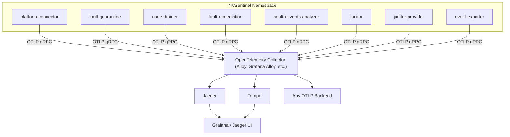

# Distributed Tracing

## Overview

NVSentinel uses OpenTelemetry distributed tracing to provide end-to-end visibility into the lifecycle of every health event as it moves through the breakfix pipeline. A single trace follows one health event from detection through quarantine, drain, and remediation across all NVSentinel modules — platform-connector, fault-quarantine, node-drainer, fault-remediation, health-events-analyzer, janitor, janitor-provider, and event-exporter.

Instead of manually correlating logs across multiple services to debug an issue (e.g., "Why was a node not remediated?" or "Why did fault-quarantine take longer than expected to handle an event?"), you can look up a single trace and see the complete journey, timing, and outcome of any health event in one view.

### Why Do You Need This?

NVSentinel's breakfix pipeline spans many modules. When something goes wrong — a health event takes longer than expected to move from detection to remediation, a remediation fails, or a node isn't recovered — understanding what happened requires piecing together information from multiple services:

- **Manual log correlation is slow**: You have to search logs across each module, match by event ID or node name, align timestamps, and mentally reconstruct the flow. This is time-consuming and error-prone.
- **Timing is manual work**: Logs have timestamps, so you can calculate how long each step took — but you have to find the right log lines across multiple modules, diff the timestamps yourself, and mentally reconstruct the nesting. Traces give you per-step durations and a nested timeline automatically, making it trivial to see whether a slow remediation was caused by a long drain, a slow database write, or a delayed Kubernetes API call.
- **Context is scattered**: To understand why an event was skipped, cancelled, or failed, you need to log into the cluster and search through its logs.

Distributed tracing solves these problems by giving you a structured, request-scoped view of every health event's path through the system — showing *where*, *what*, and *how long* each step took.

## How It Works

When a health event enters NVSentinel, the system creates a **trace** — a unique identifier that follows the event through every module. Each module adds **spans** (units of work with start/end times) to the trace as it processes the event. Spans are nested to show the call hierarchy, and carry **attributes** (key-value metadata) describing what happened and any errors if occurred.

## Architecture

All NVSentinel modules export traces via OTLP gRPC to an OpenTelemetry Collector.




### Event Lifecycle in a Trace

```text
Health Monitor
    │ send health event
    ▼
platform_connector
    └── platform_connector.process_event
    │  writes trace_id + span_id to MongoDB during event insertion
    ▼
fault_quarantine
    └── fault_quarantine.db.update_status
    │  writes span_id to MongoDB while updating quarantine status
    ▼
node_drainer
    └── node_drainer.drain_session
    └── node_drainer.update_user_pods_eviction_status
    │  writes span_id to MongoDB while updating drainer status
    ▼
fault_remediation
    └── fault_remediation.create_maintenance_resource
    │  writes trace_id + span_id to CR annotations while creating remediation CR
    ▼
janitor
    └── janitor.rebootnode.reboot_session
    │  W3C traceparent via gRPC
    ▼
janitor-provider
```

## What Can You Track?

- **Module-level performance**: How long each module spends processing an event — pinpoint whether a delay is caused by a slow database write, a retry loop, a resource update conflict, a long-running K8s API call, or time spent waiting between modules
- **Database query latency**: Every health event database operation (inserts, status updates, queries, aggregations) is automatically traced at the shared `HealthEventStore` layer. Filter slow queries with TraceQL (e.g., `{db.duration_ms > 50}`)
- **Kubernetes API call latency**: Individual K8s API calls — cordon, taint, uncordon, pod eviction, CR creation, node condition updates, status patches, node lock acquisition, service teardown/restore, and job creation. Find slow calls in Grafana with TraceQL: `{name =~ "HTTP.*" && duration > 500ms}`
- **CSP API call latency**: Cloud service provider calls — reboot signal, node-ready check, and terminate signal — so you can see whether delays are in NVSentinel or the cloud provider.
- **Remediation lifecycle**: Log collector execution (success/failure/timeout), remediation CR creation (GPUReset, RebootNode, TerminateNode), skip reasons, cancellation events, and final remediation outcome
- **Janitor operations**: GPU reset phases (node lock, service teardown, reset job, service restore), reboot flow (signal sent, time to node ready, final status), terminate flow (signal sent, node terminated, node deleted), and per-operation K8s API call latency
- **Error diagnosis**: Every module records `error.type` and `error.message` attributes on spans when something fails — you can see exactly which step failed and what error occurred. Find all error spans with TraceQL: `{status = error}`

### Trace Context Propagation

NVSentinel modules don't communicate via HTTP/gRPC with each other (except janitor → janitor-provider). Instead, trace context is propagated through three mechanisms depending on the boundary:

| Boundary | Channel | How Trace Context Flows |
|----------|---------|------------------------|
| platform-connector → fault-quarantine → node-drainer → fault-remediation | MongoDB change stream | `trace_id` in health event metadata + `span_ids` map in status |
| fault-remediation → janitor | Kubernetes CR creation | CR annotations (`nvsentinel.nvidia.com/trace-id`, `nvsentinel.nvidia.com/span-id`) |
| janitor → janitor-provider | Synchronous gRPC | W3C `traceparent` header (automatic via `otelgrpc`) |

Each module reads the upstream trace context, creates a linked span in the same trace, and writes its own span ID for the next module. The result is a single trace that spans all modules.

### Log-Trace Correlation

When tracing is enabled and a module uses trace-correlation logging, JSON logs emitted within an active span context include `trace_id` and `span_id` fields. This lets you jump from a trace to corresponding logs (or vice versa) in your log aggregation system.

```json
{
  "time": "2026-03-18T10:00:00Z",
  "level": "INFO",
  "msg": "processing event",
  "module": "fault-quarantine",
  "trace_id": "abc123def456...",
  "span_id": "789ghi012..."
}
```

Search by `trace_id` in Loki, Kibana, or any log backend to find all logs associated with a specific trace.

## Configuration

Configure tracing through your Helm values:

```yaml
global:
  tracing:
    enabled: true        # Enable/disable tracing for all components
    endpoint: ""         # Required: OTLP gRPC address of your OTel collector (e.g, "alloy.observability.svc.cluster.local:4317")
    insecure: true       # Set to false if the collector endpoint uses TLS
```

When tracing is enabled, Helm injects these environment variables into every NVSentinel module:

| Environment Variable | Value |
|---------------------|-------|
| `OTEL_EXPORTER_OTLP_ENDPOINT` | `<global.tracing.endpoint>` |
| `OTEL_EXPORTER_OTLP_INSECURE` | `<global.tracing.insecure>` |

### Prerequisites

- An OpenTelemetry Collector (e.g., Grafana Alloy, vanilla OTel Collector) accessible from the NVSentinel namespace
- A tracing backend (e.g., Grafana Tempo, Jaeger) configured as an export destination in your collector, with a UI to query and visualize traces

## Using Traces for Debugging

### Finding a Trace

You can look up traces in your tracing UI (Grafana Tempo, Jaeger) by:

- **Trace ID**: If you have a `trace_id` from logs, a health event document, or an exported CloudEvent, search for it directly
- **Health event ID**: If you have the health event's document ID, find its trace with TraceQL: `{span.health_event.id = "69e1c5b487beb8cfe7bc440e"}`. The `health_event.id` attribute is present on spans from fault-quarantine, node-drainer, and fault-remediation
- **Service name**: Filter by `service.name` (e.g., `fault-quarantine`, `node-drainer`) to see all traces through a specific module
- **Span attributes**: Use TraceQL queries to find traces matching specific conditions

### Example: Debugging a Slow Remediation

1. Find the trace for the health event (search by trace ID or event ID)
2. Look at the top-level spans to see how long each module took
3. Expand the slow module's spans to see which operation was the bottleneck
4. Check span attributes for details (e.g., `node_drainer.drain.scope`, `fault_remediation.log_collector.outcome`)
5. Look for slow K8s API calls (`HTTP *` spans) or database operations (`db.*` spans) within the slow module to identify whether the delay is from an API call or a DB query
6. For detailed info, copy the `trace_id` or `span_id` from the span and search for it in the corresponding service's container logs to get the full context

### Example: Why Was a Node Not Remediated?

1. Find the trace for the health event
2. Check if the event is still in progress — the node may not be remediated yet because it is still in the draining stage (look for an open `node_drainer.drain_session` span)
3. Check if fault-remediation has a `fault_remediation.skip_event` span — read the `fault_remediation.skip.reason` attribute to understand why it was skipped
4. Check if the remediation action itself failed — look for `janitor.reset_job.failed = true` or `janitor.error.type = "reboot_timeout"` attributes on janitor spans to see if the GPU reset or reboot failed on the node
5. Look for error spans across all modules — the event can fail at any stage if K8s API calls, CSP API calls, or database operations failed after all retries were exhausted

### Example: Identifying Database Bottlenecks

Database operations appear as spans named `<collection>.<operation>` (e.g., `HealthEvents.update`, `HealthEvents.insert`, `HealthEvents.find`), with attributes like `db.operation.name`, `db.collection.name`, `db.system.name` (`mongodb`), and `network.peer.address` (the MongoDB host). To find slow database operations, use TraceQL:

```
{name =~ "HealthEvents.*" && duration > 100ms}
```

This returns all spans where a database operation took longer than 100ms, helping you identify slow queries across all modules.

### Example: Finding Slow Kubernetes/CSP API Calls

K8s API calls appear as `HTTP PUT`, `HTTP DELETE`, `HTTP GET` spans within a trace. Each HTTP span includes `url.full` (e.g., `https://10.96.0.1:443/api/v1/nodes/<node>/status`), `http.response.status_code`, and `http.request.method`, so you can identify exactly which API call was slow and to which resource. To find slow calls across all traces, use TraceQL:

```
{name =~ "HTTP.*" && duration > 500ms}
```

This returns all spans where an HTTP call took longer than 500ms, helping you identify slow API calls across all modules.
## Troubleshooting

**Q: Tracing is enabled but I don't see any traces in my backend**
- Verify that `global.tracing.endpoint` is set to the correct OTLP gRPC address of your collector
- Ensure the OTel Collector is reachable from the NVSentinel namespace (check network policies)
- Confirm the collector is configured to export to your tracing backend
- Check NVSentinel module logs for OTLP export errors

**Q: Log lines don't have `trace_id` and `span_id` fields**
- Log-trace correlation requires tracing to be enabled. Verify `global.tracing.enabled` is set to `true` in your Helm values and that `OTEL_EXPORTER_OTLP_ENDPOINT` is present in the module's environment. You can also confirm tracing is active by checking the module's container logs for the startup message `"OpenTelemetry tracing initialized"` — if present, tracing was successfully initialized for that module
- The `trace_id` and `span_id` are only injected into log lines emitted during an active span context. Logs outside of event processing won't have these fields

**Q: Can I use tracing without Grafana Tempo?**
- Yes. NVSentinel exports standard OTLP traces. Any OTLP-compatible backend works — Jaeger, Zipkin (with an OTLP receiver), Grafana Cloud, Datadog, or any vendor that accepts OTLP gRPC

**Q: I don't see any database spans in my traces**
- Database spans only appear when the database call happens within an active parent span context. Calls made outside of event processing (e.g., startup queries, background health checks) are not traced by design

**Q: What is the performance impact of enabling tracing?**
- Tracing adds minimal overhead per span (microseconds for span creation and attribute recording). The primary cost is the OTLP gRPC export, which is batched asynchronously and does not block event processing
- NVSentinel traces only event-processing paths — background operations and internal polling loops are not traced, keeping volume proportional to your event rate
